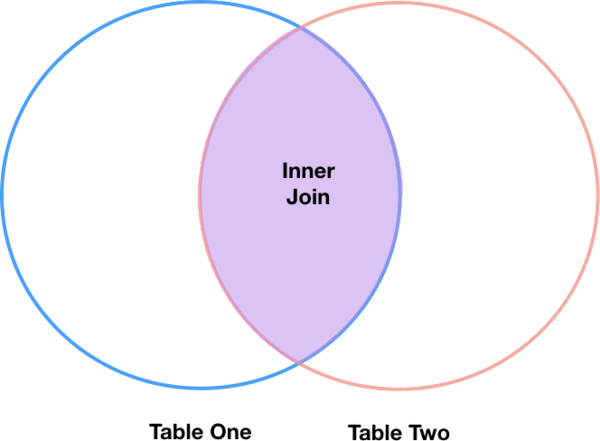

---
jupytext:
  formats: ipynb,md:myst
  text_representation:
    extension: .md
    format_name: myst
    format_version: 0.13
    jupytext_version: 1.11.5
kernelspec:
  display_name: Python 3
  language: python
  name: python3
---

## Combining DataFrames in Pandas

In many “real world” situations, the data that we want to use come in multiple files. We often need to combine these files into a single DataFrame to analyze the data. The pandas package provides various methods for combining DataFrames including `merge` and `concat`.

+++

To work through the examples below, we first need to load the species and surveys files into pandas DataFrames. Before we start, we will make sure that libraries are currectly installed. 

+++

```python
!pip install pandas matplotlib
```

+++

```python 
Requirement already satisfied: pandas in /Users/asha0035/.local/share/virtualenvs/python-workshop-base-LFzz33nP/lib/python3.6/site-packages (0.23.0)
Requirement already satisfied: matplotlib in /Users/asha0035/.local/share/virtualenvs/python-workshop-base-LFzz33nP/lib/python3.6/site-packages (2.2.2)
Requirement already satisfied: python-dateutil>=2.5.0 in /Users/asha0035/.local/share/virtualenvs/python-workshop-base-LFzz33nP/lib/python3.6/site-packages (from pandas) (2.7.3)
Requirement already satisfied: pytz>=2011k in /Users/asha0035/.local/share/virtualenvs/python-workshop-base-LFzz33nP/lib/python3.6/site-packages (from pandas) (2018.4)
Requirement already satisfied: numpy>=1.9.0 in /Users/asha0035/.local/share/virtualenvs/python-workshop-base-LFzz33nP/lib/python3.6/site-packages (from pandas) (1.14.3)
Requirement already satisfied: cycler>=0.10 in /Users/asha0035/.local/share/virtualenvs/python-workshop-base-LFzz33nP/lib/python3.6/site-packages (from matplotlib) (0.10.0)
Requirement already satisfied: six>=1.10 in /Users/asha0035/.local/share/virtualenvs/python-workshop-base-LFzz33nP/lib/python3.6/site-packages (from matplotlib) (1.11.0)
Requirement already satisfied: pyparsing!=2.0.4,!=2.1.2,!=2.1.6,>=2.0.1 in /Users/asha0035/.local/share/virtualenvs/python-workshop-base-LFzz33nP/lib/python3.6/site-packages (from matplotlib) (2.2.0)
Requirement already satisfied: kiwisolver>=1.0.1 in /Users/asha0035/.local/share/virtualenvs/python-workshop-base-LFzz33nP/lib/python3.6/site-packages (from matplotlib) (1.0.1)
Requirement already satisfied: setuptools in /Users/asha0035/.local/share/virtualenvs/python-workshop-base-LFzz33nP/lib/python3.6/site-packages (from kiwisolver>=1.0.1->matplotlib) (39.2.0)
You are using pip version 10.0.1, however version 18.1 is available.
You should consider upgrading via the 'pip install --upgrade pip' command.
```

```{code-cell} ipython3
import pandas as pd
surveys_df = pd.read_csv("surveys.csv",
                         keep_default_na=False, na_values=[""])
surveys_df
```

## Concatenating DataFrames

We can use the concat function in pandas to append either columns or rows from one DataFrame to another. Let’s grab two subsets of our data to see how this works.

```{code-cell} ipython3
# Read in first 10 lines of surveys table
survey_sub = surveys_df.head(10)
# Grab the last 10 rows
survey_sub_last10 = surveys_df.tail(10)
# Reset the index values to the second dataframe appends properly
survey_sub_last10=survey_sub_last10.reset_index(drop=True)
# drop=True option avoids adding new index column with old index values
```

When we concatenate DataFrames, we need to specify the axis. axis=0 tells pandas to stack the second DataFrame under the first one. It will automatically detect whether the column names are the same and will stack accordingly. axis=1 will stack the columns in the second DataFrame to the RIGHT of the first DataFrame. To stack the data vertically, we need to make sure we have the same columns and associated column format in both datasets. When we stack horizonally, we want to make sure what we are doing makes sense (ie the data are related in some way).

```{code-cell} ipython3
# Stack the DataFrames on top of each other
vertical_stack = pd.concat([survey_sub, survey_sub_last10], axis=0)

# Place the DataFrames side by side
horizontal_stack = pd.concat([survey_sub, survey_sub_last10], axis=1)
```

### Row Index Values and Concat

+++

Have a look at the `vertical_stack` dataframe? Notice anything unusual? The row indexes for the two data frames `survey_sub` and `survey_sub_last10` have been repeated. We can reindex the new dataframe using the reset_index() method.


+++

## Writing Out Data to CSV

We can use the to_csv command to do export a DataFrame in CSV format. Note that the code below will by default save the data into the current working directory. We can save it to a different folder by adding the foldername and a slash to the file `vertical_stack.to_csv('foldername/out.csv')`. We use the ‘index=False’ so that pandas doesn’t include the index number for each line.

```{code-cell} ipython3
# Write DataFrame to CSV
vertical_stack.to_csv('output/out.csv', index=False)
```

Check out your working directory to make sure the CSV wrote out properly, and that you can open it! If you want, try to bring it back into Python to make sure it imports properly.

```{code-cell} ipython3
# For kicks read our output back into Python and make sure all looks good
new_output = pd.read_csv('output/out.csv', keep_default_na=False, na_values=[""])
```

+++ {"tags": ["challenge"]}

## Challenge - Combine Data

In the data folder, there are two survey data files: survey2001.csv and survey2002.csv. Read the data into Python and combine the files to make one new data frame. Create a plot of average plot weight by year grouped by sex. Export your results as a CSV and make sure it reads back into Python properly.

+++

## Joining DataFrames

When we concatenated our DataFrames we simply added them to each other - stacking them either vertically or side by side. Another way to combine DataFrames is to use columns in each dataset that contain common values (a common unique id). Combining DataFrames using a common field is called “joining”. The columns containing the common values are called “join key(s)”. Joining DataFrames in this way is often useful when one DataFrame is a “lookup table” containing additional data that we want to include in the other.

NOTE: This process of joining tables is similar to what we do with tables in an SQL database.

For example, the `species.csv` file that we’ve been working with is a lookup table. This table contains the genus, species and taxa code for 55 species. The species code is unique for each line. These species are identified in our survey data as well using the unique species code. Rather than adding 3 more columns for the genus, species and taxa to each of the 35,549 line Survey data table, we can maintain the shorter table with the species information. When we want to access that information, we can create a query that joins the additional columns of information to the Survey data.

Storing data in this way has many benefits including:

 1. It ensures consistency in the spelling of species attributes (genus, species and taxa) given each species is only entered once. Imagine the possibilities for spelling errors when entering the genus and species thousands of times!
 2. It also makes it easy for us to make changes to the species information once without having to find each instance of it in the larger survey data.
 3. It optimizes the size of our data.

+++

### Joining Two DataFrames

To better understand joins, let’s grab the first 10 lines of our data as a subset to work with. We’ll use the `.head` method to do this. We’ll also read in a subset of the species table.

```{code-cell} ipython3
# Read in first 10 lines of surveys table
survey_sub = surveys_df.head(10)

### Download speciesSubset.csv file from web
import urllib.request

url = 'https://bit.ly/2DfqN6C'


urllib.request.urlretrieve(url, 'speciesSubset.csv')

# Import a small subset of the species data designed for this part of the lesson.
# It is stored in the data folder.
species_sub = pd.read_csv('speciesSubset.csv', keep_default_na=False, na_values=[""])
```

In this example, `species_sub` is the lookup table containing genus, species, and taxa names that we want to join with the data in `survey_sub` to produce a new DataFrame that contains all of the columns from both `species_df` and `survey_df`

```{code-cell} ipython3
species_sub.columns
```

```{code-cell} ipython3
survey_sub.columns
```

In our example, the join key is the column containing the two-letter species identifier, which is called `species_id`.

Now that we know the fields with the common species ID attributes in each DataFrame, we are almost ready to join our data. However, since there are **different types of joins**, we also need to decide which type of join makes sense for our analysis.

+++

### Inner Joins

The most common type of join is called an *inner join*. An inner join combines two DataFrames based on a join key and returns a new DataFrame that contains only those rows that have matching values in both of the original DataFrames.

Inner joins yield a DataFrame that contains only rows where the value being joins exists in BOTH tables. An example of an inner join, adapted from [this page](https://blog.codinghorror.com/a-visual-explanation-of-sql-joins/) is below:

+++



+++

The pandas function for performing joins is called `merge` and an Inner join is the default option:

```{code-cell} ipython3
merged_inner = pd.merge(left=survey_sub,right=species_sub, left_on='species_id', right_on='species_id')
# In this case `species_id` is the only column name in  both dataframes, so if we skippd `left_on`
# And `right_on` arguments we would still get the same result

# What's the size of the output data?
merged_inner.shape
merged_inner
```

The result of an inner join of `survey_sub` and `species_sub` is a new DataFrame that contains the combined set of columns from `survey_sub` and `species_sub`. It only contains rows that have two-letter species codes that are the same in both the `survey_sub` and `species_sub` DataFrames. In other words, if a row in `survey_sub` has a value of `species_id` that does not appear in the `species_id` column of `species`, it will not be included in the DataFrame returned by an inner join. Similarly, if a row in `species_sub` has a value of `species_id` that does not appear in the `species_id` column of `survey_sub`, that row will not be included in the DataFrame returned by an **inner join**.

The two DataFrames that we want to join are passed to the `merge` function using the left and right argument. The `left_on='species'` argument tells `merge` to use the `species_id` column as the join key from `survey_sub` (the left DataFrame). Similarly , the `right_on='species_id'` argument tells merge to use the `species_id` column as the join key from `species_sub` (the right DataFrame). For inner joins, the order of the left and right arguments does not matter.

The result `merged_inner` DataFrame contains all of the columns from `survey_sub` (record id, month, day, etc.) as well as all the columns from species_sub (species_id, genus, species, and taxa).

Notice that `merged_inner` has fewer rows than `survey_sub`. This is an indication that there were rows in `surveys_df` with value(s) for species_id that do not exist as value(s) for `species_id` in `species_df`.


+++

### Left Joins

What if we want to add information from `species_sub` to `survey_sub` without losing any of the information from `survey_sub`? In this case, we use a different type of join called a “left outer join”, or a “left join”.

Like an inner join, a left join uses join keys to combine two DataFrames. Unlike an inner join, a left join will return *all* of the rows from the `left` DataFrame, even those rows whose join key(s) do not have values in the `right` DataFrame. Rows in the left DataFrame that are missing values for the join key(s) in the `right` DataFrame will simply have null (i.e., NaN or None) values for those columns in the resulting joined DataFrame.

Note: a left join will still discard rows from the `right` DataFrame that do not have values for the join key(s) in the `left` DataFrame.

+++

Missing Values

+++

A left join is performed in pandas by calling the same `merge` function used for inner join, but using the `how='left'` argument:

```{code-cell} ipython3
merged_left = pd.merge(left=survey_sub,right=species_sub, how='left', left_on='species_id', right_on='species_id')

merged_left
```

The result DataFrame from a left join (`merged_left`) looks very much like the result DataFrame from an inner join (`merged_inner`) in terms of the columns it contains. However, unlike `merged_inner`, merged_left contains the same number of rows as the original `survey_sub` DataFrame. When we inspect `merged_left`, we find there are rows where the information that should have come from `species_sub (i.e., species_id, genus, and taxa)` is missing (they contain NaN values):

```{code-cell} ipython3
merged_left[ pd.isnull(merged_left.genus) ]
```

These rows are the ones where the value of `species_id` from `survey_sub` (in this case, PF) does not occur in `species_sub`.

+++

### Other join types

The pandas merge function supports two other join types:

 - Right (outer) join: Invoked by passing `how='right'` as an argument. Similar to a left join, except all rows from the `right` DataFrame are kept, while rows from the left DataFrame without matching join key(s) values are discarded.
 - Full (outer) join: Invoked by passing `how='outer'` as an argument. This join type returns the all pairwise combinations of rows from both DataFrames; i.e., the result DataFrame will `NaN` where data is missing in one of the dataframes. This join type is very rarely used.

+++ {"tags": ["challenge"]}

## Extra Challenge 1

Create a new DataFrame by joining the contents of the `surveys.csv` and `speciesSubset.csv` tables. Then calculate and plot the distribution of:

 1. taxa by plot
 2. taxa by sex by plot

```{code-cell} ipython3

```
