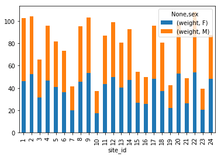

<style>
.output_label {
    text-align: right;
    margin: -1em;
    padding: 0;
    font-size: 0.5em;
    color: grey
}
</style>

<!-- 
# Indexing, Slicing and Subsetting

*Estimated teaching time:* 30 min

*Estimated challenge time:* 30 min

*Key questions:*

  - "How can I access specific data within my data set?"
  - "How  can Python and Pandas help me to analyse my data?"
    
*Learning objectives:*

  - Describe what 0-based indexing is.
  - Manipulate and extract data using column headings and index locations.
  - Employ slicing to select sets of data from a DataFrame.
  - Employ label and integer-based indexing to select ranges of data in a dataframe.
  - Reassign values within subsets of a DataFrame.
  - Create a copy of a DataFrame.
  - "Query /select a subset of data using a set of criteria using the following operators: =, !=, >, <, >=, <=."
  - Locate subsets of data using masks.
  - Describe BOOLEAN objects in Python and manipulate data using BOOLEANs.

---

In this lesson, we will explore **ways to access different parts of the data** in a Pandas DataFrame using:

  - Indexing,
  - Slicing, and
  - Subsetting
 -->


# Indexing, Slicing and Subsetting


In this lesson, we will explore **ways to access different parts of the data** in a Pandas DataFrame using:

  - Indexing,
  - Slicing, and
  - Subsetting


## Ensure the Pandas package is installed


```python
!pip install pandas matplotlib
```

<pre class="output">
<div class="output_label">output</div>
<code class="text">
Requirement already satisfied: pandas in /Users/perry/.virtualenvs/python-workshop-base-ufuVBSbV/lib/python3.6/site-packages (0.25.0)
Requirement already satisfied: matplotlib in /Users/perry/.virtualenvs/python-workshop-base-ufuVBSbV/lib/python3.6/site-packages (3.1.1)
Requirement already satisfied: numpy>=1.13.3 in /Users/perry/.virtualenvs/python-workshop-base-ufuVBSbV/lib/python3.6/site-packages (from pandas) (1.17.0)
Requirement already satisfied: pytz>=2017.2 in /Users/perry/.virtualenvs/python-workshop-base-ufuVBSbV/lib/python3.6/site-packages (from pandas) (2019.1)
Requirement already satisfied: python-dateutil>=2.6.1 in /Users/perry/.virtualenvs/python-workshop-base-ufuVBSbV/lib/python3.6/site-packages (from pandas) (2.8.0)
Requirement already satisfied: cycler>=0.10 in /Users/perry/.virtualenvs/python-workshop-base-ufuVBSbV/lib/python3.6/site-packages (from matplotlib) (0.10.0)
Requirement already satisfied: pyparsing!=2.0.4,!=2.1.2,!=2.1.6,>=2.0.1 in /Users/perry/.virtualenvs/python-workshop-base-ufuVBSbV/lib/python3.6/site-packages (from matplotlib) (2.4.1.1)
Requirement already satisfied: kiwisolver>=1.0.1 in /Users/perry/.virtualenvs/python-workshop-base-ufuVBSbV/lib/python3.6/site-packages (from matplotlib) (1.1.0)
Requirement already satisfied: six>=1.5 in /Users/perry/.virtualenvs/python-workshop-base-ufuVBSbV/lib/python3.6/site-packages (from python-dateutil>=2.6.1->pandas) (1.12.0)
Requirement already satisfied: setuptools in /Users/perry/.virtualenvs/python-workshop-base-ufuVBSbV/lib/python3.6/site-packages (from kiwisolver>=1.0.1->matplotlib) (39.1.0)

</code>
</pre>


## Loading our data

We will continue to use the surveys dataset that we worked with in the last lesson. Let's reopen and read in the data again:


```python
# Make sure pandas is loaded
import pandas as pd

# Read in the survey CSV
surveys_df = pd.read_csv("surveys.csv")
```


## Indexing and Slicing in Python

We often want to work with subsets of a **DataFrame** object. There are
different ways to accomplish this including: using labels (column headings),
numeric ranges, or specific x,y index locations.


## Selecting data using Labels (Column Headings)

We use square brackets `[]` to select a subset of an Python object. For example,
we can select all data from a column named `species_id` from the `surveys_df`
DataFrame by name. There are two ways to do this:


```python
# Method 1: select a 'subset' of the data using the column name
surveys_df['species_id'].head()
```


<pre class="output">
<div style="text-align: right; margin: -1em; padding: 0;"><span style="font-size: 0.5em; color: grey">output</span></div>
<code class="text">
0    NL
1    NL
2    DM
3    DM
4    DM
Name: species_id, dtype: object
</code>
</pre>


```python
# Method 2: use the column name as an 'attribute'; gives the same output
surveys_df.species_id.head()
```


<pre class="output">
<div style="text-align: right; margin: -1em; padding: 0;"><span style="font-size: 0.5em; color: grey">output</span></div>
<code class="text">
0    NL
1    NL
2    DM
3    DM
4    DM
Name: species_id, dtype: object
</code>
</pre>


We can also create a new object that contains only the data within the
`species_id` column as follows:


```python
# Creates an object, surveys_species, that only contains the `species_id` column
surveys_species = surveys_df['species_id']
```


We can pass a list of column names too, as an index to select columns in that
order. This is useful when we need to reorganize our data.

**NOTE:** If a column name is not contained in the DataFrame, an exception
(error) will be raised.


```python
# Select the species and plot columns from the DataFrame
surveys_df[['species_id', 'site_id']].head()
```


<div>
<style scoped>
    .dataframe tbody tr th:only-of-type {
        vertical-align: middle;
    }

    .dataframe tbody tr th {
        vertical-align: top;
    }

    .dataframe thead th {
        text-align: right;
    }
</style>
<table border="1" class="dataframe">
  <thead>
    <tr style="text-align: right;">
      <th></th>
      <th>species_id</th>
      <th>site_id</th>
    </tr>
  </thead>
  <tbody>
    <tr>
      <th>0</th>
      <td>NL</td>
      <td>2</td>
    </tr>
    <tr>
      <th>1</th>
      <td>NL</td>
      <td>3</td>
    </tr>
    <tr>
      <th>2</th>
      <td>DM</td>
      <td>2</td>
    </tr>
    <tr>
      <th>3</th>
      <td>DM</td>
      <td>7</td>
    </tr>
    <tr>
      <th>4</th>
      <td>DM</td>
      <td>3</td>
    </tr>
  </tbody>
</table>
</div>


What happens if you ask for a column that doesn't exist?

```python
surveys_df['speciess']
```

Outputs:


```python
---------------------------------------------------------------------------
KeyError                                  Traceback (most recent call last)
/Applications/anaconda/lib/python3.6/site-packages/pandas/core/indexes/base.py in get_loc(self, key, method, tolerance)
   2392             try:
-> 2393                 return self._engine.get_loc(key)
   2394             except KeyError:

pandas/_libs/index.pyx in pandas._libs.index.IndexEngine.get_loc (pandas/_libs/index.c:5239)()

pandas/_libs/index.pyx in pandas._libs.index.IndexEngine.get_loc (pandas/_libs/index.c:5085)()

pandas/_libs/hashtable_class_helper.pxi in pandas._libs.hashtable.PyObjectHashTable.get_item (pandas/_libs/hashtable.c:20405)()

pandas/_libs/hashtable_class_helper.pxi in pandas._libs.hashtable.PyObjectHashTable.get_item (pandas/_libs/hashtable.c:20359)()

KeyError: 'speciess'

During handling of the above exception, another exception occurred:

KeyError                                  Traceback (most recent call last)
<ipython-input-7-7d65fa0158b8> in <module>()
      1 
      2 # What happens if you ask for a column that doesn't exist?
----> 3 surveys_df['speciess']
      4 

/Applications/anaconda/lib/python3.6/site-packages/pandas/core/frame.py in __getitem__(self, key)
   2060             return self._getitem_multilevel(key)
   2061         else:
-> 2062             return self._getitem_column(key)
   2063 
   2064     def _getitem_column(self, key):

/Applications/anaconda/lib/python3.6/site-packages/pandas/core/frame.py in _getitem_column(self, key)
   2067         # get column
   2068         if self.columns.is_unique:
-> 2069             return self._get_item_cache(key)
   2070 
   2071         # duplicate columns & possible reduce dimensionality

/Applications/anaconda/lib/python3.6/site-packages/pandas/core/generic.py in _get_item_cache(self, item)
   1532         res = cache.get(item)
   1533         if res is None:
-> 1534             values = self._data.get(item)
   1535             res = self._box_item_values(item, values)
   1536             cache[item] = res

/Applications/anaconda/lib/python3.6/site-packages/pandas/core/internals.py in get(self, item, fastpath)
   3588 
   3589             if not isnull(item):
-> 3590                 loc = self.items.get_loc(item)
   3591             else:
   3592                 indexer = np.arange(len(self.items))[isnull(self.items)]

/Applications/anaconda/lib/python3.6/site-packages/pandas/core/indexes/base.py in get_loc(self, key, method, tolerance)
   2393                 return self._engine.get_loc(key)
   2394             except KeyError:
-> 2395                 return self._engine.get_loc(self._maybe_cast_indexer(key))
   2396 
   2397         indexer = self.get_indexer([key], method=method, tolerance=tolerance)

pandas/_libs/index.pyx in pandas._libs.index.IndexEngine.get_loc (pandas/_libs/index.c:5239)()

pandas/_libs/index.pyx in pandas._libs.index.IndexEngine.get_loc (pandas/_libs/index.c:5085)()

pandas/_libs/hashtable_class_helper.pxi in pandas._libs.hashtable.PyObjectHashTable.get_item (pandas/_libs/hashtable.c:20405)()

pandas/_libs/hashtable_class_helper.pxi in pandas._libs.hashtable.PyObjectHashTable.get_item (pandas/_libs/hashtable.c:20359)()

KeyError: 'speciess'
```


Python tells us what type of error it is in the traceback, at the bottom it says `KeyError: 'speciess'` which means that `speciess` is not a column name (or Key in the related python data type dictionary).


```python
# What happens when you flip the order?
surveys_df[['site_id', 'species_id']].head()
```


<div>
<style scoped>
    .dataframe tbody tr th:only-of-type {
        vertical-align: middle;
    }

    .dataframe tbody tr th {
        vertical-align: top;
    }

    .dataframe thead th {
        text-align: right;
    }
</style>
<table border="1" class="dataframe">
  <thead>
    <tr style="text-align: right;">
      <th></th>
      <th>site_id</th>
      <th>species_id</th>
    </tr>
  </thead>
  <tbody>
    <tr>
      <th>0</th>
      <td>2</td>
      <td>NL</td>
    </tr>
    <tr>
      <th>1</th>
      <td>3</td>
      <td>NL</td>
    </tr>
    <tr>
      <th>2</th>
      <td>2</td>
      <td>DM</td>
    </tr>
    <tr>
      <th>3</th>
      <td>7</td>
      <td>DM</td>
    </tr>
    <tr>
      <th>4</th>
      <td>3</td>
      <td>DM</td>
    </tr>
  </tbody>
</table>
</div>


## Extracting Range based Subsets: Slicing

**REMINDER**: Python Uses 0-based Indexing

Let's remind ourselves that Python uses 0-based
indexing. This means that the first element in an object is located at position
0. This is different from other tools like R and Matlab that index elements
within objects starting at 1.


```python
# Create a list of numbers:
a = [1, 2, 3, 4, 5]
```


## Challenge - Extracting data

1. What value does the code **a[0]** return?

2. How about this: **a[5]**

3. In the example above, calling `a[5]` returns an error. Why is that?

4. What about **a[len(a)]** ?


## Solutions - Extracting data


<!-- 

```python
a[0]
```


<pre class="output">
<div style="text-align: right; margin: -1em; padding: 0;"><span style="font-size: 0.5em; color: grey">output</span></div>
<code class="text">
1
</code>
</pre>


 -->


<!-- 

```python
# Solution #2
# a[5]
```
 -->


<!-- 
#### Solution #2

In above example, the error says `list index out of range`. This means we don't have index 5 in our list. The maximum index for `a` is `4`, as indexing starts at `0`.
 -->


<!-- 

```python
# Solution #3
# a[len(a)]
```
 -->


<!-- 
#### Solution - # 4 - Extracting data 
This also gives an error, because len(a) is `5` which is not the maximum index
 -->


## Slicing Subsets of Rows in Python

Slicing using the `[]` operator selects a set of rows and/or columns from a
DataFrame. To slice out a set of rows, you use the following syntax:
`data[start:stop]`. When slicing in pandas the start bound is included in the
output. The stop bound is one step BEYOND the row you want to select. So if you
want to select rows 0, 1 and 2 your code would look like this with our `surveys data`:


```python
# Select rows 0, 1, 2 (row 3 is not selected)
surveys_df[0:3]
```


<div>
<style scoped>
    .dataframe tbody tr th:only-of-type {
        vertical-align: middle;
    }

    .dataframe tbody tr th {
        vertical-align: top;
    }

    .dataframe thead th {
        text-align: right;
    }
</style>
<table border="1" class="dataframe">
  <thead>
    <tr style="text-align: right;">
      <th></th>
      <th>record_id</th>
      <th>month</th>
      <th>day</th>
      <th>year</th>
      <th>site_id</th>
      <th>species_id</th>
      <th>sex</th>
      <th>hindfoot_length</th>
      <th>weight</th>
    </tr>
  </thead>
  <tbody>
    <tr>
      <th>0</th>
      <td>1</td>
      <td>7</td>
      <td>16</td>
      <td>1977</td>
      <td>2</td>
      <td>NL</td>
      <td>M</td>
      <td>32.0</td>
      <td>NaN</td>
    </tr>
    <tr>
      <th>1</th>
      <td>2</td>
      <td>7</td>
      <td>16</td>
      <td>1977</td>
      <td>3</td>
      <td>NL</td>
      <td>M</td>
      <td>33.0</td>
      <td>NaN</td>
    </tr>
    <tr>
      <th>2</th>
      <td>3</td>
      <td>7</td>
      <td>16</td>
      <td>1977</td>
      <td>2</td>
      <td>DM</td>
      <td>F</td>
      <td>37.0</td>
      <td>NaN</td>
    </tr>
  </tbody>
</table>
</div>


The stop bound in Python is different from what you might be used to in
languages like Matlab and R.

Now lets select the `first 5 rows (rows 0, 1, 2, 3, 4)`.


```python
surveys_df[:5]
```


<div>
<style scoped>
    .dataframe tbody tr th:only-of-type {
        vertical-align: middle;
    }

    .dataframe tbody tr th {
        vertical-align: top;
    }

    .dataframe thead th {
        text-align: right;
    }
</style>
<table border="1" class="dataframe">
  <thead>
    <tr style="text-align: right;">
      <th></th>
      <th>record_id</th>
      <th>month</th>
      <th>day</th>
      <th>year</th>
      <th>site_id</th>
      <th>species_id</th>
      <th>sex</th>
      <th>hindfoot_length</th>
      <th>weight</th>
    </tr>
  </thead>
  <tbody>
    <tr>
      <th>0</th>
      <td>1</td>
      <td>7</td>
      <td>16</td>
      <td>1977</td>
      <td>2</td>
      <td>NL</td>
      <td>M</td>
      <td>32.0</td>
      <td>NaN</td>
    </tr>
    <tr>
      <th>1</th>
      <td>2</td>
      <td>7</td>
      <td>16</td>
      <td>1977</td>
      <td>3</td>
      <td>NL</td>
      <td>M</td>
      <td>33.0</td>
      <td>NaN</td>
    </tr>
    <tr>
      <th>2</th>
      <td>3</td>
      <td>7</td>
      <td>16</td>
      <td>1977</td>
      <td>2</td>
      <td>DM</td>
      <td>F</td>
      <td>37.0</td>
      <td>NaN</td>
    </tr>
    <tr>
      <th>3</th>
      <td>4</td>
      <td>7</td>
      <td>16</td>
      <td>1977</td>
      <td>7</td>
      <td>DM</td>
      <td>M</td>
      <td>36.0</td>
      <td>NaN</td>
    </tr>
    <tr>
      <th>4</th>
      <td>5</td>
      <td>7</td>
      <td>16</td>
      <td>1977</td>
      <td>3</td>
      <td>DM</td>
      <td>M</td>
      <td>35.0</td>
      <td>NaN</td>
    </tr>
  </tbody>
</table>
</div>


```python
# Select the last element in the list
# (the slice starts at the last element, and ends at the end of the list)
surveys_df[-1:]
```


<div>
<style scoped>
    .dataframe tbody tr th:only-of-type {
        vertical-align: middle;
    }

    .dataframe tbody tr th {
        vertical-align: top;
    }

    .dataframe thead th {
        text-align: right;
    }
</style>
<table border="1" class="dataframe">
  <thead>
    <tr style="text-align: right;">
      <th></th>
      <th>record_id</th>
      <th>month</th>
      <th>day</th>
      <th>year</th>
      <th>site_id</th>
      <th>species_id</th>
      <th>sex</th>
      <th>hindfoot_length</th>
      <th>weight</th>
    </tr>
  </thead>
  <tbody>
    <tr>
      <th>35548</th>
      <td>35549</td>
      <td>12</td>
      <td>31</td>
      <td>2002</td>
      <td>5</td>
      <td>NaN</td>
      <td>NaN</td>
      <td>NaN</td>
      <td>NaN</td>
    </tr>
  </tbody>
</table>
</div>


We can also reassign values within subsets of our DataFrame.


Let's create a brand new clean dataframe from
the original data CSV file.


```python
surveys_df = pd.read_csv("surveys.csv")
```


## Slicing Subsets of Rows and Columns in Python

We can select specific ranges of our data in both the row and column directions
using either label or integer-based indexing.

- `loc` is primarily *label* based indexing. *Integers* may be used but
  they are interpreted as a *label*.
- `iloc` is primarily *integer* based indexing

To select a subset of rows **and** columns from our DataFrame, we can use the
`iloc` method. For example, we can select month, day and year (columns 2, 3
and 4 if we start counting at 1), like this:

`iloc[row slicing, column slicing]`


```python
surveys_df.iloc[0:3, 1:4]
```


<div>
<style scoped>
    .dataframe tbody tr th:only-of-type {
        vertical-align: middle;
    }

    .dataframe tbody tr th {
        vertical-align: top;
    }

    .dataframe thead th {
        text-align: right;
    }
</style>
<table border="1" class="dataframe">
  <thead>
    <tr style="text-align: right;">
      <th></th>
      <th>month</th>
      <th>day</th>
      <th>year</th>
    </tr>
  </thead>
  <tbody>
    <tr>
      <th>0</th>
      <td>7</td>
      <td>16</td>
      <td>1977</td>
    </tr>
    <tr>
      <th>1</th>
      <td>7</td>
      <td>16</td>
      <td>1977</td>
    </tr>
    <tr>
      <th>2</th>
      <td>7</td>
      <td>16</td>
      <td>1977</td>
    </tr>
  </tbody>
</table>
</div>


Notice that we asked for a slice from 0:3. This yielded 3 rows of data. When you
ask for 0:3, you are actually telling Python to start at index 0 and select rows
0, 1, 2 **up to but not including 3**.

Let's explore some other ways to index and select subsets of data:


```python
# Select all columns for rows of index values 0 and 10
surveys_df.loc[[0, 10], :]
```


<div>
<style scoped>
    .dataframe tbody tr th:only-of-type {
        vertical-align: middle;
    }

    .dataframe tbody tr th {
        vertical-align: top;
    }

    .dataframe thead th {
        text-align: right;
    }
</style>
<table border="1" class="dataframe">
  <thead>
    <tr style="text-align: right;">
      <th></th>
      <th>record_id</th>
      <th>month</th>
      <th>day</th>
      <th>year</th>
      <th>site_id</th>
      <th>species_id</th>
      <th>sex</th>
      <th>hindfoot_length</th>
      <th>weight</th>
    </tr>
  </thead>
  <tbody>
    <tr>
      <th>0</th>
      <td>1</td>
      <td>7</td>
      <td>16</td>
      <td>1977</td>
      <td>2</td>
      <td>NL</td>
      <td>M</td>
      <td>32.0</td>
      <td>NaN</td>
    </tr>
    <tr>
      <th>10</th>
      <td>11</td>
      <td>7</td>
      <td>16</td>
      <td>1977</td>
      <td>5</td>
      <td>DS</td>
      <td>F</td>
      <td>53.0</td>
      <td>NaN</td>
    </tr>
  </tbody>
</table>
</div>


```python
# What does this do?
surveys_df.loc[0, ['species_id', 'site_id', 'weight']]
```


<pre class="output">
<div style="text-align: right; margin: -1em; padding: 0;"><span style="font-size: 0.5em; color: grey">output</span></div>
<code class="text">
species_id     NL
site_id         2
weight        NaN
Name: 0, dtype: object
</code>
</pre>


```python
# What happens when you type the code below?
surveys_df.loc[[0, 10, 35549], :]
```

<pre class="output">
<div class="output_label">output</div>
<code class="text">
/Users/perry/.virtualenvs/python-workshop-base-ufuVBSbV/lib/python3.6/site-packages/pandas/core/indexing.py:1404: FutureWarning: 
Passing list-likes to .loc or [] with any missing label will raise
KeyError in the future, you can use .reindex() as an alternative.

See the documentation here:
https://pandas.pydata.org/pandas-docs/stable/user_guide/indexing.html#deprecate-loc-reindex-listlike
  return self._getitem_tuple(key)

</code>
</pre>


<div>
<style scoped>
    .dataframe tbody tr th:only-of-type {
        vertical-align: middle;
    }

    .dataframe tbody tr th {
        vertical-align: top;
    }

    .dataframe thead th {
        text-align: right;
    }
</style>
<table border="1" class="dataframe">
  <thead>
    <tr style="text-align: right;">
      <th></th>
      <th>record_id</th>
      <th>month</th>
      <th>day</th>
      <th>year</th>
      <th>site_id</th>
      <th>species_id</th>
      <th>sex</th>
      <th>hindfoot_length</th>
      <th>weight</th>
    </tr>
  </thead>
  <tbody>
    <tr>
      <th>0</th>
      <td>1.0</td>
      <td>7.0</td>
      <td>16.0</td>
      <td>1977.0</td>
      <td>2.0</td>
      <td>NL</td>
      <td>M</td>
      <td>32.0</td>
      <td>NaN</td>
    </tr>
    <tr>
      <th>10</th>
      <td>11.0</td>
      <td>7.0</td>
      <td>16.0</td>
      <td>1977.0</td>
      <td>5.0</td>
      <td>DS</td>
      <td>F</td>
      <td>53.0</td>
      <td>NaN</td>
    </tr>
    <tr>
      <th>35549</th>
      <td>NaN</td>
      <td>NaN</td>
      <td>NaN</td>
      <td>NaN</td>
      <td>NaN</td>
      <td>NaN</td>
      <td>NaN</td>
      <td>NaN</td>
      <td>NaN</td>
    </tr>
  </tbody>
</table>
</div>


**NOTE**: Labels must be found in the DataFrame or you will get a `KeyError`.

Indexing by labels `loc` differs from indexing by integers `iloc`.
With `loc`, the both start bound and the stop bound are **inclusive**. When using
`loc`, integers *can* be used, but the integers refer to the
index label and not the position. For example, using `loc` and select 1:4
will get a different result than using `iloc` to select rows 1:4.

We can also select a specific data value using a row and
column location within the DataFrame and `iloc` indexing:

```python
# Syntax for iloc indexing to finding a specific data element
dat.iloc[row, column]
```

In following iloc example:


```python
surveys_df.iloc[2, 6]
```


<pre class="output">
<div style="text-align: right; margin: -1em; padding: 0;"><span style="font-size: 0.5em; color: grey">output</span></div>
<code class="text">
'F'
</code>
</pre>


Remember that Python indexing begins at 0. So, the index location [2, 6]
selects the element that is 3 rows down and 7 columns over in the DataFrame.


## Challenge - Range

1. What happens when you execute:

       - `surveys_df[0:1]`
       - `surveys_df[:4]`
       - `surveys_df[:-1]`

2. What happens when you call:

       - `surveys_df.iloc[0:4, 1:4]`


<!-- 
## Solution - Range
 -->


<!-- 

```python
# Solution - Range - #1 (a)
surveys_df[0:1]
```


<div>
<style scoped>
    .dataframe tbody tr th:only-of-type {
        vertical-align: middle;
    }

    .dataframe tbody tr th {
        vertical-align: top;
    }

    .dataframe thead th {
        text-align: right;
    }
</style>
<table border="1" class="dataframe">
  <thead>
    <tr style="text-align: right;">
      <th></th>
      <th>record_id</th>
      <th>month</th>
      <th>day</th>
      <th>year</th>
      <th>site_id</th>
      <th>species_id</th>
      <th>sex</th>
      <th>hindfoot_length</th>
      <th>weight</th>
    </tr>
  </thead>
  <tbody>
    <tr>
      <th>0</th>
      <td>1</td>
      <td>7</td>
      <td>16</td>
      <td>1977</td>
      <td>2</td>
      <td>NL</td>
      <td>M</td>
      <td>32.0</td>
      <td>NaN</td>
    </tr>
  </tbody>
</table>
</div>


 -->


<!-- 

```python
# Solution - Range - #1 (b)
surveys_df[:4]
```


<div>
<style scoped>
    .dataframe tbody tr th:only-of-type {
        vertical-align: middle;
    }

    .dataframe tbody tr th {
        vertical-align: top;
    }

    .dataframe thead th {
        text-align: right;
    }
</style>
<table border="1" class="dataframe">
  <thead>
    <tr style="text-align: right;">
      <th></th>
      <th>record_id</th>
      <th>month</th>
      <th>day</th>
      <th>year</th>
      <th>site_id</th>
      <th>species_id</th>
      <th>sex</th>
      <th>hindfoot_length</th>
      <th>weight</th>
    </tr>
  </thead>
  <tbody>
    <tr>
      <th>0</th>
      <td>1</td>
      <td>7</td>
      <td>16</td>
      <td>1977</td>
      <td>2</td>
      <td>NL</td>
      <td>M</td>
      <td>32.0</td>
      <td>NaN</td>
    </tr>
    <tr>
      <th>1</th>
      <td>2</td>
      <td>7</td>
      <td>16</td>
      <td>1977</td>
      <td>3</td>
      <td>NL</td>
      <td>M</td>
      <td>33.0</td>
      <td>NaN</td>
    </tr>
    <tr>
      <th>2</th>
      <td>3</td>
      <td>7</td>
      <td>16</td>
      <td>1977</td>
      <td>2</td>
      <td>DM</td>
      <td>F</td>
      <td>37.0</td>
      <td>NaN</td>
    </tr>
    <tr>
      <th>3</th>
      <td>4</td>
      <td>7</td>
      <td>16</td>
      <td>1977</td>
      <td>7</td>
      <td>DM</td>
      <td>M</td>
      <td>36.0</td>
      <td>NaN</td>
    </tr>
  </tbody>
</table>
</div>


 -->


<!-- 

```python
# Solution - Range - #1 (c)
surveys_df[:-1]
```


<div>
<style scoped>
    .dataframe tbody tr th:only-of-type {
        vertical-align: middle;
    }

    .dataframe tbody tr th {
        vertical-align: top;
    }

    .dataframe thead th {
        text-align: right;
    }
</style>
<table border="1" class="dataframe">
  <thead>
    <tr style="text-align: right;">
      <th></th>
      <th>record_id</th>
      <th>month</th>
      <th>day</th>
      <th>year</th>
      <th>site_id</th>
      <th>species_id</th>
      <th>sex</th>
      <th>hindfoot_length</th>
      <th>weight</th>
    </tr>
  </thead>
  <tbody>
    <tr>
      <th>0</th>
      <td>1</td>
      <td>7</td>
      <td>16</td>
      <td>1977</td>
      <td>2</td>
      <td>NL</td>
      <td>M</td>
      <td>32.0</td>
      <td>NaN</td>
    </tr>
    <tr>
      <th>1</th>
      <td>2</td>
      <td>7</td>
      <td>16</td>
      <td>1977</td>
      <td>3</td>
      <td>NL</td>
      <td>M</td>
      <td>33.0</td>
      <td>NaN</td>
    </tr>
    <tr>
      <th>2</th>
      <td>3</td>
      <td>7</td>
      <td>16</td>
      <td>1977</td>
      <td>2</td>
      <td>DM</td>
      <td>F</td>
      <td>37.0</td>
      <td>NaN</td>
    </tr>
    <tr>
      <th>3</th>
      <td>4</td>
      <td>7</td>
      <td>16</td>
      <td>1977</td>
      <td>7</td>
      <td>DM</td>
      <td>M</td>
      <td>36.0</td>
      <td>NaN</td>
    </tr>
    <tr>
      <th>4</th>
      <td>5</td>
      <td>7</td>
      <td>16</td>
      <td>1977</td>
      <td>3</td>
      <td>DM</td>
      <td>M</td>
      <td>35.0</td>
      <td>NaN</td>
    </tr>
    <tr>
      <th>5</th>
      <td>6</td>
      <td>7</td>
      <td>16</td>
      <td>1977</td>
      <td>1</td>
      <td>PF</td>
      <td>M</td>
      <td>14.0</td>
      <td>NaN</td>
    </tr>
    <tr>
      <th>6</th>
      <td>7</td>
      <td>7</td>
      <td>16</td>
      <td>1977</td>
      <td>2</td>
      <td>PE</td>
      <td>F</td>
      <td>NaN</td>
      <td>NaN</td>
    </tr>
    <tr>
      <th>7</th>
      <td>8</td>
      <td>7</td>
      <td>16</td>
      <td>1977</td>
      <td>1</td>
      <td>DM</td>
      <td>M</td>
      <td>37.0</td>
      <td>NaN</td>
    </tr>
    <tr>
      <th>8</th>
      <td>9</td>
      <td>7</td>
      <td>16</td>
      <td>1977</td>
      <td>1</td>
      <td>DM</td>
      <td>F</td>
      <td>34.0</td>
      <td>NaN</td>
    </tr>
    <tr>
      <th>9</th>
      <td>10</td>
      <td>7</td>
      <td>16</td>
      <td>1977</td>
      <td>6</td>
      <td>PF</td>
      <td>F</td>
      <td>20.0</td>
      <td>NaN</td>
    </tr>
    <tr>
      <th>10</th>
      <td>11</td>
      <td>7</td>
      <td>16</td>
      <td>1977</td>
      <td>5</td>
      <td>DS</td>
      <td>F</td>
      <td>53.0</td>
      <td>NaN</td>
    </tr>
    <tr>
      <th>11</th>
      <td>12</td>
      <td>7</td>
      <td>16</td>
      <td>1977</td>
      <td>7</td>
      <td>DM</td>
      <td>M</td>
      <td>38.0</td>
      <td>NaN</td>
    </tr>
    <tr>
      <th>12</th>
      <td>13</td>
      <td>7</td>
      <td>16</td>
      <td>1977</td>
      <td>3</td>
      <td>DM</td>
      <td>M</td>
      <td>35.0</td>
      <td>NaN</td>
    </tr>
    <tr>
      <th>13</th>
      <td>14</td>
      <td>7</td>
      <td>16</td>
      <td>1977</td>
      <td>8</td>
      <td>DM</td>
      <td>NaN</td>
      <td>NaN</td>
      <td>NaN</td>
    </tr>
    <tr>
      <th>14</th>
      <td>15</td>
      <td>7</td>
      <td>16</td>
      <td>1977</td>
      <td>6</td>
      <td>DM</td>
      <td>F</td>
      <td>36.0</td>
      <td>NaN</td>
    </tr>
    <tr>
      <th>15</th>
      <td>16</td>
      <td>7</td>
      <td>16</td>
      <td>1977</td>
      <td>4</td>
      <td>DM</td>
      <td>F</td>
      <td>36.0</td>
      <td>NaN</td>
    </tr>
    <tr>
      <th>16</th>
      <td>17</td>
      <td>7</td>
      <td>16</td>
      <td>1977</td>
      <td>3</td>
      <td>DS</td>
      <td>F</td>
      <td>48.0</td>
      <td>NaN</td>
    </tr>
    <tr>
      <th>17</th>
      <td>18</td>
      <td>7</td>
      <td>16</td>
      <td>1977</td>
      <td>2</td>
      <td>PP</td>
      <td>M</td>
      <td>22.0</td>
      <td>NaN</td>
    </tr>
    <tr>
      <th>18</th>
      <td>19</td>
      <td>7</td>
      <td>16</td>
      <td>1977</td>
      <td>4</td>
      <td>PF</td>
      <td>NaN</td>
      <td>NaN</td>
      <td>NaN</td>
    </tr>
    <tr>
      <th>19</th>
      <td>20</td>
      <td>7</td>
      <td>17</td>
      <td>1977</td>
      <td>11</td>
      <td>DS</td>
      <td>F</td>
      <td>48.0</td>
      <td>NaN</td>
    </tr>
    <tr>
      <th>20</th>
      <td>21</td>
      <td>7</td>
      <td>17</td>
      <td>1977</td>
      <td>14</td>
      <td>DM</td>
      <td>F</td>
      <td>34.0</td>
      <td>NaN</td>
    </tr>
    <tr>
      <th>21</th>
      <td>22</td>
      <td>7</td>
      <td>17</td>
      <td>1977</td>
      <td>15</td>
      <td>NL</td>
      <td>F</td>
      <td>31.0</td>
      <td>NaN</td>
    </tr>
    <tr>
      <th>22</th>
      <td>23</td>
      <td>7</td>
      <td>17</td>
      <td>1977</td>
      <td>13</td>
      <td>DM</td>
      <td>M</td>
      <td>36.0</td>
      <td>NaN</td>
    </tr>
    <tr>
      <th>23</th>
      <td>24</td>
      <td>7</td>
      <td>17</td>
      <td>1977</td>
      <td>13</td>
      <td>SH</td>
      <td>M</td>
      <td>21.0</td>
      <td>NaN</td>
    </tr>
    <tr>
      <th>24</th>
      <td>25</td>
      <td>7</td>
      <td>17</td>
      <td>1977</td>
      <td>9</td>
      <td>DM</td>
      <td>M</td>
      <td>35.0</td>
      <td>NaN</td>
    </tr>
    <tr>
      <th>25</th>
      <td>26</td>
      <td>7</td>
      <td>17</td>
      <td>1977</td>
      <td>15</td>
      <td>DM</td>
      <td>M</td>
      <td>31.0</td>
      <td>NaN</td>
    </tr>
    <tr>
      <th>26</th>
      <td>27</td>
      <td>7</td>
      <td>17</td>
      <td>1977</td>
      <td>15</td>
      <td>DM</td>
      <td>M</td>
      <td>36.0</td>
      <td>NaN</td>
    </tr>
    <tr>
      <th>27</th>
      <td>28</td>
      <td>7</td>
      <td>17</td>
      <td>1977</td>
      <td>11</td>
      <td>DM</td>
      <td>M</td>
      <td>38.0</td>
      <td>NaN</td>
    </tr>
    <tr>
      <th>28</th>
      <td>29</td>
      <td>7</td>
      <td>17</td>
      <td>1977</td>
      <td>11</td>
      <td>PP</td>
      <td>M</td>
      <td>NaN</td>
      <td>NaN</td>
    </tr>
    <tr>
      <th>29</th>
      <td>30</td>
      <td>7</td>
      <td>17</td>
      <td>1977</td>
      <td>10</td>
      <td>DS</td>
      <td>F</td>
      <td>52.0</td>
      <td>NaN</td>
    </tr>
    <tr>
      <th>...</th>
      <td>...</td>
      <td>...</td>
      <td>...</td>
      <td>...</td>
      <td>...</td>
      <td>...</td>
      <td>...</td>
      <td>...</td>
      <td>...</td>
    </tr>
    <tr>
      <th>35518</th>
      <td>35519</td>
      <td>12</td>
      <td>31</td>
      <td>2002</td>
      <td>9</td>
      <td>DM</td>
      <td>M</td>
      <td>37.0</td>
      <td>49.0</td>
    </tr>
    <tr>
      <th>35519</th>
      <td>35520</td>
      <td>12</td>
      <td>31</td>
      <td>2002</td>
      <td>9</td>
      <td>SF</td>
      <td>NaN</td>
      <td>24.0</td>
      <td>36.0</td>
    </tr>
    <tr>
      <th>35520</th>
      <td>35521</td>
      <td>12</td>
      <td>31</td>
      <td>2002</td>
      <td>9</td>
      <td>DM</td>
      <td>M</td>
      <td>37.0</td>
      <td>48.0</td>
    </tr>
    <tr>
      <th>35521</th>
      <td>35522</td>
      <td>12</td>
      <td>31</td>
      <td>2002</td>
      <td>9</td>
      <td>DM</td>
      <td>F</td>
      <td>35.0</td>
      <td>45.0</td>
    </tr>
    <tr>
      <th>35522</th>
      <td>35523</td>
      <td>12</td>
      <td>31</td>
      <td>2002</td>
      <td>9</td>
      <td>DM</td>
      <td>F</td>
      <td>36.0</td>
      <td>44.0</td>
    </tr>
    <tr>
      <th>35523</th>
      <td>35524</td>
      <td>12</td>
      <td>31</td>
      <td>2002</td>
      <td>9</td>
      <td>PB</td>
      <td>F</td>
      <td>25.0</td>
      <td>27.0</td>
    </tr>
    <tr>
      <th>35524</th>
      <td>35525</td>
      <td>12</td>
      <td>31</td>
      <td>2002</td>
      <td>9</td>
      <td>OL</td>
      <td>M</td>
      <td>21.0</td>
      <td>26.0</td>
    </tr>
    <tr>
      <th>35525</th>
      <td>35526</td>
      <td>12</td>
      <td>31</td>
      <td>2002</td>
      <td>8</td>
      <td>OT</td>
      <td>F</td>
      <td>20.0</td>
      <td>24.0</td>
    </tr>
    <tr>
      <th>35526</th>
      <td>35527</td>
      <td>12</td>
      <td>31</td>
      <td>2002</td>
      <td>13</td>
      <td>DO</td>
      <td>F</td>
      <td>33.0</td>
      <td>43.0</td>
    </tr>
    <tr>
      <th>35527</th>
      <td>35528</td>
      <td>12</td>
      <td>31</td>
      <td>2002</td>
      <td>13</td>
      <td>US</td>
      <td>NaN</td>
      <td>NaN</td>
      <td>NaN</td>
    </tr>
    <tr>
      <th>35528</th>
      <td>35529</td>
      <td>12</td>
      <td>31</td>
      <td>2002</td>
      <td>13</td>
      <td>PB</td>
      <td>F</td>
      <td>25.0</td>
      <td>25.0</td>
    </tr>
    <tr>
      <th>35529</th>
      <td>35530</td>
      <td>12</td>
      <td>31</td>
      <td>2002</td>
      <td>13</td>
      <td>OT</td>
      <td>F</td>
      <td>20.0</td>
      <td>NaN</td>
    </tr>
    <tr>
      <th>35530</th>
      <td>35531</td>
      <td>12</td>
      <td>31</td>
      <td>2002</td>
      <td>13</td>
      <td>PB</td>
      <td>F</td>
      <td>27.0</td>
      <td>NaN</td>
    </tr>
    <tr>
      <th>35531</th>
      <td>35532</td>
      <td>12</td>
      <td>31</td>
      <td>2002</td>
      <td>14</td>
      <td>DM</td>
      <td>F</td>
      <td>34.0</td>
      <td>43.0</td>
    </tr>
    <tr>
      <th>35532</th>
      <td>35533</td>
      <td>12</td>
      <td>31</td>
      <td>2002</td>
      <td>14</td>
      <td>DM</td>
      <td>F</td>
      <td>36.0</td>
      <td>48.0</td>
    </tr>
    <tr>
      <th>35533</th>
      <td>35534</td>
      <td>12</td>
      <td>31</td>
      <td>2002</td>
      <td>14</td>
      <td>DM</td>
      <td>M</td>
      <td>37.0</td>
      <td>56.0</td>
    </tr>
    <tr>
      <th>35534</th>
      <td>35535</td>
      <td>12</td>
      <td>31</td>
      <td>2002</td>
      <td>14</td>
      <td>DM</td>
      <td>M</td>
      <td>37.0</td>
      <td>53.0</td>
    </tr>
    <tr>
      <th>35535</th>
      <td>35536</td>
      <td>12</td>
      <td>31</td>
      <td>2002</td>
      <td>14</td>
      <td>DM</td>
      <td>F</td>
      <td>35.0</td>
      <td>42.0</td>
    </tr>
    <tr>
      <th>35536</th>
      <td>35537</td>
      <td>12</td>
      <td>31</td>
      <td>2002</td>
      <td>14</td>
      <td>DM</td>
      <td>F</td>
      <td>36.0</td>
      <td>46.0</td>
    </tr>
    <tr>
      <th>35537</th>
      <td>35538</td>
      <td>12</td>
      <td>31</td>
      <td>2002</td>
      <td>15</td>
      <td>PB</td>
      <td>F</td>
      <td>26.0</td>
      <td>31.0</td>
    </tr>
    <tr>
      <th>35538</th>
      <td>35539</td>
      <td>12</td>
      <td>31</td>
      <td>2002</td>
      <td>15</td>
      <td>SF</td>
      <td>M</td>
      <td>26.0</td>
      <td>68.0</td>
    </tr>
    <tr>
      <th>35539</th>
      <td>35540</td>
      <td>12</td>
      <td>31</td>
      <td>2002</td>
      <td>15</td>
      <td>PB</td>
      <td>F</td>
      <td>26.0</td>
      <td>23.0</td>
    </tr>
    <tr>
      <th>35540</th>
      <td>35541</td>
      <td>12</td>
      <td>31</td>
      <td>2002</td>
      <td>15</td>
      <td>PB</td>
      <td>F</td>
      <td>24.0</td>
      <td>31.0</td>
    </tr>
    <tr>
      <th>35541</th>
      <td>35542</td>
      <td>12</td>
      <td>31</td>
      <td>2002</td>
      <td>15</td>
      <td>PB</td>
      <td>F</td>
      <td>26.0</td>
      <td>29.0</td>
    </tr>
    <tr>
      <th>35542</th>
      <td>35543</td>
      <td>12</td>
      <td>31</td>
      <td>2002</td>
      <td>15</td>
      <td>PB</td>
      <td>F</td>
      <td>27.0</td>
      <td>34.0</td>
    </tr>
    <tr>
      <th>35543</th>
      <td>35544</td>
      <td>12</td>
      <td>31</td>
      <td>2002</td>
      <td>15</td>
      <td>US</td>
      <td>NaN</td>
      <td>NaN</td>
      <td>NaN</td>
    </tr>
    <tr>
      <th>35544</th>
      <td>35545</td>
      <td>12</td>
      <td>31</td>
      <td>2002</td>
      <td>15</td>
      <td>AH</td>
      <td>NaN</td>
      <td>NaN</td>
      <td>NaN</td>
    </tr>
    <tr>
      <th>35545</th>
      <td>35546</td>
      <td>12</td>
      <td>31</td>
      <td>2002</td>
      <td>15</td>
      <td>AH</td>
      <td>NaN</td>
      <td>NaN</td>
      <td>NaN</td>
    </tr>
    <tr>
      <th>35546</th>
      <td>35547</td>
      <td>12</td>
      <td>31</td>
      <td>2002</td>
      <td>10</td>
      <td>RM</td>
      <td>F</td>
      <td>15.0</td>
      <td>14.0</td>
    </tr>
    <tr>
      <th>35547</th>
      <td>35548</td>
      <td>12</td>
      <td>31</td>
      <td>2002</td>
      <td>7</td>
      <td>DO</td>
      <td>M</td>
      <td>36.0</td>
      <td>51.0</td>
    </tr>
  </tbody>
</table>
<p>35548 rows × 9 columns</p>
</div>


 -->


<!-- 

```python
# Solution - Range - #2
surveys_df.iloc[0:4, 1:4]
```


<div>
<style scoped>
    .dataframe tbody tr th:only-of-type {
        vertical-align: middle;
    }

    .dataframe tbody tr th {
        vertical-align: top;
    }

    .dataframe thead th {
        text-align: right;
    }
</style>
<table border="1" class="dataframe">
  <thead>
    <tr style="text-align: right;">
      <th></th>
      <th>month</th>
      <th>day</th>
      <th>year</th>
    </tr>
  </thead>
  <tbody>
    <tr>
      <th>0</th>
      <td>7</td>
      <td>16</td>
      <td>1977</td>
    </tr>
    <tr>
      <th>1</th>
      <td>7</td>
      <td>16</td>
      <td>1977</td>
    </tr>
    <tr>
      <th>2</th>
      <td>7</td>
      <td>16</td>
      <td>1977</td>
    </tr>
    <tr>
      <th>3</th>
      <td>7</td>
      <td>16</td>
      <td>1977</td>
    </tr>
  </tbody>
</table>
</div>


 -->


## Subsetting Data using Criteria

We can also select a subset of our data using criteria. For example, we can
select all rows that `have a year value of 2002`:


```python
surveys_df[surveys_df.year == 2002].head()
```


<div>
<style scoped>
    .dataframe tbody tr th:only-of-type {
        vertical-align: middle;
    }

    .dataframe tbody tr th {
        vertical-align: top;
    }

    .dataframe thead th {
        text-align: right;
    }
</style>
<table border="1" class="dataframe">
  <thead>
    <tr style="text-align: right;">
      <th></th>
      <th>record_id</th>
      <th>month</th>
      <th>day</th>
      <th>year</th>
      <th>site_id</th>
      <th>species_id</th>
      <th>sex</th>
      <th>hindfoot_length</th>
      <th>weight</th>
    </tr>
  </thead>
  <tbody>
    <tr>
      <th>33320</th>
      <td>33321</td>
      <td>1</td>
      <td>12</td>
      <td>2002</td>
      <td>1</td>
      <td>DM</td>
      <td>M</td>
      <td>38.0</td>
      <td>44.0</td>
    </tr>
    <tr>
      <th>33321</th>
      <td>33322</td>
      <td>1</td>
      <td>12</td>
      <td>2002</td>
      <td>1</td>
      <td>DO</td>
      <td>M</td>
      <td>37.0</td>
      <td>58.0</td>
    </tr>
    <tr>
      <th>33322</th>
      <td>33323</td>
      <td>1</td>
      <td>12</td>
      <td>2002</td>
      <td>1</td>
      <td>PB</td>
      <td>M</td>
      <td>28.0</td>
      <td>45.0</td>
    </tr>
    <tr>
      <th>33323</th>
      <td>33324</td>
      <td>1</td>
      <td>12</td>
      <td>2002</td>
      <td>1</td>
      <td>AB</td>
      <td>NaN</td>
      <td>NaN</td>
      <td>NaN</td>
    </tr>
    <tr>
      <th>33324</th>
      <td>33325</td>
      <td>1</td>
      <td>12</td>
      <td>2002</td>
      <td>1</td>
      <td>DO</td>
      <td>M</td>
      <td>35.0</td>
      <td>29.0</td>
    </tr>
  </tbody>
</table>
</div>


Or we can select all rows that `do not contain the year 2002`:


```python
surveys_df[surveys_df.year != 2002]
```


<div>
<style scoped>
    .dataframe tbody tr th:only-of-type {
        vertical-align: middle;
    }

    .dataframe tbody tr th {
        vertical-align: top;
    }

    .dataframe thead th {
        text-align: right;
    }
</style>
<table border="1" class="dataframe">
  <thead>
    <tr style="text-align: right;">
      <th></th>
      <th>record_id</th>
      <th>month</th>
      <th>day</th>
      <th>year</th>
      <th>site_id</th>
      <th>species_id</th>
      <th>sex</th>
      <th>hindfoot_length</th>
      <th>weight</th>
    </tr>
  </thead>
  <tbody>
    <tr>
      <th>0</th>
      <td>1</td>
      <td>7</td>
      <td>16</td>
      <td>1977</td>
      <td>2</td>
      <td>NL</td>
      <td>M</td>
      <td>32.0</td>
      <td>NaN</td>
    </tr>
    <tr>
      <th>1</th>
      <td>2</td>
      <td>7</td>
      <td>16</td>
      <td>1977</td>
      <td>3</td>
      <td>NL</td>
      <td>M</td>
      <td>33.0</td>
      <td>NaN</td>
    </tr>
    <tr>
      <th>2</th>
      <td>3</td>
      <td>7</td>
      <td>16</td>
      <td>1977</td>
      <td>2</td>
      <td>DM</td>
      <td>F</td>
      <td>37.0</td>
      <td>NaN</td>
    </tr>
    <tr>
      <th>3</th>
      <td>4</td>
      <td>7</td>
      <td>16</td>
      <td>1977</td>
      <td>7</td>
      <td>DM</td>
      <td>M</td>
      <td>36.0</td>
      <td>NaN</td>
    </tr>
    <tr>
      <th>4</th>
      <td>5</td>
      <td>7</td>
      <td>16</td>
      <td>1977</td>
      <td>3</td>
      <td>DM</td>
      <td>M</td>
      <td>35.0</td>
      <td>NaN</td>
    </tr>
    <tr>
      <th>5</th>
      <td>6</td>
      <td>7</td>
      <td>16</td>
      <td>1977</td>
      <td>1</td>
      <td>PF</td>
      <td>M</td>
      <td>14.0</td>
      <td>NaN</td>
    </tr>
    <tr>
      <th>6</th>
      <td>7</td>
      <td>7</td>
      <td>16</td>
      <td>1977</td>
      <td>2</td>
      <td>PE</td>
      <td>F</td>
      <td>NaN</td>
      <td>NaN</td>
    </tr>
    <tr>
      <th>7</th>
      <td>8</td>
      <td>7</td>
      <td>16</td>
      <td>1977</td>
      <td>1</td>
      <td>DM</td>
      <td>M</td>
      <td>37.0</td>
      <td>NaN</td>
    </tr>
    <tr>
      <th>8</th>
      <td>9</td>
      <td>7</td>
      <td>16</td>
      <td>1977</td>
      <td>1</td>
      <td>DM</td>
      <td>F</td>
      <td>34.0</td>
      <td>NaN</td>
    </tr>
    <tr>
      <th>9</th>
      <td>10</td>
      <td>7</td>
      <td>16</td>
      <td>1977</td>
      <td>6</td>
      <td>PF</td>
      <td>F</td>
      <td>20.0</td>
      <td>NaN</td>
    </tr>
    <tr>
      <th>10</th>
      <td>11</td>
      <td>7</td>
      <td>16</td>
      <td>1977</td>
      <td>5</td>
      <td>DS</td>
      <td>F</td>
      <td>53.0</td>
      <td>NaN</td>
    </tr>
    <tr>
      <th>11</th>
      <td>12</td>
      <td>7</td>
      <td>16</td>
      <td>1977</td>
      <td>7</td>
      <td>DM</td>
      <td>M</td>
      <td>38.0</td>
      <td>NaN</td>
    </tr>
    <tr>
      <th>12</th>
      <td>13</td>
      <td>7</td>
      <td>16</td>
      <td>1977</td>
      <td>3</td>
      <td>DM</td>
      <td>M</td>
      <td>35.0</td>
      <td>NaN</td>
    </tr>
    <tr>
      <th>13</th>
      <td>14</td>
      <td>7</td>
      <td>16</td>
      <td>1977</td>
      <td>8</td>
      <td>DM</td>
      <td>NaN</td>
      <td>NaN</td>
      <td>NaN</td>
    </tr>
    <tr>
      <th>14</th>
      <td>15</td>
      <td>7</td>
      <td>16</td>
      <td>1977</td>
      <td>6</td>
      <td>DM</td>
      <td>F</td>
      <td>36.0</td>
      <td>NaN</td>
    </tr>
    <tr>
      <th>15</th>
      <td>16</td>
      <td>7</td>
      <td>16</td>
      <td>1977</td>
      <td>4</td>
      <td>DM</td>
      <td>F</td>
      <td>36.0</td>
      <td>NaN</td>
    </tr>
    <tr>
      <th>16</th>
      <td>17</td>
      <td>7</td>
      <td>16</td>
      <td>1977</td>
      <td>3</td>
      <td>DS</td>
      <td>F</td>
      <td>48.0</td>
      <td>NaN</td>
    </tr>
    <tr>
      <th>17</th>
      <td>18</td>
      <td>7</td>
      <td>16</td>
      <td>1977</td>
      <td>2</td>
      <td>PP</td>
      <td>M</td>
      <td>22.0</td>
      <td>NaN</td>
    </tr>
    <tr>
      <th>18</th>
      <td>19</td>
      <td>7</td>
      <td>16</td>
      <td>1977</td>
      <td>4</td>
      <td>PF</td>
      <td>NaN</td>
      <td>NaN</td>
      <td>NaN</td>
    </tr>
    <tr>
      <th>19</th>
      <td>20</td>
      <td>7</td>
      <td>17</td>
      <td>1977</td>
      <td>11</td>
      <td>DS</td>
      <td>F</td>
      <td>48.0</td>
      <td>NaN</td>
    </tr>
    <tr>
      <th>20</th>
      <td>21</td>
      <td>7</td>
      <td>17</td>
      <td>1977</td>
      <td>14</td>
      <td>DM</td>
      <td>F</td>
      <td>34.0</td>
      <td>NaN</td>
    </tr>
    <tr>
      <th>21</th>
      <td>22</td>
      <td>7</td>
      <td>17</td>
      <td>1977</td>
      <td>15</td>
      <td>NL</td>
      <td>F</td>
      <td>31.0</td>
      <td>NaN</td>
    </tr>
    <tr>
      <th>22</th>
      <td>23</td>
      <td>7</td>
      <td>17</td>
      <td>1977</td>
      <td>13</td>
      <td>DM</td>
      <td>M</td>
      <td>36.0</td>
      <td>NaN</td>
    </tr>
    <tr>
      <th>23</th>
      <td>24</td>
      <td>7</td>
      <td>17</td>
      <td>1977</td>
      <td>13</td>
      <td>SH</td>
      <td>M</td>
      <td>21.0</td>
      <td>NaN</td>
    </tr>
    <tr>
      <th>24</th>
      <td>25</td>
      <td>7</td>
      <td>17</td>
      <td>1977</td>
      <td>9</td>
      <td>DM</td>
      <td>M</td>
      <td>35.0</td>
      <td>NaN</td>
    </tr>
    <tr>
      <th>25</th>
      <td>26</td>
      <td>7</td>
      <td>17</td>
      <td>1977</td>
      <td>15</td>
      <td>DM</td>
      <td>M</td>
      <td>31.0</td>
      <td>NaN</td>
    </tr>
    <tr>
      <th>26</th>
      <td>27</td>
      <td>7</td>
      <td>17</td>
      <td>1977</td>
      <td>15</td>
      <td>DM</td>
      <td>M</td>
      <td>36.0</td>
      <td>NaN</td>
    </tr>
    <tr>
      <th>27</th>
      <td>28</td>
      <td>7</td>
      <td>17</td>
      <td>1977</td>
      <td>11</td>
      <td>DM</td>
      <td>M</td>
      <td>38.0</td>
      <td>NaN</td>
    </tr>
    <tr>
      <th>28</th>
      <td>29</td>
      <td>7</td>
      <td>17</td>
      <td>1977</td>
      <td>11</td>
      <td>PP</td>
      <td>M</td>
      <td>NaN</td>
      <td>NaN</td>
    </tr>
    <tr>
      <th>29</th>
      <td>30</td>
      <td>7</td>
      <td>17</td>
      <td>1977</td>
      <td>10</td>
      <td>DS</td>
      <td>F</td>
      <td>52.0</td>
      <td>NaN</td>
    </tr>
    <tr>
      <th>...</th>
      <td>...</td>
      <td>...</td>
      <td>...</td>
      <td>...</td>
      <td>...</td>
      <td>...</td>
      <td>...</td>
      <td>...</td>
      <td>...</td>
    </tr>
    <tr>
      <th>33290</th>
      <td>33291</td>
      <td>12</td>
      <td>15</td>
      <td>2001</td>
      <td>23</td>
      <td>PE</td>
      <td>M</td>
      <td>20.0</td>
      <td>18.0</td>
    </tr>
    <tr>
      <th>33291</th>
      <td>33292</td>
      <td>12</td>
      <td>15</td>
      <td>2001</td>
      <td>23</td>
      <td>RM</td>
      <td>F</td>
      <td>16.0</td>
      <td>8.0</td>
    </tr>
    <tr>
      <th>33292</th>
      <td>33293</td>
      <td>12</td>
      <td>15</td>
      <td>2001</td>
      <td>20</td>
      <td>PE</td>
      <td>F</td>
      <td>20.0</td>
      <td>22.0</td>
    </tr>
    <tr>
      <th>33293</th>
      <td>33294</td>
      <td>12</td>
      <td>15</td>
      <td>2001</td>
      <td>20</td>
      <td>SH</td>
      <td>M</td>
      <td>25.0</td>
      <td>43.0</td>
    </tr>
    <tr>
      <th>33294</th>
      <td>33295</td>
      <td>12</td>
      <td>15</td>
      <td>2001</td>
      <td>20</td>
      <td>PB</td>
      <td>F</td>
      <td>27.0</td>
      <td>33.0</td>
    </tr>
    <tr>
      <th>33295</th>
      <td>33296</td>
      <td>12</td>
      <td>15</td>
      <td>2001</td>
      <td>20</td>
      <td>PB</td>
      <td>M</td>
      <td>25.0</td>
      <td>35.0</td>
    </tr>
    <tr>
      <th>33296</th>
      <td>33297</td>
      <td>12</td>
      <td>15</td>
      <td>2001</td>
      <td>20</td>
      <td>RM</td>
      <td>M</td>
      <td>16.0</td>
      <td>11.0</td>
    </tr>
    <tr>
      <th>33297</th>
      <td>33298</td>
      <td>12</td>
      <td>15</td>
      <td>2001</td>
      <td>20</td>
      <td>RM</td>
      <td>F</td>
      <td>16.0</td>
      <td>8.0</td>
    </tr>
    <tr>
      <th>33298</th>
      <td>33299</td>
      <td>12</td>
      <td>15</td>
      <td>2001</td>
      <td>20</td>
      <td>PB</td>
      <td>F</td>
      <td>25.0</td>
      <td>28.0</td>
    </tr>
    <tr>
      <th>33299</th>
      <td>33300</td>
      <td>12</td>
      <td>15</td>
      <td>2001</td>
      <td>20</td>
      <td>PB</td>
      <td>F</td>
      <td>26.0</td>
      <td>30.0</td>
    </tr>
    <tr>
      <th>33300</th>
      <td>33301</td>
      <td>12</td>
      <td>15</td>
      <td>2001</td>
      <td>20</td>
      <td>PB</td>
      <td>F</td>
      <td>27.0</td>
      <td>31.0</td>
    </tr>
    <tr>
      <th>33301</th>
      <td>33302</td>
      <td>12</td>
      <td>15</td>
      <td>2001</td>
      <td>24</td>
      <td>PE</td>
      <td>M</td>
      <td>20.0</td>
      <td>24.0</td>
    </tr>
    <tr>
      <th>33302</th>
      <td>33303</td>
      <td>12</td>
      <td>15</td>
      <td>2001</td>
      <td>24</td>
      <td>PE</td>
      <td>M</td>
      <td>20.0</td>
      <td>23.0</td>
    </tr>
    <tr>
      <th>33303</th>
      <td>33304</td>
      <td>12</td>
      <td>15</td>
      <td>2001</td>
      <td>24</td>
      <td>RM</td>
      <td>M</td>
      <td>16.0</td>
      <td>10.0</td>
    </tr>
    <tr>
      <th>33304</th>
      <td>33305</td>
      <td>12</td>
      <td>15</td>
      <td>2001</td>
      <td>7</td>
      <td>PB</td>
      <td>M</td>
      <td>29.0</td>
      <td>44.0</td>
    </tr>
    <tr>
      <th>33305</th>
      <td>33306</td>
      <td>12</td>
      <td>15</td>
      <td>2001</td>
      <td>7</td>
      <td>OT</td>
      <td>M</td>
      <td>19.0</td>
      <td>21.0</td>
    </tr>
    <tr>
      <th>33306</th>
      <td>33307</td>
      <td>12</td>
      <td>15</td>
      <td>2001</td>
      <td>7</td>
      <td>OT</td>
      <td>M</td>
      <td>20.0</td>
      <td>19.0</td>
    </tr>
    <tr>
      <th>33307</th>
      <td>33308</td>
      <td>12</td>
      <td>15</td>
      <td>2001</td>
      <td>7</td>
      <td>PP</td>
      <td>M</td>
      <td>24.0</td>
      <td>16.0</td>
    </tr>
    <tr>
      <th>33308</th>
      <td>33309</td>
      <td>12</td>
      <td>16</td>
      <td>2001</td>
      <td>3</td>
      <td>NaN</td>
      <td>NaN</td>
      <td>NaN</td>
      <td>NaN</td>
    </tr>
    <tr>
      <th>33309</th>
      <td>33310</td>
      <td>12</td>
      <td>16</td>
      <td>2001</td>
      <td>4</td>
      <td>NaN</td>
      <td>NaN</td>
      <td>NaN</td>
      <td>NaN</td>
    </tr>
    <tr>
      <th>33310</th>
      <td>33311</td>
      <td>12</td>
      <td>16</td>
      <td>2001</td>
      <td>5</td>
      <td>NaN</td>
      <td>NaN</td>
      <td>NaN</td>
      <td>NaN</td>
    </tr>
    <tr>
      <th>33311</th>
      <td>33312</td>
      <td>12</td>
      <td>16</td>
      <td>2001</td>
      <td>6</td>
      <td>NaN</td>
      <td>NaN</td>
      <td>NaN</td>
      <td>NaN</td>
    </tr>
    <tr>
      <th>33312</th>
      <td>33313</td>
      <td>12</td>
      <td>16</td>
      <td>2001</td>
      <td>8</td>
      <td>NaN</td>
      <td>NaN</td>
      <td>NaN</td>
      <td>NaN</td>
    </tr>
    <tr>
      <th>33313</th>
      <td>33314</td>
      <td>12</td>
      <td>16</td>
      <td>2001</td>
      <td>9</td>
      <td>NaN</td>
      <td>NaN</td>
      <td>NaN</td>
      <td>NaN</td>
    </tr>
    <tr>
      <th>33314</th>
      <td>33315</td>
      <td>12</td>
      <td>16</td>
      <td>2001</td>
      <td>10</td>
      <td>NaN</td>
      <td>NaN</td>
      <td>NaN</td>
      <td>NaN</td>
    </tr>
    <tr>
      <th>33315</th>
      <td>33316</td>
      <td>12</td>
      <td>16</td>
      <td>2001</td>
      <td>11</td>
      <td>NaN</td>
      <td>NaN</td>
      <td>NaN</td>
      <td>NaN</td>
    </tr>
    <tr>
      <th>33316</th>
      <td>33317</td>
      <td>12</td>
      <td>16</td>
      <td>2001</td>
      <td>13</td>
      <td>NaN</td>
      <td>NaN</td>
      <td>NaN</td>
      <td>NaN</td>
    </tr>
    <tr>
      <th>33317</th>
      <td>33318</td>
      <td>12</td>
      <td>16</td>
      <td>2001</td>
      <td>14</td>
      <td>NaN</td>
      <td>NaN</td>
      <td>NaN</td>
      <td>NaN</td>
    </tr>
    <tr>
      <th>33318</th>
      <td>33319</td>
      <td>12</td>
      <td>16</td>
      <td>2001</td>
      <td>15</td>
      <td>NaN</td>
      <td>NaN</td>
      <td>NaN</td>
      <td>NaN</td>
    </tr>
    <tr>
      <th>33319</th>
      <td>33320</td>
      <td>12</td>
      <td>16</td>
      <td>2001</td>
      <td>16</td>
      <td>NaN</td>
      <td>NaN</td>
      <td>NaN</td>
      <td>NaN</td>
    </tr>
  </tbody>
</table>
<p>33320 rows × 9 columns</p>
</div>


We can define sets of criteria too:


```python
surveys_df[(surveys_df.year >= 1980) & (surveys_df.year <= 1985)]
```


<div>
<style scoped>
    .dataframe tbody tr th:only-of-type {
        vertical-align: middle;
    }

    .dataframe tbody tr th {
        vertical-align: top;
    }

    .dataframe thead th {
        text-align: right;
    }
</style>
<table border="1" class="dataframe">
  <thead>
    <tr style="text-align: right;">
      <th></th>
      <th>record_id</th>
      <th>month</th>
      <th>day</th>
      <th>year</th>
      <th>site_id</th>
      <th>species_id</th>
      <th>sex</th>
      <th>hindfoot_length</th>
      <th>weight</th>
    </tr>
  </thead>
  <tbody>
    <tr>
      <th>2270</th>
      <td>2271</td>
      <td>1</td>
      <td>15</td>
      <td>1980</td>
      <td>8</td>
      <td>DO</td>
      <td>M</td>
      <td>35.0</td>
      <td>53.0</td>
    </tr>
    <tr>
      <th>2271</th>
      <td>2272</td>
      <td>1</td>
      <td>15</td>
      <td>1980</td>
      <td>11</td>
      <td>PF</td>
      <td>F</td>
      <td>16.0</td>
      <td>10.0</td>
    </tr>
    <tr>
      <th>2272</th>
      <td>2273</td>
      <td>1</td>
      <td>15</td>
      <td>1980</td>
      <td>18</td>
      <td>DM</td>
      <td>F</td>
      <td>34.0</td>
      <td>33.0</td>
    </tr>
    <tr>
      <th>2273</th>
      <td>2274</td>
      <td>1</td>
      <td>15</td>
      <td>1980</td>
      <td>11</td>
      <td>DM</td>
      <td>M</td>
      <td>38.0</td>
      <td>37.0</td>
    </tr>
    <tr>
      <th>2274</th>
      <td>2275</td>
      <td>1</td>
      <td>15</td>
      <td>1980</td>
      <td>8</td>
      <td>DO</td>
      <td>F</td>
      <td>33.0</td>
      <td>29.0</td>
    </tr>
    <tr>
      <th>2275</th>
      <td>2276</td>
      <td>1</td>
      <td>15</td>
      <td>1980</td>
      <td>11</td>
      <td>DS</td>
      <td>M</td>
      <td>47.0</td>
      <td>132.0</td>
    </tr>
    <tr>
      <th>2276</th>
      <td>2277</td>
      <td>1</td>
      <td>15</td>
      <td>1980</td>
      <td>8</td>
      <td>PF</td>
      <td>M</td>
      <td>15.0</td>
      <td>8.0</td>
    </tr>
    <tr>
      <th>2277</th>
      <td>2278</td>
      <td>1</td>
      <td>15</td>
      <td>1980</td>
      <td>9</td>
      <td>OT</td>
      <td>M</td>
      <td>21.0</td>
      <td>23.0</td>
    </tr>
    <tr>
      <th>2278</th>
      <td>2279</td>
      <td>1</td>
      <td>15</td>
      <td>1980</td>
      <td>11</td>
      <td>DM</td>
      <td>F</td>
      <td>36.0</td>
      <td>36.0</td>
    </tr>
    <tr>
      <th>2279</th>
      <td>2280</td>
      <td>1</td>
      <td>15</td>
      <td>1980</td>
      <td>21</td>
      <td>OT</td>
      <td>F</td>
      <td>20.0</td>
      <td>21.0</td>
    </tr>
    <tr>
      <th>2280</th>
      <td>2281</td>
      <td>1</td>
      <td>15</td>
      <td>1980</td>
      <td>11</td>
      <td>OL</td>
      <td>M</td>
      <td>20.0</td>
      <td>29.0</td>
    </tr>
    <tr>
      <th>2281</th>
      <td>2282</td>
      <td>1</td>
      <td>15</td>
      <td>1980</td>
      <td>17</td>
      <td>DM</td>
      <td>F</td>
      <td>36.0</td>
      <td>49.0</td>
    </tr>
    <tr>
      <th>2282</th>
      <td>2283</td>
      <td>1</td>
      <td>15</td>
      <td>1980</td>
      <td>11</td>
      <td>OL</td>
      <td>M</td>
      <td>21.0</td>
      <td>23.0</td>
    </tr>
    <tr>
      <th>2283</th>
      <td>2284</td>
      <td>1</td>
      <td>15</td>
      <td>1980</td>
      <td>9</td>
      <td>OL</td>
      <td>M</td>
      <td>20.0</td>
      <td>32.0</td>
    </tr>
    <tr>
      <th>2284</th>
      <td>2285</td>
      <td>1</td>
      <td>15</td>
      <td>1980</td>
      <td>10</td>
      <td>OL</td>
      <td>F</td>
      <td>20.0</td>
      <td>24.0</td>
    </tr>
    <tr>
      <th>2285</th>
      <td>2286</td>
      <td>1</td>
      <td>15</td>
      <td>1980</td>
      <td>11</td>
      <td>DM</td>
      <td>M</td>
      <td>38.0</td>
      <td>47.0</td>
    </tr>
    <tr>
      <th>2286</th>
      <td>2287</td>
      <td>1</td>
      <td>15</td>
      <td>1980</td>
      <td>21</td>
      <td>OT</td>
      <td>M</td>
      <td>19.0</td>
      <td>22.0</td>
    </tr>
    <tr>
      <th>2287</th>
      <td>2288</td>
      <td>1</td>
      <td>15</td>
      <td>1980</td>
      <td>19</td>
      <td>RM</td>
      <td>F</td>
      <td>17.0</td>
      <td>12.0</td>
    </tr>
    <tr>
      <th>2288</th>
      <td>2289</td>
      <td>1</td>
      <td>15</td>
      <td>1980</td>
      <td>20</td>
      <td>DS</td>
      <td>F</td>
      <td>52.0</td>
      <td>150.0</td>
    </tr>
    <tr>
      <th>2289</th>
      <td>2290</td>
      <td>1</td>
      <td>15</td>
      <td>1980</td>
      <td>11</td>
      <td>DM</td>
      <td>M</td>
      <td>37.0</td>
      <td>49.0</td>
    </tr>
    <tr>
      <th>2290</th>
      <td>2291</td>
      <td>1</td>
      <td>15</td>
      <td>1980</td>
      <td>9</td>
      <td>OL</td>
      <td>F</td>
      <td>21.0</td>
      <td>34.0</td>
    </tr>
    <tr>
      <th>2291</th>
      <td>2292</td>
      <td>1</td>
      <td>15</td>
      <td>1980</td>
      <td>12</td>
      <td>DM</td>
      <td>F</td>
      <td>35.0</td>
      <td>40.0</td>
    </tr>
    <tr>
      <th>2292</th>
      <td>2293</td>
      <td>1</td>
      <td>15</td>
      <td>1980</td>
      <td>18</td>
      <td>DS</td>
      <td>F</td>
      <td>51.0</td>
      <td>132.0</td>
    </tr>
    <tr>
      <th>2293</th>
      <td>2294</td>
      <td>1</td>
      <td>15</td>
      <td>1980</td>
      <td>22</td>
      <td>DM</td>
      <td>F</td>
      <td>34.0</td>
      <td>25.0</td>
    </tr>
    <tr>
      <th>2294</th>
      <td>2295</td>
      <td>1</td>
      <td>15</td>
      <td>1980</td>
      <td>9</td>
      <td>OL</td>
      <td>M</td>
      <td>21.0</td>
      <td>36.0</td>
    </tr>
    <tr>
      <th>2295</th>
      <td>2296</td>
      <td>1</td>
      <td>15</td>
      <td>1980</td>
      <td>8</td>
      <td>DO</td>
      <td>F</td>
      <td>34.0</td>
      <td>50.0</td>
    </tr>
    <tr>
      <th>2296</th>
      <td>2297</td>
      <td>1</td>
      <td>15</td>
      <td>1980</td>
      <td>11</td>
      <td>DM</td>
      <td>M</td>
      <td>37.0</td>
      <td>45.0</td>
    </tr>
    <tr>
      <th>2297</th>
      <td>2298</td>
      <td>1</td>
      <td>15</td>
      <td>1980</td>
      <td>17</td>
      <td>DM</td>
      <td>M</td>
      <td>35.0</td>
      <td>47.0</td>
    </tr>
    <tr>
      <th>2298</th>
      <td>2299</td>
      <td>1</td>
      <td>15</td>
      <td>1980</td>
      <td>9</td>
      <td>DM</td>
      <td>M</td>
      <td>38.0</td>
      <td>46.0</td>
    </tr>
    <tr>
      <th>2299</th>
      <td>2300</td>
      <td>1</td>
      <td>15</td>
      <td>1980</td>
      <td>18</td>
      <td>DM</td>
      <td>F</td>
      <td>32.0</td>
      <td>29.0</td>
    </tr>
    <tr>
      <th>...</th>
      <td>...</td>
      <td>...</td>
      <td>...</td>
      <td>...</td>
      <td>...</td>
      <td>...</td>
      <td>...</td>
      <td>...</td>
      <td>...</td>
    </tr>
    <tr>
      <th>11197</th>
      <td>11198</td>
      <td>12</td>
      <td>8</td>
      <td>1985</td>
      <td>4</td>
      <td>DS</td>
      <td>M</td>
      <td>45.0</td>
      <td>129.0</td>
    </tr>
    <tr>
      <th>11198</th>
      <td>11199</td>
      <td>12</td>
      <td>8</td>
      <td>1985</td>
      <td>8</td>
      <td>DM</td>
      <td>F</td>
      <td>38.0</td>
      <td>42.0</td>
    </tr>
    <tr>
      <th>11199</th>
      <td>11200</td>
      <td>12</td>
      <td>8</td>
      <td>1985</td>
      <td>7</td>
      <td>AB</td>
      <td>NaN</td>
      <td>NaN</td>
      <td>NaN</td>
    </tr>
    <tr>
      <th>11200</th>
      <td>11201</td>
      <td>12</td>
      <td>8</td>
      <td>1985</td>
      <td>5</td>
      <td>OL</td>
      <td>M</td>
      <td>21.0</td>
      <td>29.0</td>
    </tr>
    <tr>
      <th>11201</th>
      <td>11202</td>
      <td>12</td>
      <td>8</td>
      <td>1985</td>
      <td>9</td>
      <td>DM</td>
      <td>F</td>
      <td>35.0</td>
      <td>39.0</td>
    </tr>
    <tr>
      <th>11202</th>
      <td>11203</td>
      <td>12</td>
      <td>8</td>
      <td>1985</td>
      <td>7</td>
      <td>PE</td>
      <td>F</td>
      <td>17.0</td>
      <td>19.0</td>
    </tr>
    <tr>
      <th>11203</th>
      <td>11204</td>
      <td>12</td>
      <td>8</td>
      <td>1985</td>
      <td>3</td>
      <td>PP</td>
      <td>F</td>
      <td>22.0</td>
      <td>16.0</td>
    </tr>
    <tr>
      <th>11204</th>
      <td>11205</td>
      <td>12</td>
      <td>8</td>
      <td>1985</td>
      <td>5</td>
      <td>DO</td>
      <td>M</td>
      <td>37.0</td>
      <td>56.0</td>
    </tr>
    <tr>
      <th>11205</th>
      <td>11206</td>
      <td>12</td>
      <td>8</td>
      <td>1985</td>
      <td>11</td>
      <td>DM</td>
      <td>F</td>
      <td>38.0</td>
      <td>38.0</td>
    </tr>
    <tr>
      <th>11206</th>
      <td>11207</td>
      <td>12</td>
      <td>8</td>
      <td>1985</td>
      <td>2</td>
      <td>PE</td>
      <td>M</td>
      <td>18.0</td>
      <td>19.0</td>
    </tr>
    <tr>
      <th>11207</th>
      <td>11208</td>
      <td>12</td>
      <td>8</td>
      <td>1985</td>
      <td>8</td>
      <td>DS</td>
      <td>F</td>
      <td>50.0</td>
      <td>120.0</td>
    </tr>
    <tr>
      <th>11208</th>
      <td>11209</td>
      <td>12</td>
      <td>8</td>
      <td>1985</td>
      <td>2</td>
      <td>DO</td>
      <td>F</td>
      <td>37.0</td>
      <td>52.0</td>
    </tr>
    <tr>
      <th>11209</th>
      <td>11210</td>
      <td>12</td>
      <td>8</td>
      <td>1985</td>
      <td>2</td>
      <td>DM</td>
      <td>F</td>
      <td>35.0</td>
      <td>40.0</td>
    </tr>
    <tr>
      <th>11210</th>
      <td>11211</td>
      <td>12</td>
      <td>8</td>
      <td>1985</td>
      <td>13</td>
      <td>DM</td>
      <td>M</td>
      <td>37.0</td>
      <td>45.0</td>
    </tr>
    <tr>
      <th>11211</th>
      <td>11212</td>
      <td>12</td>
      <td>8</td>
      <td>1985</td>
      <td>4</td>
      <td>DS</td>
      <td>NaN</td>
      <td>NaN</td>
      <td>121.0</td>
    </tr>
    <tr>
      <th>11212</th>
      <td>11213</td>
      <td>12</td>
      <td>8</td>
      <td>1985</td>
      <td>13</td>
      <td>AH</td>
      <td>NaN</td>
      <td>NaN</td>
      <td>NaN</td>
    </tr>
    <tr>
      <th>11213</th>
      <td>11214</td>
      <td>12</td>
      <td>8</td>
      <td>1985</td>
      <td>1</td>
      <td>DM</td>
      <td>F</td>
      <td>37.0</td>
      <td>44.0</td>
    </tr>
    <tr>
      <th>11214</th>
      <td>11215</td>
      <td>12</td>
      <td>8</td>
      <td>1985</td>
      <td>2</td>
      <td>NL</td>
      <td>F</td>
      <td>32.0</td>
      <td>160.0</td>
    </tr>
    <tr>
      <th>11215</th>
      <td>11216</td>
      <td>12</td>
      <td>8</td>
      <td>1985</td>
      <td>3</td>
      <td>RM</td>
      <td>M</td>
      <td>17.0</td>
      <td>9.0</td>
    </tr>
    <tr>
      <th>11216</th>
      <td>11217</td>
      <td>12</td>
      <td>8</td>
      <td>1985</td>
      <td>4</td>
      <td>OL</td>
      <td>M</td>
      <td>24.0</td>
      <td>34.0</td>
    </tr>
    <tr>
      <th>11217</th>
      <td>11218</td>
      <td>12</td>
      <td>8</td>
      <td>1985</td>
      <td>9</td>
      <td>DM</td>
      <td>F</td>
      <td>36.0</td>
      <td>39.0</td>
    </tr>
    <tr>
      <th>11218</th>
      <td>11219</td>
      <td>12</td>
      <td>8</td>
      <td>1985</td>
      <td>8</td>
      <td>DM</td>
      <td>F</td>
      <td>38.0</td>
      <td>41.0</td>
    </tr>
    <tr>
      <th>11219</th>
      <td>11220</td>
      <td>12</td>
      <td>8</td>
      <td>1985</td>
      <td>5</td>
      <td>DO</td>
      <td>F</td>
      <td>37.0</td>
      <td>56.0</td>
    </tr>
    <tr>
      <th>11220</th>
      <td>11221</td>
      <td>12</td>
      <td>8</td>
      <td>1985</td>
      <td>13</td>
      <td>AH</td>
      <td>NaN</td>
      <td>NaN</td>
      <td>NaN</td>
    </tr>
    <tr>
      <th>11221</th>
      <td>11222</td>
      <td>12</td>
      <td>8</td>
      <td>1985</td>
      <td>7</td>
      <td>AB</td>
      <td>NaN</td>
      <td>NaN</td>
      <td>NaN</td>
    </tr>
    <tr>
      <th>11222</th>
      <td>11223</td>
      <td>12</td>
      <td>8</td>
      <td>1985</td>
      <td>4</td>
      <td>DM</td>
      <td>M</td>
      <td>36.0</td>
      <td>40.0</td>
    </tr>
    <tr>
      <th>11223</th>
      <td>11224</td>
      <td>12</td>
      <td>8</td>
      <td>1985</td>
      <td>11</td>
      <td>DM</td>
      <td>M</td>
      <td>37.0</td>
      <td>49.0</td>
    </tr>
    <tr>
      <th>11224</th>
      <td>11225</td>
      <td>12</td>
      <td>8</td>
      <td>1985</td>
      <td>7</td>
      <td>PE</td>
      <td>M</td>
      <td>20.0</td>
      <td>18.0</td>
    </tr>
    <tr>
      <th>11225</th>
      <td>11226</td>
      <td>12</td>
      <td>8</td>
      <td>1985</td>
      <td>1</td>
      <td>DM</td>
      <td>M</td>
      <td>38.0</td>
      <td>47.0</td>
    </tr>
    <tr>
      <th>11226</th>
      <td>11227</td>
      <td>12</td>
      <td>8</td>
      <td>1985</td>
      <td>15</td>
      <td>NaN</td>
      <td>NaN</td>
      <td>NaN</td>
      <td>NaN</td>
    </tr>
  </tbody>
</table>
<p>8957 rows × 9 columns</p>
</div>


### Python Syntax Cheat Sheet

Use can use the syntax below when querying data by criteria from a DataFrame.
Experiment with selecting various subsets of the "surveys" data.

* Equals: `==`
* Not equals: `!=`
* Greater than, less than: `>` or `<`
* Greater than or equal to `>=`
* Less than or equal to `<=`


## Challenge - Queries

1. Select a subset of rows in the `surveys_df` DataFrame that contain data from
   the year 1999 and that contain weight values less than or equal to 8. How
   many rows did you end up with? What did your neighbor get?

2. **(Extra)** Use the `isin` function to find all plots that contain `PB` and `PL` species
in the "surveys" DataFrame. How many records contain these values?

You can use the `isin` command in Python to query a DataFrame based upon a
   list of values as follows:

```python
surveys_df[surveys_df['species_id'].isin([listGoesHere])]
```


<!-- 
## Solution - Queries 
 -->


<!-- 

```python
## Solution - Queries #1
surveys_df[(surveys_df["year"] == 1999) & (surveys_df["weight"] <= 8)]
```


<div>
<style scoped>
    .dataframe tbody tr th:only-of-type {
        vertical-align: middle;
    }

    .dataframe tbody tr th {
        vertical-align: top;
    }

    .dataframe thead th {
        text-align: right;
    }
</style>
<table border="1" class="dataframe">
  <thead>
    <tr style="text-align: right;">
      <th></th>
      <th>record_id</th>
      <th>month</th>
      <th>day</th>
      <th>year</th>
      <th>site_id</th>
      <th>species_id</th>
      <th>sex</th>
      <th>hindfoot_length</th>
      <th>weight</th>
    </tr>
  </thead>
  <tbody>
    <tr>
      <th>29082</th>
      <td>29083</td>
      <td>1</td>
      <td>16</td>
      <td>1999</td>
      <td>21</td>
      <td>RM</td>
      <td>M</td>
      <td>16.0</td>
      <td>8.0</td>
    </tr>
    <tr>
      <th>29196</th>
      <td>29197</td>
      <td>2</td>
      <td>20</td>
      <td>1999</td>
      <td>18</td>
      <td>RM</td>
      <td>M</td>
      <td>18.0</td>
      <td>8.0</td>
    </tr>
    <tr>
      <th>29421</th>
      <td>29422</td>
      <td>3</td>
      <td>15</td>
      <td>1999</td>
      <td>16</td>
      <td>RM</td>
      <td>M</td>
      <td>15.0</td>
      <td>8.0</td>
    </tr>
    <tr>
      <th>29903</th>
      <td>29904</td>
      <td>10</td>
      <td>10</td>
      <td>1999</td>
      <td>4</td>
      <td>PP</td>
      <td>M</td>
      <td>20.0</td>
      <td>7.0</td>
    </tr>
    <tr>
      <th>29905</th>
      <td>29906</td>
      <td>10</td>
      <td>10</td>
      <td>1999</td>
      <td>4</td>
      <td>PP</td>
      <td>M</td>
      <td>21.0</td>
      <td>4.0</td>
    </tr>
  </tbody>
</table>
</div>


 -->


<!-- 

```python
# when only interested in how many, the sum of True values could be used as well: 
sum((surveys_df["year"] == 1999) & (surveys_df["weight"] <= 8))
```


<pre class="output">
<div style="text-align: right; margin: -1em; padding: 0;"><span style="font-size: 0.5em; color: grey">output</span></div>
<code class="text">
5
</code>
</pre>


 -->


<!-- 

```python
# Solution - Queries #2
surveys_df[surveys_df['species_id'].isin(['PB', 'PL'])]['site_id'].unique()
```


<pre class="output">
<div style="text-align: right; margin: -1em; padding: 0;"><span style="font-size: 0.5em; color: grey">output</span></div>
<code class="text">
array([ 1, 10,  6, 24,  2, 23, 19, 12, 20, 22,  3,  9, 14, 13, 21,  7, 11,
       15,  4, 16, 17,  8, 18,  5])
</code>
</pre>


 -->


<!-- 

```python
# To get number of records
surveys_df[surveys_df['species_id'].isin(['PB', 'PL'])].shape
```


<pre class="output">
<div style="text-align: right; margin: -1em; padding: 0;"><span style="font-size: 0.5em; color: grey">output</span></div>
<code class="text">
(2927, 9)
</code>
</pre>


 -->


## Extra Challenges


3. **(Extra)** Create a query that finds all rows with a
   weight value greater than (`>`) or equal to 0.

4. **(Extra)** The `~` symbol in Python can be used to return the OPPOSITE of the
   selection that you specify in Python. It is equivalent to **is not in**.
   Write a query that selects all rows with sex NOT equal to 'M' or 'F' in
   the "surveys" data.


<!-- 

```python
sum(surveys_df["weight"]>=0)
```


<pre class="output">
<div style="text-align: right; margin: -1em; padding: 0;"><span style="font-size: 0.5em; color: grey">output</span></div>
<code class="text">
32283
</code>
</pre>


 -->


<!-- 

```python
surveys_df[~surveys_df["sex"].isin(['M', 'F'])]

```


<div>
<style scoped>
    .dataframe tbody tr th:only-of-type {
        vertical-align: middle;
    }

    .dataframe tbody tr th {
        vertical-align: top;
    }

    .dataframe thead th {
        text-align: right;
    }
</style>
<table border="1" class="dataframe">
  <thead>
    <tr style="text-align: right;">
      <th></th>
      <th>record_id</th>
      <th>month</th>
      <th>day</th>
      <th>year</th>
      <th>site_id</th>
      <th>species_id</th>
      <th>sex</th>
      <th>hindfoot_length</th>
      <th>weight</th>
    </tr>
  </thead>
  <tbody>
    <tr>
      <th>13</th>
      <td>14</td>
      <td>7</td>
      <td>16</td>
      <td>1977</td>
      <td>8</td>
      <td>DM</td>
      <td>NaN</td>
      <td>NaN</td>
      <td>NaN</td>
    </tr>
    <tr>
      <th>18</th>
      <td>19</td>
      <td>7</td>
      <td>16</td>
      <td>1977</td>
      <td>4</td>
      <td>PF</td>
      <td>NaN</td>
      <td>NaN</td>
      <td>NaN</td>
    </tr>
    <tr>
      <th>33</th>
      <td>34</td>
      <td>7</td>
      <td>17</td>
      <td>1977</td>
      <td>17</td>
      <td>DM</td>
      <td>NaN</td>
      <td>NaN</td>
      <td>NaN</td>
    </tr>
    <tr>
      <th>56</th>
      <td>57</td>
      <td>7</td>
      <td>18</td>
      <td>1977</td>
      <td>22</td>
      <td>DM</td>
      <td>NaN</td>
      <td>NaN</td>
      <td>NaN</td>
    </tr>
    <tr>
      <th>76</th>
      <td>77</td>
      <td>8</td>
      <td>19</td>
      <td>1977</td>
      <td>4</td>
      <td>SS</td>
      <td>NaN</td>
      <td>NaN</td>
      <td>NaN</td>
    </tr>
    <tr>
      <th>92</th>
      <td>93</td>
      <td>8</td>
      <td>20</td>
      <td>1977</td>
      <td>18</td>
      <td>DM</td>
      <td>NaN</td>
      <td>NaN</td>
      <td>42.0</td>
    </tr>
    <tr>
      <th>105</th>
      <td>106</td>
      <td>8</td>
      <td>20</td>
      <td>1977</td>
      <td>12</td>
      <td>NL</td>
      <td>NaN</td>
      <td>NaN</td>
      <td>NaN</td>
    </tr>
    <tr>
      <th>106</th>
      <td>107</td>
      <td>8</td>
      <td>20</td>
      <td>1977</td>
      <td>18</td>
      <td>NL</td>
      <td>NaN</td>
      <td>NaN</td>
      <td>NaN</td>
    </tr>
    <tr>
      <th>109</th>
      <td>110</td>
      <td>8</td>
      <td>20</td>
      <td>1977</td>
      <td>10</td>
      <td>DS</td>
      <td>NaN</td>
      <td>NaN</td>
      <td>NaN</td>
    </tr>
    <tr>
      <th>120</th>
      <td>121</td>
      <td>8</td>
      <td>21</td>
      <td>1977</td>
      <td>15</td>
      <td>NL</td>
      <td>NaN</td>
      <td>NaN</td>
      <td>NaN</td>
    </tr>
    <tr>
      <th>154</th>
      <td>155</td>
      <td>8</td>
      <td>21</td>
      <td>1977</td>
      <td>20</td>
      <td>DS</td>
      <td>NaN</td>
      <td>NaN</td>
      <td>NaN</td>
    </tr>
    <tr>
      <th>170</th>
      <td>171</td>
      <td>9</td>
      <td>11</td>
      <td>1977</td>
      <td>12</td>
      <td>NL</td>
      <td>NaN</td>
      <td>NaN</td>
      <td>NaN</td>
    </tr>
    <tr>
      <th>192</th>
      <td>193</td>
      <td>9</td>
      <td>12</td>
      <td>1977</td>
      <td>7</td>
      <td>PE</td>
      <td>NaN</td>
      <td>NaN</td>
      <td>NaN</td>
    </tr>
    <tr>
      <th>193</th>
      <td>194</td>
      <td>9</td>
      <td>12</td>
      <td>1977</td>
      <td>11</td>
      <td>NL</td>
      <td>NaN</td>
      <td>NaN</td>
      <td>NaN</td>
    </tr>
    <tr>
      <th>211</th>
      <td>212</td>
      <td>9</td>
      <td>12</td>
      <td>1977</td>
      <td>16</td>
      <td>PF</td>
      <td>NaN</td>
      <td>NaN</td>
      <td>NaN</td>
    </tr>
    <tr>
      <th>213</th>
      <td>214</td>
      <td>9</td>
      <td>12</td>
      <td>1977</td>
      <td>17</td>
      <td>NL</td>
      <td>NaN</td>
      <td>NaN</td>
      <td>NaN</td>
    </tr>
    <tr>
      <th>220</th>
      <td>221</td>
      <td>9</td>
      <td>13</td>
      <td>1977</td>
      <td>3</td>
      <td>DM</td>
      <td>NaN</td>
      <td>NaN</td>
      <td>NaN</td>
    </tr>
    <tr>
      <th>223</th>
      <td>224</td>
      <td>9</td>
      <td>13</td>
      <td>1977</td>
      <td>2</td>
      <td>NL</td>
      <td>NaN</td>
      <td>NaN</td>
      <td>NaN</td>
    </tr>
    <tr>
      <th>224</th>
      <td>225</td>
      <td>9</td>
      <td>13</td>
      <td>1977</td>
      <td>15</td>
      <td>DM</td>
      <td>NaN</td>
      <td>NaN</td>
      <td>NaN</td>
    </tr>
    <tr>
      <th>226</th>
      <td>227</td>
      <td>9</td>
      <td>13</td>
      <td>1977</td>
      <td>15</td>
      <td>DM</td>
      <td>NaN</td>
      <td>NaN</td>
      <td>NaN</td>
    </tr>
    <tr>
      <th>229</th>
      <td>230</td>
      <td>9</td>
      <td>13</td>
      <td>1977</td>
      <td>15</td>
      <td>DM</td>
      <td>NaN</td>
      <td>NaN</td>
      <td>NaN</td>
    </tr>
    <tr>
      <th>230</th>
      <td>231</td>
      <td>9</td>
      <td>13</td>
      <td>1977</td>
      <td>15</td>
      <td>DS</td>
      <td>NaN</td>
      <td>NaN</td>
      <td>NaN</td>
    </tr>
    <tr>
      <th>240</th>
      <td>241</td>
      <td>9</td>
      <td>13</td>
      <td>1977</td>
      <td>3</td>
      <td>DS</td>
      <td>NaN</td>
      <td>NaN</td>
      <td>NaN</td>
    </tr>
    <tr>
      <th>265</th>
      <td>266</td>
      <td>10</td>
      <td>16</td>
      <td>1977</td>
      <td>2</td>
      <td>NL</td>
      <td>NaN</td>
      <td>NaN</td>
      <td>NaN</td>
    </tr>
    <tr>
      <th>271</th>
      <td>272</td>
      <td>10</td>
      <td>16</td>
      <td>1977</td>
      <td>18</td>
      <td>NL</td>
      <td>NaN</td>
      <td>NaN</td>
      <td>NaN</td>
    </tr>
    <tr>
      <th>276</th>
      <td>277</td>
      <td>10</td>
      <td>16</td>
      <td>1977</td>
      <td>6</td>
      <td>OL</td>
      <td>NaN</td>
      <td>20.0</td>
      <td>21.0</td>
    </tr>
    <tr>
      <th>280</th>
      <td>281</td>
      <td>10</td>
      <td>16</td>
      <td>1977</td>
      <td>20</td>
      <td>NL</td>
      <td>NaN</td>
      <td>NaN</td>
      <td>NaN</td>
    </tr>
    <tr>
      <th>281</th>
      <td>282</td>
      <td>10</td>
      <td>16</td>
      <td>1977</td>
      <td>22</td>
      <td>NL</td>
      <td>NaN</td>
      <td>NaN</td>
      <td>NaN</td>
    </tr>
    <tr>
      <th>295</th>
      <td>296</td>
      <td>10</td>
      <td>17</td>
      <td>1977</td>
      <td>17</td>
      <td>OT</td>
      <td>NaN</td>
      <td>18.0</td>
      <td>21.0</td>
    </tr>
    <tr>
      <th>296</th>
      <td>297</td>
      <td>10</td>
      <td>17</td>
      <td>1977</td>
      <td>11</td>
      <td>NL</td>
      <td>NaN</td>
      <td>NaN</td>
      <td>NaN</td>
    </tr>
    <tr>
      <th>...</th>
      <td>...</td>
      <td>...</td>
      <td>...</td>
      <td>...</td>
      <td>...</td>
      <td>...</td>
      <td>...</td>
      <td>...</td>
      <td>...</td>
    </tr>
    <tr>
      <th>34748</th>
      <td>34749</td>
      <td>9</td>
      <td>10</td>
      <td>2002</td>
      <td>6</td>
      <td>AH</td>
      <td>NaN</td>
      <td>NaN</td>
      <td>NaN</td>
    </tr>
    <tr>
      <th>34754</th>
      <td>34755</td>
      <td>9</td>
      <td>10</td>
      <td>2002</td>
      <td>5</td>
      <td>NaN</td>
      <td>NaN</td>
      <td>NaN</td>
      <td>NaN</td>
    </tr>
    <tr>
      <th>34755</th>
      <td>34756</td>
      <td>9</td>
      <td>10</td>
      <td>2002</td>
      <td>10</td>
      <td>NaN</td>
      <td>NaN</td>
      <td>NaN</td>
      <td>NaN</td>
    </tr>
    <tr>
      <th>34756</th>
      <td>34757</td>
      <td>9</td>
      <td>10</td>
      <td>2002</td>
      <td>23</td>
      <td>NaN</td>
      <td>NaN</td>
      <td>NaN</td>
      <td>NaN</td>
    </tr>
    <tr>
      <th>34783</th>
      <td>34784</td>
      <td>10</td>
      <td>5</td>
      <td>2002</td>
      <td>17</td>
      <td>SS</td>
      <td>NaN</td>
      <td>NaN</td>
      <td>NaN</td>
    </tr>
    <tr>
      <th>34789</th>
      <td>34790</td>
      <td>10</td>
      <td>5</td>
      <td>2002</td>
      <td>17</td>
      <td>PB</td>
      <td>NaN</td>
      <td>26.0</td>
      <td>NaN</td>
    </tr>
    <tr>
      <th>34852</th>
      <td>34853</td>
      <td>10</td>
      <td>5</td>
      <td>2002</td>
      <td>20</td>
      <td>PB</td>
      <td>NaN</td>
      <td>NaN</td>
      <td>NaN</td>
    </tr>
    <tr>
      <th>34929</th>
      <td>34930</td>
      <td>10</td>
      <td>6</td>
      <td>2002</td>
      <td>15</td>
      <td>AH</td>
      <td>NaN</td>
      <td>NaN</td>
      <td>NaN</td>
    </tr>
    <tr>
      <th>34969</th>
      <td>34970</td>
      <td>10</td>
      <td>6</td>
      <td>2002</td>
      <td>10</td>
      <td>NaN</td>
      <td>NaN</td>
      <td>NaN</td>
      <td>NaN</td>
    </tr>
    <tr>
      <th>35016</th>
      <td>35017</td>
      <td>11</td>
      <td>9</td>
      <td>2002</td>
      <td>18</td>
      <td>PB</td>
      <td>NaN</td>
      <td>NaN</td>
      <td>NaN</td>
    </tr>
    <tr>
      <th>35026</th>
      <td>35027</td>
      <td>11</td>
      <td>9</td>
      <td>2002</td>
      <td>12</td>
      <td>AH</td>
      <td>NaN</td>
      <td>NaN</td>
      <td>NaN</td>
    </tr>
    <tr>
      <th>35137</th>
      <td>35138</td>
      <td>11</td>
      <td>10</td>
      <td>2002</td>
      <td>9</td>
      <td>SS</td>
      <td>NaN</td>
      <td>NaN</td>
      <td>NaN</td>
    </tr>
    <tr>
      <th>35168</th>
      <td>35169</td>
      <td>11</td>
      <td>10</td>
      <td>2002</td>
      <td>14</td>
      <td>AH</td>
      <td>NaN</td>
      <td>NaN</td>
      <td>NaN</td>
    </tr>
    <tr>
      <th>35187</th>
      <td>35188</td>
      <td>11</td>
      <td>10</td>
      <td>2002</td>
      <td>10</td>
      <td>NaN</td>
      <td>NaN</td>
      <td>NaN</td>
      <td>NaN</td>
    </tr>
    <tr>
      <th>35277</th>
      <td>35278</td>
      <td>12</td>
      <td>7</td>
      <td>2002</td>
      <td>20</td>
      <td>AH</td>
      <td>NaN</td>
      <td>NaN</td>
      <td>NaN</td>
    </tr>
    <tr>
      <th>35322</th>
      <td>35323</td>
      <td>12</td>
      <td>8</td>
      <td>2002</td>
      <td>11</td>
      <td>AH</td>
      <td>NaN</td>
      <td>NaN</td>
      <td>NaN</td>
    </tr>
    <tr>
      <th>35370</th>
      <td>35371</td>
      <td>12</td>
      <td>8</td>
      <td>2002</td>
      <td>14</td>
      <td>AH</td>
      <td>NaN</td>
      <td>NaN</td>
      <td>NaN</td>
    </tr>
    <tr>
      <th>35384</th>
      <td>35385</td>
      <td>12</td>
      <td>8</td>
      <td>2002</td>
      <td>10</td>
      <td>NaN</td>
      <td>NaN</td>
      <td>NaN</td>
      <td>NaN</td>
    </tr>
    <tr>
      <th>35457</th>
      <td>35458</td>
      <td>12</td>
      <td>29</td>
      <td>2002</td>
      <td>20</td>
      <td>AH</td>
      <td>NaN</td>
      <td>NaN</td>
      <td>NaN</td>
    </tr>
    <tr>
      <th>35477</th>
      <td>35478</td>
      <td>12</td>
      <td>29</td>
      <td>2002</td>
      <td>24</td>
      <td>AH</td>
      <td>NaN</td>
      <td>NaN</td>
      <td>NaN</td>
    </tr>
    <tr>
      <th>35495</th>
      <td>35496</td>
      <td>12</td>
      <td>31</td>
      <td>2002</td>
      <td>4</td>
      <td>PB</td>
      <td>NaN</td>
      <td>NaN</td>
      <td>NaN</td>
    </tr>
    <tr>
      <th>35510</th>
      <td>35511</td>
      <td>12</td>
      <td>31</td>
      <td>2002</td>
      <td>11</td>
      <td>DX</td>
      <td>NaN</td>
      <td>NaN</td>
      <td>NaN</td>
    </tr>
    <tr>
      <th>35511</th>
      <td>35512</td>
      <td>12</td>
      <td>31</td>
      <td>2002</td>
      <td>11</td>
      <td>US</td>
      <td>NaN</td>
      <td>NaN</td>
      <td>NaN</td>
    </tr>
    <tr>
      <th>35512</th>
      <td>35513</td>
      <td>12</td>
      <td>31</td>
      <td>2002</td>
      <td>11</td>
      <td>US</td>
      <td>NaN</td>
      <td>NaN</td>
      <td>NaN</td>
    </tr>
    <tr>
      <th>35519</th>
      <td>35520</td>
      <td>12</td>
      <td>31</td>
      <td>2002</td>
      <td>9</td>
      <td>SF</td>
      <td>NaN</td>
      <td>24.0</td>
      <td>36.0</td>
    </tr>
    <tr>
      <th>35527</th>
      <td>35528</td>
      <td>12</td>
      <td>31</td>
      <td>2002</td>
      <td>13</td>
      <td>US</td>
      <td>NaN</td>
      <td>NaN</td>
      <td>NaN</td>
    </tr>
    <tr>
      <th>35543</th>
      <td>35544</td>
      <td>12</td>
      <td>31</td>
      <td>2002</td>
      <td>15</td>
      <td>US</td>
      <td>NaN</td>
      <td>NaN</td>
      <td>NaN</td>
    </tr>
    <tr>
      <th>35544</th>
      <td>35545</td>
      <td>12</td>
      <td>31</td>
      <td>2002</td>
      <td>15</td>
      <td>AH</td>
      <td>NaN</td>
      <td>NaN</td>
      <td>NaN</td>
    </tr>
    <tr>
      <th>35545</th>
      <td>35546</td>
      <td>12</td>
      <td>31</td>
      <td>2002</td>
      <td>15</td>
      <td>AH</td>
      <td>NaN</td>
      <td>NaN</td>
      <td>NaN</td>
    </tr>
    <tr>
      <th>35548</th>
      <td>35549</td>
      <td>12</td>
      <td>31</td>
      <td>2002</td>
      <td>5</td>
      <td>NaN</td>
      <td>NaN</td>
      <td>NaN</td>
      <td>NaN</td>
    </tr>
  </tbody>
</table>
<p>2511 rows × 9 columns</p>
</div>


 -->


# Using masks to identify a specific condition

A **mask** can be useful to locate where a particular subset of values exist or
don't exist - for example,  NaN, or "Not a Number" values. To understand masks,
we also need to understand `BOOLEAN` objects in Python.

Boolean values include `True` or `False`. For example,


```python
# Set x to 5
x = 5
```


```python
# What does the code below return?
x > 5
```


<pre class="output">
<div style="text-align: right; margin: -1em; padding: 0;"><span style="font-size: 0.5em; color: grey">output</span></div>
<code class="text">
False
</code>
</pre>


```python
# How about this?
x == 5
```


<pre class="output">
<div style="text-align: right; margin: -1em; padding: 0;"><span style="font-size: 0.5em; color: grey">output</span></div>
<code class="text">
True
</code>
</pre>


## _Extra Challenges - Putting it all together_

 1. Create a new DataFrame that only contains observations with sex values that
   are **not** female or male. Assign each sex value in the new DataFrame to a
   new value of 'x'. Determine the number of null values in the subset.
   
 2. Create a new DataFrame that contains only observations that are of sex male
   or female and where weight values are greater than 0. Create a stacked bar
   plot of average weight by plot with male vs female values stacked for each
   plot.
  3. Count the number of missing values per column. Hint: The method .count() gives you the number of non-NA observations per column. 


<!-- 
## Solution _Extra Challenges_
 -->


<!-- 

```python
# Solution extra challenge 1
new = surveys_df[~surveys_df['sex'].isin(['M', 'F'])].copy()
new['sex']='x'
print(len(new))
```

<pre class="output">
<div class="output_label">output</div>
<code class="text">
2511

</code>
</pre>
 -->


<!-- 

```python
# We can verify the number of NaN values with
sum(surveys_df['sex'].isnull())
```


<pre class="output">
<div style="text-align: right; margin: -1em; padding: 0;"><span style="font-size: 0.5em; color: grey">output</span></div>
<code class="text">
2511
</code>
</pre>


 -->


```python
# Solution extra challenge 2

# selection of the data with isin
stack_selection = surveys_df[(surveys_df['sex'].isin(['M', 'F'])) &
							surveys_df["weight"] > 0.][["sex", "weight", "site_id"]]

# calculate the mean weight for each site id and sex combination:
stack_selection = stack_selection.groupby(["site_id", "sex"]).mean().unstack()

# Plot inside jupyter notebook
%matplotlib inline

# and we can make a stacked bar plot from this:
stack_selection.plot(kind='bar', stacked=True)
```


<pre class="output">
<div style="text-align: right; margin: -1em; padding: 0;"><span style="font-size: 0.5em; color: grey">output</span></div>
<code class="text">
<matplotlib.axes._subplots.AxesSubplot at 0x1167569b0>
</code>
</pre>





