<style>
.output_label {
    text-align: right;
    margin: -1em;
    padding: 0;
    font-size: 0.5em;
    color: grey
}
</style>


# Making Plots With ggplot (aka plotnine)


<!-- 
## Instructor notes

*Estimated teaching time:* 40 min

*Estimated challenge time:* 50 min

*Key questions:*

  - " How can I visualize data in Python ?"
  - " What is 'grammar of graphics' ?"
    
*Learning objectives:*

  - "Familiarise yourself with The Grammar of Graphics through plotinine library"
  - "Create a ggplot object."
  - "Explore different geom objects"
  - "Explore other layers of ggplot, including themes and labels"

*Key points:*

  - "plotnine is python implementation of The Gramma of Graphics"
  - "ggplot is a set of gramma rules to make publication quality plots"
  - "ggplot has idea of layer, building a plot is just adding different layers together"
 -->


## Introduction

Python has a number of powerful plotting libraries to choose from. One of the oldest and most popular is [`matplotlib`](https://matplotlib.org/) - it forms the foundation for many other Python plotting libraries. For this exercise we are going to use [`plotnine`](https://plotnine.readthedocs.io/en/stable/) which is a Python implementation of the [The Grammar of Graphics](http://link.springer.com/book/10.1007%2F0-387-28695-0), inspired by the interface of the [`ggplot2`](http://ggplot2.org/) package from R. `plotnine` (and it's R cousin `ggplot2`) is a very nice way to create publication quality plots.

#### The Grammar of Graphics

> Statistical graphics is a mapping from data to aesthetic attributes (colour, shape, size) of geometric objects (points, lines, bars)

> Faceting can be used to generate the same plot for different subsets of the dataset

These are basic building blocks according to the grammar of graphics:

- **data** The data + a set of aesthetic mappings that describing variables mapping
- **geom** Geometric objects, represent what you actually see on the plot: points, lines, polygons, etc.
- **stats** Statistical transformations, summarise data in many useful ways.
- **scale** The scales map values in the data space to values in an aesthetic space
- **coord** A coordinate system, describes how data coordinates are mapped to the plane of the graphic.
- **facet** A faceting specification describes how to break up the data into subsets for plotting individual set

Let's explore these in detail.


First, install the `pandas` and `plotnine` packages to ensure they are available.


```python
!pip install pandas plotnine
```

<pre class="output">
<div class="output_label">output</div>
<code class="text">
Requirement already satisfied: pandas in /Users/asha0035/.local/share/virtualenvs/python-workshop-base-LFzz33nP/lib/python3.6/site-packages (0.23.0)
Requirement already satisfied: plotnine in /Users/asha0035/.local/share/virtualenvs/python-workshop-base-LFzz33nP/lib/python3.6/site-packages (0.3.0)
Requirement already satisfied: python-dateutil>=2.5.0 in /Users/asha0035/.local/share/virtualenvs/python-workshop-base-LFzz33nP/lib/python3.6/site-packages (from pandas) (2.7.3)
Requirement already satisfied: pytz>=2011k in /Users/asha0035/.local/share/virtualenvs/python-workshop-base-LFzz33nP/lib/python3.6/site-packages (from pandas) (2018.4)
Requirement already satisfied: numpy>=1.9.0 in /Users/asha0035/.local/share/virtualenvs/python-workshop-base-LFzz33nP/lib/python3.6/site-packages (from pandas) (1.14.3)
Requirement already satisfied: matplotlib>=2.1.0 in /Users/asha0035/.local/share/virtualenvs/python-workshop-base-LFzz33nP/lib/python3.6/site-packages (from plotnine) (2.2.2)
Requirement already satisfied: patsy>=0.4.1 in /Users/asha0035/.local/share/virtualenvs/python-workshop-base-LFzz33nP/lib/python3.6/site-packages (from plotnine) (0.5.0)
Requirement already satisfied: six in /Users/asha0035/.local/share/virtualenvs/python-workshop-base-LFzz33nP/lib/python3.6/site-packages (from plotnine) (1.11.0)
Requirement already satisfied: mizani>=0.4.1 in /Users/asha0035/.local/share/virtualenvs/python-workshop-base-LFzz33nP/lib/python3.6/site-packages (from plotnine) (0.4.6)
Requirement already satisfied: statsmodels>=0.8.0 in /Users/asha0035/.local/share/virtualenvs/python-workshop-base-LFzz33nP/lib/python3.6/site-packages (from plotnine) (0.9.0)
Requirement already satisfied: scipy>=1.0.0 in /Users/asha0035/.local/share/virtualenvs/python-workshop-base-LFzz33nP/lib/python3.6/site-packages (from plotnine) (1.1.0)
Requirement already satisfied: pyparsing!=2.0.4,!=2.1.2,!=2.1.6,>=2.0.1 in /Users/asha0035/.local/share/virtualenvs/python-workshop-base-LFzz33nP/lib/python3.6/site-packages (from matplotlib>=2.1.0->plotnine) (2.2.0)
Requirement already satisfied: kiwisolver>=1.0.1 in /Users/asha0035/.local/share/virtualenvs/python-workshop-base-LFzz33nP/lib/python3.6/site-packages (from matplotlib>=2.1.0->plotnine) (1.0.1)
Requirement already satisfied: cycler>=0.10 in /Users/asha0035/.local/share/virtualenvs/python-workshop-base-LFzz33nP/lib/python3.6/site-packages (from matplotlib>=2.1.0->plotnine) (0.10.0)
Requirement already satisfied: palettable in /Users/asha0035/.local/share/virtualenvs/python-workshop-base-LFzz33nP/lib/python3.6/site-packages (from mizani>=0.4.1->plotnine) (3.1.1)
Requirement already satisfied: setuptools in /Users/asha0035/.local/share/virtualenvs/python-workshop-base-LFzz33nP/lib/python3.6/site-packages (from kiwisolver>=1.0.1->matplotlib>=2.1.0->plotnine) (39.2.0)
You are using pip version 10.0.1, however version 18.1 is available.
You should consider upgrading via the 'pip install --upgrade pip' command.

</code>
</pre>


```python
# We run this to suppress various deprecation warnings from plotnine - keeps our notebook cleaner
import warnings
warnings.filterwarnings('ignore')
```


# Plotting in ggplot style

Let's set up our working environment with necessary libraries and also load our csv file into data frame called `survs_df`,


```python
import numpy as np
import pandas as pd
from plotnine import *

%matplotlib inline
survs_df = pd.read_csv('surveys.csv').dropna()
```


To produce a plot with the `ggplot` class from `plotnine`, we must provide three things:

1. A data frame containing our data.
2. How the columns of the data frame can be translated into positions, colors, sizes, and shapes of graphical elements ("aesthetics").
3. The actual graphical elements to display ("geometric objects").


## Introduction to plotting


```python
ggplot(survs_df, aes(x='weight', y='hindfoot_length')) + geom_point()
```


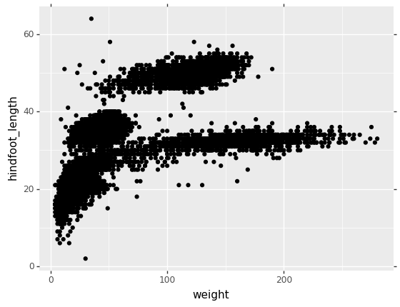


<pre class="output">
<div style="text-align: right; margin: -1em; padding: 0;"><span style="font-size: 0.5em; color: grey">output</span></div>
<code class="text">
<ggplot: (280563425)>
</code>
</pre>


Let's see if we can also include information about species and year.


```python
ggplot(survs_df, aes('weight', 'hindfoot_length',
    size = 'year')) + geom_point()
```


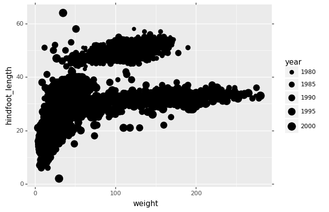


<pre class="output">
<div style="text-align: right; margin: -1em; padding: 0;"><span style="font-size: 0.5em; color: grey">output</span></div>
<code class="text">
<ggplot: (-9223372036574210097)>
</code>
</pre>


Notice that we've dropped the `x=` and `y=` ? These are implied for the first and second argument of `aes()`.


```python
ggplot(survs_df, aes('weight', 'hindfoot_length', 
    size = 'year', color = 'species_id')) + geom_point()
```


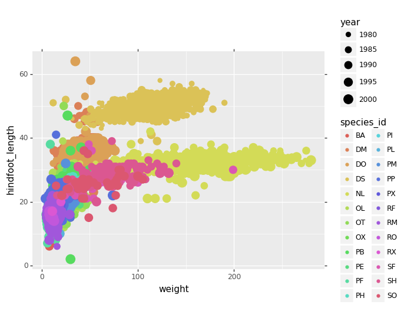


<pre class="output">
<div style="text-align: right; margin: -1em; padding: 0;"><span style="font-size: 0.5em; color: grey">output</span></div>
<code class="text">
<ggplot: (281736768)>
</code>
</pre>


We can do simple counting plot, to see how many observation (data points) we have for each year for example


```python
ggplot(survs_df, aes('year')) + \
    geom_bar(stat = 'count')
```


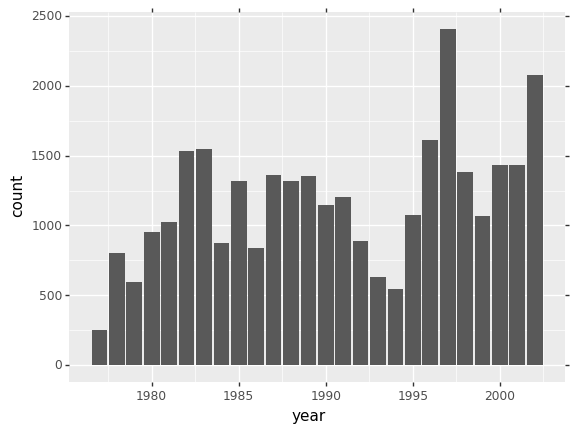


<pre class="output">
<div style="text-align: right; margin: -1em; padding: 0;"><span style="font-size: 0.5em; color: grey">output</span></div>
<code class="text">
<ggplot: (282088147)>
</code>
</pre>


Let's now also color by species to see how many observation we have per species in a given year


```python
ggplot(survs_df, aes('year', fill = 'species_id')) + \
    geom_bar(stat = 'count')
```


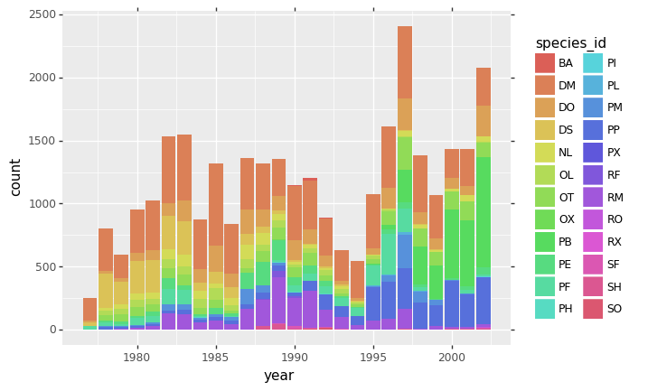


<pre class="output">
<div style="text-align: right; margin: -1em; padding: 0;"><span style="font-size: 0.5em; color: grey">output</span></div>
<code class="text">
<ggplot: (282080064)>
</code>
</pre>


## Challenges

Is there a better visualisation for comparing weight across years? The plot should have categorical data on x axis and continuous on y axis.

Plot a boxplot of `hindfoot_length` across different species (`species_id` column).


<!-- 
## Solution
 -->


<!-- 

```python
# Part 2
ggplot(survs_df, aes('species_id', 'hindfoot_length')) + \
    geom_boxplot() + \
    theme(axis_text_x = element_text(angle=90, hjust=1))
```


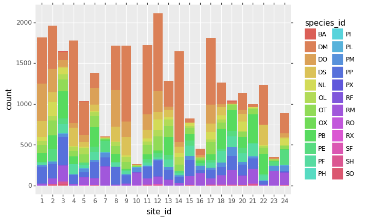


<pre class="output">
<div style="text-align: right; margin: -1em; padding: 0;"><span style="font-size: 0.5em; color: grey">output</span></div>
<code class="text">
<ggplot: (281216923)>
</code>
</pre>


 -->


## More geom types


```python
ggplot(survs_df, aes('year', 'weight')) + \
    geom_boxplot()
```


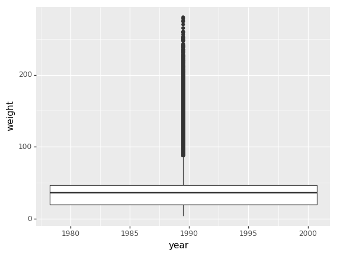


<pre class="output">
<div style="text-align: right; margin: -1em; padding: 0;"><span style="font-size: 0.5em; color: grey">output</span></div>
<code class="text">
<ggplot: (-9223372036573558882)>
</code>
</pre>


Why are we not seeing mulitple boxplots, one for each year?
This is because year variable is continuous in our data frame, but for this purpose we want it to be categorical.


```python
survs_df['year_fact'] = survs_df['year'].astype("category")

ggplot(survs_df, aes('year_fact', 'weight')) + \
    geom_boxplot()
```


<pre class="output">
<div style="text-align: right; margin: -1em; padding: 0;"><span style="font-size: 0.5em; color: grey">output</span></div>
<code class="text">
<ggplot: (282425110)>
</code>
</pre>


You'll notice the x-axis labels are overlapped. To flip them 90-degrees we can apply a `theme` so they look less cluttered. We will revisit themes later.


```python
ggplot(survs_df, aes('year_fact', 'weight')) + \
    geom_boxplot() + \
    theme(axis_text_x = element_text(angle=90, hjust=1))
```


<pre class="output">
<div style="text-align: right; margin: -1em; padding: 0;"><span style="font-size: 0.5em; color: grey">output</span></div>
<code class="text">
<ggplot: (-9223372036573217336)>
</code>
</pre>


To save some typing, let's define this x-axis label rotating theme as a short variable name that we can reuse:


```python
flip_xlabels = theme(axis_text_x = element_text(angle=90, hjust=1))
```


```python
ggplot(survs_df, aes('year_fact', 'weight')) + \
    geom_violin() + \
    flip_xlabels
```


<pre class="output">
<div style="text-align: right; margin: -1em; padding: 0;"><span style="font-size: 0.5em; color: grey">output</span></div>
<code class="text">
<ggplot: (-9223372036582088455)>
</code>
</pre>


To save an image for later:


```python
plt1 = ggplot(survs_df, aes('year_fact', 'weight')) + \
           geom_boxplot() + \
           xlab("Years") + \
           ylab("Weight log2(kg)") + \
           ggtitle("Boxplots, summary of species weight in each year")

ggsave(filename="plot1.png",
       plot=plt1,
       device='png',
       dpi=300,
       height=25,
       width=25)
```

<pre class="output">
<div class="output_label">output</div>
<code class="text">
/Users/asha0035/.local/share/virtualenvs/python-workshop-base-LFzz33nP/lib/python3.6/site-packages/plotnine/ggplot.py:688: UserWarning: Saving 25 x 25 in image.
  from_inches(height, units), units))
/Users/asha0035/.local/share/virtualenvs/python-workshop-base-LFzz33nP/lib/python3.6/site-packages/plotnine/ggplot.py:689: UserWarning: Filename: plot1.png
  warn('Filename: {}'.format(filename))

</code>
</pre>


## Challenges

Can you log2 transform `weight` and plot a "normalised" boxplot ? Hint: use `np.log2()` function and name new column `weight_log`.

Does a log2 transform make this data visualisation better ?


<!-- 
## Solution
 -->


<!-- 

```python
survs_df['weight_log'] = np.log2(survs_df['weight'])
    
ggplot(survs_df, aes('year_fact', 'weight_log')) + \
    geom_boxplot() + \
    xlab("Years") + \
    ylab("Weight log2(kg)") + \
    ggtitle("Boxplots, summary of species wieght in each year") + \
    theme(axis_text_x = element_text(angle=90, hjust=1))
```


<pre class="output">
<div style="text-align: right; margin: -1em; padding: 0;"><span style="font-size: 0.5em; color: grey">output</span></div>
<code class="text">
<ggplot: (280712975)>
</code>
</pre>


 -->


## Faceting

ggplot has a special technique called *faceting* that allows to split one plot
into multiple plots based on a factor included in the dataset. We will use it to
make one plot for a time series for each species.


```python
ggplot(survs_df, aes('year_fact', 'weight')) + \
    geom_boxplot() + \
    facet_wrap(['sex']) + \
    flip_xlabels + \
    theme(axis_text_x = element_text(size=6))
```


<pre class="output">
<div style="text-align: right; margin: -1em; padding: 0;"><span style="font-size: 0.5em; color: grey">output</span></div>
<code class="text">
<ggplot: (281877063)>
</code>
</pre>


```python
ggplot(survs_df, aes('year_fact', 'weight_log')) + \
    geom_boxplot() + \
    theme(axis_text_x = element_text(size=6, angle=90, hjust=1)) + \
    facet_wrap(['species_id']) + \
    flip_xlabels + \
    theme(axis_text_x = element_text(size=8))
```


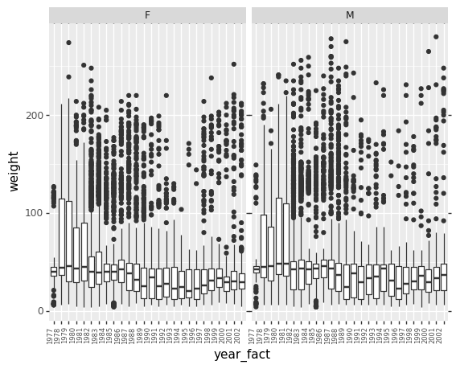


<pre class="output">
<div style="text-align: right; margin: -1em; padding: 0;"><span style="font-size: 0.5em; color: grey">output</span></div>
<code class="text">
<ggplot: (281482132)>
</code>
</pre>


## The "Layered Grammar of Graphics"

```erlang
ggplot(data = <DATA>) + 
  <GEOM_FUNCTION>(
     mapping = aes(<MAPPINGS>),
     stat = <STAT>, 
     position = <POSITION>
  ) +
  <COORDINATE_FUNCTION> +
  <FACET_FUNCTION>
```


## Theming


```python
ggplot(survs_df, aes('year_fact', 'weight')) + \
    geom_boxplot() + \
    theme_bw() + \
    flip_xlabels
```


<pre class="output">
<div style="text-align: right; margin: -1em; padding: 0;"><span style="font-size: 0.5em; color: grey">output</span></div>
<code class="text">
<ggplot: (283768170)>
</code>
</pre>


```python
ggplot(survs_df, aes('year_fact', 'weight_log')) + \
    geom_boxplot() + \
    facet_wrap(['species_id']) + \
    theme_xkcd() + \
    theme(axis_text_x = element_text(size=4, angle=90, hjust=1))
```


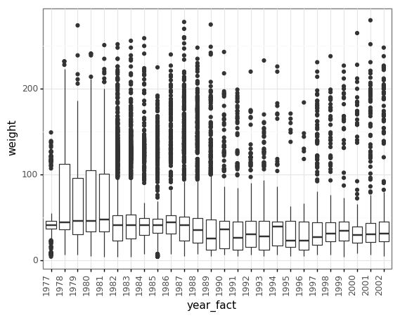


<pre class="output">
<div style="text-align: right; margin: -1em; padding: 0;"><span style="font-size: 0.5em; color: grey">output</span></div>
<code class="text">
<ggplot: (-9223372036573359833)>
</code>
</pre>


## Extra bits 1

Let's try to bin years into decades, which could be crude but might gives simple images to look at.


```python
bins = [(survs_df['year'] < 1980),
        (survs_df['year'] < 1990),
        (survs_df['year'] < 2000),
        (survs_df['year'] >= 2000)]

labels = ['70s', '80s', '90s', 'Z']

survs_df['year_bins'] = np.select(bins, labels)
```


```python
plt2 = ggplot(survs_df, aes('year_bins', 'weight_log')) + \
           geom_boxplot()
plt2
```


<pre class="output">
<div style="text-align: right; margin: -1em; padding: 0;"><span style="font-size: 0.5em; color: grey">output</span></div>
<code class="text">
<ggplot: (-9223372036571930364)>
</code>
</pre>


```python
plt2 = ggplot(survs_df, aes('year_bins', 'weight_log')) + \
           geom_boxplot() + \
           flip_xlabels + \
           facet_wrap(['species_id'])
plt2
```


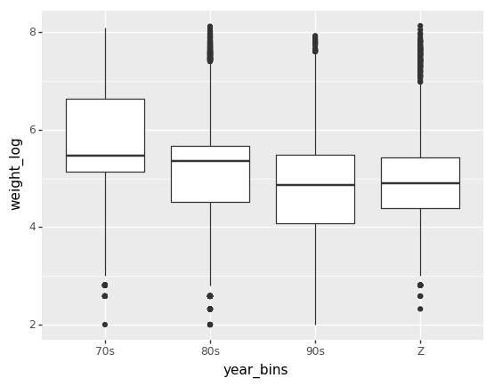


<pre class="output">
<div style="text-align: right; margin: -1em; padding: 0;"><span style="font-size: 0.5em; color: grey">output</span></div>
<code class="text">
<ggplot: (282506097)>
</code>
</pre>


## Extra bits 2

This is a different way to look at your data


```python
ggplot(survs_df, aes("year_fact", "weight")) + \
    stat_summary(fun_y = np.mean, fun_ymin=np.min, fun_ymax=np.max) + \
    theme(axis_text_x = element_text(angle=90, hjust=1))
    
ggplot(survs_df, aes("year_fact", "weight")) + \
    stat_summary(fun_y = np.median, fun_ymin=np.min, fun_ymax=np.max) + \
    theme(axis_text_x = element_text(angle=90, hjust=1))
    
ggplot(survs_df, aes("year_fact", "weight_log")) + \
    stat_summary(fun_y = np.mean, fun_ymin=np.min, fun_ymax=np.max) + \
    theme(axis_text_x = element_text(angle=90, hjust=1))
```


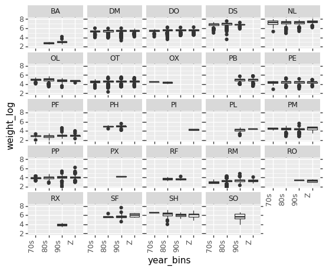


<pre class="output">
<div style="text-align: right; margin: -1em; padding: 0;"><span style="font-size: 0.5em; color: grey">output</span></div>
<code class="text">
<ggplot: (-9223372036572222492)>
</code>
</pre>


