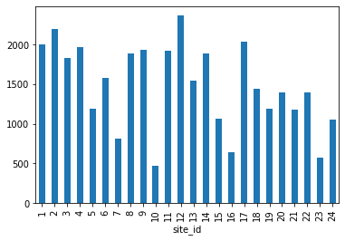
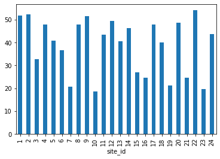
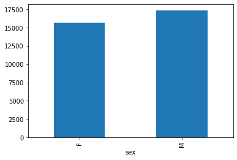
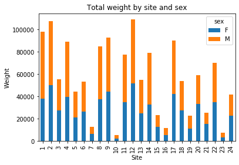

<style>
.output_label {
    text-align: right;
    margin: -1em;
    padding: 0;
    font-size: 0.5em;
    color: grey
}
</style>


# Data Analysis with Python


---


<!-- 
## Instructor notes

*Estimated teaching time:* 30 min

*Estimated challenge time:* 30 min

*Key questions:*

  - "How can I import data in Python ?"
  - "What is Pandas ?"
  - "Why should I use Pandas to work with data ?"
    
*Learning objectives:*

  - "Navigate the workshop directory and download a dataset."
  - "Explain what a library is and what libraries are used for."
  - "Describe what the Python Data Analysis Library (Pandas) is."
  - "Load the Python Data Analysis Library (Pandas)."
  - "Use `read_csv` to read tabular data into Python."
  - "Describe what a DataFrame is in Python."
  - "Access and summarize data stored in a DataFrame."
  - "Define indexing as it relates to data structures."
  - "Perform basic mathematical operations and summary statistics on data in a Pandas DataFrame."
  - "Create simple plots."
 -->


## Automating data analysis tasks in Python

We can automate the process of performing data manipulations in Python. It's efficient to spend time
building the code to perform these tasks because once it's built, we can use it
over and over on different datasets that use a similar format. This makes our
methods easily reproducible. We can also easily share our code with colleagues
and they can replicate the same analysis.

### The Dataset

For this lesson, we will be using the Portal Teaching data, a subset of the data
from Ernst et al
[Long-term monitoring and experimental manipulation of a Chihuahuan Desert ecosystem near Portal, Arizona, USA](http://www.esapubs.org/archive/ecol/E090/118/default.htm)

We will be using this dataset, which can be downloaded here: [surveys.csv](data/surveys.csv) ... but **don't click** to download it in your browser - **we are going to use Python !**


```python
import urllib.request
# You can also get this URL value by right-clicking the `surveys.csv` link above and selecting "Copy Link Address"
url = 'https://monashdatafluency.github.io/python-workshop-base/modules/data/surveys.csv'
# url = 'https://goo.gl/9ZxqBg'  # or a shortened version to save typing
urllib.request.urlretrieve(url, 'surveys.csv')
```


<pre class="output">
<div style="text-align: right; margin: -1em; padding: 0;"><span style="font-size: 0.5em; color: grey">output</span></div>
<code class="text">
('surveys.csv', <http.client.HTTPMessage at 0x1086fa390>)
</code>
</pre>


If Jupyter is running locally on your computer, you'll now have a file `surveys.csv` in the current working directory.
You can check by clicking on `File` tab on the top left of the notebook to see if the file exists. If you are running Jupyter on a remote server or cloud service (eg Colaboratory or Azure Notebooks), the file will be there instead.


We are studying the species and weight of animals caught in plots in our study
area. The dataset is stored as a `.csv` file: each row holds information for a
single animal, and the columns represent:

| Column           | Description                        |
|------------------|------------------------------------|
| record_id        | Unique id for the observation      |
| month            | month of observation               |
| day              | day of observation                 |
| year             | year of observation                |
| site_id          | ID of a particular plot            |
| species_id       | 2-letter code                      |
| sex              | sex of animal ("M", "F")           |
| hindfoot_length  | length of the hindfoot in mm       |
| weight           | weight of the animal in grams      |


The first few rows of our file look like this:

```
record_id,month,day,year,site_id,species_id,sex,hindfoot_length,weight
1,7,16,1977,2,NL,M,32,
2,7,16,1977,3,NL,M,33,
3,7,16,1977,2,DM,F,37,
4,7,16,1977,7,DM,M,36,
5,7,16,1977,3,DM,M,35,
6,7,16,1977,1,PF,M,14,
7,7,16,1977,2,PE,F,,
8,7,16,1977,1,DM,M,37,
9,7,16,1977,1,DM,F,34,
```

---


## About Libraries

A library in Python contains a set of tools (called functions) that perform
tasks on our data. Importing a library is like getting a piece of lab equipment
out of a storage locker and setting it up on the bench for use in a project.
Once a library is set up, it can be used or called to perform many tasks.

If you have noticed in the previous code `import urllib.request`, we are calling 
a **request** function from library **urllib** to download our dataset from web.


## Pandas in Python
The dataset we have, is in table format. One of the best options for working with tabular data in Python is to use the
[Python Data Analysis Library](http://pandas.pydata.org/) (a.k.a. Pandas). The
Pandas library provides data structures, produces high quality plots with
[matplotlib](http://matplotlib.org/) and integrates nicely with other libraries
that use [NumPy](http://www.numpy.org/) (which is another Python library) arrays.

First, lets make sure the Pandas and matplotlib packages are **installed**.


```python
!pip install pandas matplotlib
```

<pre class="output">
<div class="output_label">output</div>
<code class="text">
Requirement already satisfied: pandas in /Users/perry/.virtualenvs/python-workshop-base-ufuVBSbV/lib/python3.6/site-packages (0.23.0)
Requirement already satisfied: matplotlib in /Users/perry/.virtualenvs/python-workshop-base-ufuVBSbV/lib/python3.6/site-packages (2.2.2)
Requirement already satisfied: numpy>=1.9.0 in /Users/perry/.virtualenvs/python-workshop-base-ufuVBSbV/lib/python3.6/site-packages (from pandas) (1.14.3)
Requirement already satisfied: pytz>=2011k in /Users/perry/.virtualenvs/python-workshop-base-ufuVBSbV/lib/python3.6/site-packages (from pandas) (2018.4)
Requirement already satisfied: python-dateutil>=2.5.0 in /Users/perry/.virtualenvs/python-workshop-base-ufuVBSbV/lib/python3.6/site-packages (from pandas) (2.7.3)
Requirement already satisfied: kiwisolver>=1.0.1 in /Users/perry/.virtualenvs/python-workshop-base-ufuVBSbV/lib/python3.6/site-packages (from matplotlib) (1.0.1)
Requirement already satisfied: cycler>=0.10 in /Users/perry/.virtualenvs/python-workshop-base-ufuVBSbV/lib/python3.6/site-packages (from matplotlib) (0.10.0)
Requirement already satisfied: six>=1.10 in /Users/perry/.virtualenvs/python-workshop-base-ufuVBSbV/lib/python3.6/site-packages (from matplotlib) (1.11.0)
Requirement already satisfied: pyparsing!=2.0.4,!=2.1.2,!=2.1.6,>=2.0.1 in /Users/perry/.virtualenvs/python-workshop-base-ufuVBSbV/lib/python3.6/site-packages (from matplotlib) (2.2.0)
Requirement already satisfied: setuptools in /Users/perry/.virtualenvs/python-workshop-base-ufuVBSbV/lib/python3.6/site-packages (from kiwisolver>=1.0.1->matplotlib) (39.1.0)

</code>
</pre>


Python doesn't load all of the libraries available to it by default. We have to
add an `import` statement to our code in order to use library functions. To import
a library, we use the syntax `import libraryName`. If we want to give the
library a nickname to shorten the command, we can add `as nickNameHere`.  An
example of importing the pandas library using the common nickname `pd` is below.


```python
import pandas as pd
```


Each time we call a function that's in a library, we use the syntax
`LibraryName.FunctionName`. Adding the library name with a `.` before the
function name tells Python where to find the function. In the example above, we
have imported Pandas as `pd`. This means we don't have to type out `pandas` each
time we call a Pandas function.


# Reading CSV Data Using Pandas

We will begin by locating and reading our survey data which are in CSV format. CSV stands for Comma-Separated Values and is a common way store formatted data. Other symbols my also be used, so you might see tab-separated, colon-separated or space separated files. It is quite easy to replace one separator with another, to match your application. The first line in the file often has headers to explain what is in each column. CSV (and other separators) make it easy to share data, and can be imported and exported from many applications, including Microsoft Excel.

We can use Pandas' `read_csv` function to pull the file directly into a
[DataFrame](http://pandas.pydata.org/pandas-docs/stable/dsintro.html#dataframe).


## So What's a DataFrame?

A DataFrame is a 2-dimensional data structure that can store data of different
types (including characters, integers, floating point values, factors and more)
in columns. It is similar to a spreadsheet or an SQL table or the `data.frame` in
R. A DataFrame always has an index (0-based). An index refers to the position of
an element in the data structure.


```python
# Note that pd.read_csv is used because we imported pandas as pd
pd.read_csv("surveys.csv")
```


<div>
<style scoped>
    .dataframe tbody tr th:only-of-type {
        vertical-align: middle;
    }

    .dataframe tbody tr th {
        vertical-align: top;
    }

    .dataframe thead th {
        text-align: right;
    }
</style>
<table border="1" class="dataframe">
  <thead>
    <tr style="text-align: right;">
      <th></th>
      <th>record_id</th>
      <th>month</th>
      <th>day</th>
      <th>year</th>
      <th>site_id</th>
      <th>species_id</th>
      <th>sex</th>
      <th>hindfoot_length</th>
      <th>weight</th>
    </tr>
  </thead>
  <tbody>
    <tr>
      <th>0</th>
      <td>1</td>
      <td>7</td>
      <td>16</td>
      <td>1977</td>
      <td>2</td>
      <td>NL</td>
      <td>M</td>
      <td>32.0</td>
      <td>NaN</td>
    </tr>
    <tr>
      <th>1</th>
      <td>2</td>
      <td>7</td>
      <td>16</td>
      <td>1977</td>
      <td>3</td>
      <td>NL</td>
      <td>M</td>
      <td>33.0</td>
      <td>NaN</td>
    </tr>
    <tr>
      <th>2</th>
      <td>3</td>
      <td>7</td>
      <td>16</td>
      <td>1977</td>
      <td>2</td>
      <td>DM</td>
      <td>F</td>
      <td>37.0</td>
      <td>NaN</td>
    </tr>
    <tr>
      <th>3</th>
      <td>4</td>
      <td>7</td>
      <td>16</td>
      <td>1977</td>
      <td>7</td>
      <td>DM</td>
      <td>M</td>
      <td>36.0</td>
      <td>NaN</td>
    </tr>
    <tr>
      <th>4</th>
      <td>5</td>
      <td>7</td>
      <td>16</td>
      <td>1977</td>
      <td>3</td>
      <td>DM</td>
      <td>M</td>
      <td>35.0</td>
      <td>NaN</td>
    </tr>
    <tr>
      <th>5</th>
      <td>6</td>
      <td>7</td>
      <td>16</td>
      <td>1977</td>
      <td>1</td>
      <td>PF</td>
      <td>M</td>
      <td>14.0</td>
      <td>NaN</td>
    </tr>
    <tr>
      <th>6</th>
      <td>7</td>
      <td>7</td>
      <td>16</td>
      <td>1977</td>
      <td>2</td>
      <td>PE</td>
      <td>F</td>
      <td>NaN</td>
      <td>NaN</td>
    </tr>
    <tr>
      <th>7</th>
      <td>8</td>
      <td>7</td>
      <td>16</td>
      <td>1977</td>
      <td>1</td>
      <td>DM</td>
      <td>M</td>
      <td>37.0</td>
      <td>NaN</td>
    </tr>
    <tr>
      <th>8</th>
      <td>9</td>
      <td>7</td>
      <td>16</td>
      <td>1977</td>
      <td>1</td>
      <td>DM</td>
      <td>F</td>
      <td>34.0</td>
      <td>NaN</td>
    </tr>
    <tr>
      <th>9</th>
      <td>10</td>
      <td>7</td>
      <td>16</td>
      <td>1977</td>
      <td>6</td>
      <td>PF</td>
      <td>F</td>
      <td>20.0</td>
      <td>NaN</td>
    </tr>
    <tr>
      <th>10</th>
      <td>11</td>
      <td>7</td>
      <td>16</td>
      <td>1977</td>
      <td>5</td>
      <td>DS</td>
      <td>F</td>
      <td>53.0</td>
      <td>NaN</td>
    </tr>
    <tr>
      <th>11</th>
      <td>12</td>
      <td>7</td>
      <td>16</td>
      <td>1977</td>
      <td>7</td>
      <td>DM</td>
      <td>M</td>
      <td>38.0</td>
      <td>NaN</td>
    </tr>
    <tr>
      <th>12</th>
      <td>13</td>
      <td>7</td>
      <td>16</td>
      <td>1977</td>
      <td>3</td>
      <td>DM</td>
      <td>M</td>
      <td>35.0</td>
      <td>NaN</td>
    </tr>
    <tr>
      <th>13</th>
      <td>14</td>
      <td>7</td>
      <td>16</td>
      <td>1977</td>
      <td>8</td>
      <td>DM</td>
      <td>NaN</td>
      <td>NaN</td>
      <td>NaN</td>
    </tr>
    <tr>
      <th>14</th>
      <td>15</td>
      <td>7</td>
      <td>16</td>
      <td>1977</td>
      <td>6</td>
      <td>DM</td>
      <td>F</td>
      <td>36.0</td>
      <td>NaN</td>
    </tr>
    <tr>
      <th>15</th>
      <td>16</td>
      <td>7</td>
      <td>16</td>
      <td>1977</td>
      <td>4</td>
      <td>DM</td>
      <td>F</td>
      <td>36.0</td>
      <td>NaN</td>
    </tr>
    <tr>
      <th>16</th>
      <td>17</td>
      <td>7</td>
      <td>16</td>
      <td>1977</td>
      <td>3</td>
      <td>DS</td>
      <td>F</td>
      <td>48.0</td>
      <td>NaN</td>
    </tr>
    <tr>
      <th>17</th>
      <td>18</td>
      <td>7</td>
      <td>16</td>
      <td>1977</td>
      <td>2</td>
      <td>PP</td>
      <td>M</td>
      <td>22.0</td>
      <td>NaN</td>
    </tr>
    <tr>
      <th>18</th>
      <td>19</td>
      <td>7</td>
      <td>16</td>
      <td>1977</td>
      <td>4</td>
      <td>PF</td>
      <td>NaN</td>
      <td>NaN</td>
      <td>NaN</td>
    </tr>
    <tr>
      <th>19</th>
      <td>20</td>
      <td>7</td>
      <td>17</td>
      <td>1977</td>
      <td>11</td>
      <td>DS</td>
      <td>F</td>
      <td>48.0</td>
      <td>NaN</td>
    </tr>
    <tr>
      <th>20</th>
      <td>21</td>
      <td>7</td>
      <td>17</td>
      <td>1977</td>
      <td>14</td>
      <td>DM</td>
      <td>F</td>
      <td>34.0</td>
      <td>NaN</td>
    </tr>
    <tr>
      <th>21</th>
      <td>22</td>
      <td>7</td>
      <td>17</td>
      <td>1977</td>
      <td>15</td>
      <td>NL</td>
      <td>F</td>
      <td>31.0</td>
      <td>NaN</td>
    </tr>
    <tr>
      <th>22</th>
      <td>23</td>
      <td>7</td>
      <td>17</td>
      <td>1977</td>
      <td>13</td>
      <td>DM</td>
      <td>M</td>
      <td>36.0</td>
      <td>NaN</td>
    </tr>
    <tr>
      <th>23</th>
      <td>24</td>
      <td>7</td>
      <td>17</td>
      <td>1977</td>
      <td>13</td>
      <td>SH</td>
      <td>M</td>
      <td>21.0</td>
      <td>NaN</td>
    </tr>
    <tr>
      <th>24</th>
      <td>25</td>
      <td>7</td>
      <td>17</td>
      <td>1977</td>
      <td>9</td>
      <td>DM</td>
      <td>M</td>
      <td>35.0</td>
      <td>NaN</td>
    </tr>
    <tr>
      <th>25</th>
      <td>26</td>
      <td>7</td>
      <td>17</td>
      <td>1977</td>
      <td>15</td>
      <td>DM</td>
      <td>M</td>
      <td>31.0</td>
      <td>NaN</td>
    </tr>
    <tr>
      <th>26</th>
      <td>27</td>
      <td>7</td>
      <td>17</td>
      <td>1977</td>
      <td>15</td>
      <td>DM</td>
      <td>M</td>
      <td>36.0</td>
      <td>NaN</td>
    </tr>
    <tr>
      <th>27</th>
      <td>28</td>
      <td>7</td>
      <td>17</td>
      <td>1977</td>
      <td>11</td>
      <td>DM</td>
      <td>M</td>
      <td>38.0</td>
      <td>NaN</td>
    </tr>
    <tr>
      <th>28</th>
      <td>29</td>
      <td>7</td>
      <td>17</td>
      <td>1977</td>
      <td>11</td>
      <td>PP</td>
      <td>M</td>
      <td>NaN</td>
      <td>NaN</td>
    </tr>
    <tr>
      <th>29</th>
      <td>30</td>
      <td>7</td>
      <td>17</td>
      <td>1977</td>
      <td>10</td>
      <td>DS</td>
      <td>F</td>
      <td>52.0</td>
      <td>NaN</td>
    </tr>
    <tr>
      <th>...</th>
      <td>...</td>
      <td>...</td>
      <td>...</td>
      <td>...</td>
      <td>...</td>
      <td>...</td>
      <td>...</td>
      <td>...</td>
      <td>...</td>
    </tr>
    <tr>
      <th>35519</th>
      <td>35520</td>
      <td>12</td>
      <td>31</td>
      <td>2002</td>
      <td>9</td>
      <td>SF</td>
      <td>NaN</td>
      <td>24.0</td>
      <td>36.0</td>
    </tr>
    <tr>
      <th>35520</th>
      <td>35521</td>
      <td>12</td>
      <td>31</td>
      <td>2002</td>
      <td>9</td>
      <td>DM</td>
      <td>M</td>
      <td>37.0</td>
      <td>48.0</td>
    </tr>
    <tr>
      <th>35521</th>
      <td>35522</td>
      <td>12</td>
      <td>31</td>
      <td>2002</td>
      <td>9</td>
      <td>DM</td>
      <td>F</td>
      <td>35.0</td>
      <td>45.0</td>
    </tr>
    <tr>
      <th>35522</th>
      <td>35523</td>
      <td>12</td>
      <td>31</td>
      <td>2002</td>
      <td>9</td>
      <td>DM</td>
      <td>F</td>
      <td>36.0</td>
      <td>44.0</td>
    </tr>
    <tr>
      <th>35523</th>
      <td>35524</td>
      <td>12</td>
      <td>31</td>
      <td>2002</td>
      <td>9</td>
      <td>PB</td>
      <td>F</td>
      <td>25.0</td>
      <td>27.0</td>
    </tr>
    <tr>
      <th>35524</th>
      <td>35525</td>
      <td>12</td>
      <td>31</td>
      <td>2002</td>
      <td>9</td>
      <td>OL</td>
      <td>M</td>
      <td>21.0</td>
      <td>26.0</td>
    </tr>
    <tr>
      <th>35525</th>
      <td>35526</td>
      <td>12</td>
      <td>31</td>
      <td>2002</td>
      <td>8</td>
      <td>OT</td>
      <td>F</td>
      <td>20.0</td>
      <td>24.0</td>
    </tr>
    <tr>
      <th>35526</th>
      <td>35527</td>
      <td>12</td>
      <td>31</td>
      <td>2002</td>
      <td>13</td>
      <td>DO</td>
      <td>F</td>
      <td>33.0</td>
      <td>43.0</td>
    </tr>
    <tr>
      <th>35527</th>
      <td>35528</td>
      <td>12</td>
      <td>31</td>
      <td>2002</td>
      <td>13</td>
      <td>US</td>
      <td>NaN</td>
      <td>NaN</td>
      <td>NaN</td>
    </tr>
    <tr>
      <th>35528</th>
      <td>35529</td>
      <td>12</td>
      <td>31</td>
      <td>2002</td>
      <td>13</td>
      <td>PB</td>
      <td>F</td>
      <td>25.0</td>
      <td>25.0</td>
    </tr>
    <tr>
      <th>35529</th>
      <td>35530</td>
      <td>12</td>
      <td>31</td>
      <td>2002</td>
      <td>13</td>
      <td>OT</td>
      <td>F</td>
      <td>20.0</td>
      <td>NaN</td>
    </tr>
    <tr>
      <th>35530</th>
      <td>35531</td>
      <td>12</td>
      <td>31</td>
      <td>2002</td>
      <td>13</td>
      <td>PB</td>
      <td>F</td>
      <td>27.0</td>
      <td>NaN</td>
    </tr>
    <tr>
      <th>35531</th>
      <td>35532</td>
      <td>12</td>
      <td>31</td>
      <td>2002</td>
      <td>14</td>
      <td>DM</td>
      <td>F</td>
      <td>34.0</td>
      <td>43.0</td>
    </tr>
    <tr>
      <th>35532</th>
      <td>35533</td>
      <td>12</td>
      <td>31</td>
      <td>2002</td>
      <td>14</td>
      <td>DM</td>
      <td>F</td>
      <td>36.0</td>
      <td>48.0</td>
    </tr>
    <tr>
      <th>35533</th>
      <td>35534</td>
      <td>12</td>
      <td>31</td>
      <td>2002</td>
      <td>14</td>
      <td>DM</td>
      <td>M</td>
      <td>37.0</td>
      <td>56.0</td>
    </tr>
    <tr>
      <th>35534</th>
      <td>35535</td>
      <td>12</td>
      <td>31</td>
      <td>2002</td>
      <td>14</td>
      <td>DM</td>
      <td>M</td>
      <td>37.0</td>
      <td>53.0</td>
    </tr>
    <tr>
      <th>35535</th>
      <td>35536</td>
      <td>12</td>
      <td>31</td>
      <td>2002</td>
      <td>14</td>
      <td>DM</td>
      <td>F</td>
      <td>35.0</td>
      <td>42.0</td>
    </tr>
    <tr>
      <th>35536</th>
      <td>35537</td>
      <td>12</td>
      <td>31</td>
      <td>2002</td>
      <td>14</td>
      <td>DM</td>
      <td>F</td>
      <td>36.0</td>
      <td>46.0</td>
    </tr>
    <tr>
      <th>35537</th>
      <td>35538</td>
      <td>12</td>
      <td>31</td>
      <td>2002</td>
      <td>15</td>
      <td>PB</td>
      <td>F</td>
      <td>26.0</td>
      <td>31.0</td>
    </tr>
    <tr>
      <th>35538</th>
      <td>35539</td>
      <td>12</td>
      <td>31</td>
      <td>2002</td>
      <td>15</td>
      <td>SF</td>
      <td>M</td>
      <td>26.0</td>
      <td>68.0</td>
    </tr>
    <tr>
      <th>35539</th>
      <td>35540</td>
      <td>12</td>
      <td>31</td>
      <td>2002</td>
      <td>15</td>
      <td>PB</td>
      <td>F</td>
      <td>26.0</td>
      <td>23.0</td>
    </tr>
    <tr>
      <th>35540</th>
      <td>35541</td>
      <td>12</td>
      <td>31</td>
      <td>2002</td>
      <td>15</td>
      <td>PB</td>
      <td>F</td>
      <td>24.0</td>
      <td>31.0</td>
    </tr>
    <tr>
      <th>35541</th>
      <td>35542</td>
      <td>12</td>
      <td>31</td>
      <td>2002</td>
      <td>15</td>
      <td>PB</td>
      <td>F</td>
      <td>26.0</td>
      <td>29.0</td>
    </tr>
    <tr>
      <th>35542</th>
      <td>35543</td>
      <td>12</td>
      <td>31</td>
      <td>2002</td>
      <td>15</td>
      <td>PB</td>
      <td>F</td>
      <td>27.0</td>
      <td>34.0</td>
    </tr>
    <tr>
      <th>35543</th>
      <td>35544</td>
      <td>12</td>
      <td>31</td>
      <td>2002</td>
      <td>15</td>
      <td>US</td>
      <td>NaN</td>
      <td>NaN</td>
      <td>NaN</td>
    </tr>
    <tr>
      <th>35544</th>
      <td>35545</td>
      <td>12</td>
      <td>31</td>
      <td>2002</td>
      <td>15</td>
      <td>AH</td>
      <td>NaN</td>
      <td>NaN</td>
      <td>NaN</td>
    </tr>
    <tr>
      <th>35545</th>
      <td>35546</td>
      <td>12</td>
      <td>31</td>
      <td>2002</td>
      <td>15</td>
      <td>AH</td>
      <td>NaN</td>
      <td>NaN</td>
      <td>NaN</td>
    </tr>
    <tr>
      <th>35546</th>
      <td>35547</td>
      <td>12</td>
      <td>31</td>
      <td>2002</td>
      <td>10</td>
      <td>RM</td>
      <td>F</td>
      <td>15.0</td>
      <td>14.0</td>
    </tr>
    <tr>
      <th>35547</th>
      <td>35548</td>
      <td>12</td>
      <td>31</td>
      <td>2002</td>
      <td>7</td>
      <td>DO</td>
      <td>M</td>
      <td>36.0</td>
      <td>51.0</td>
    </tr>
    <tr>
      <th>35548</th>
      <td>35549</td>
      <td>12</td>
      <td>31</td>
      <td>2002</td>
      <td>5</td>
      <td>NaN</td>
      <td>NaN</td>
      <td>NaN</td>
      <td>NaN</td>
    </tr>
  </tbody>
</table>
<p>35549 rows × 9 columns</p>
</div>


The above command outputs a `DateFrame` object, which Jupyter displays as a table (snipped in the middle since there are many rows).

We can see that there were 33,549 rows parsed. Each row has 9
columns. The first column is the index of the DataFrame. The index is used to
identify the position of the data, but it is not an actual column of the DataFrame.
It looks like  the `read_csv` function in Pandas  read our file properly. However,
we haven't saved any data to memory so we can work with it.We need to assign the
DataFrame to a variable. Remember that a variable is a name for a value, such as `x`,
or `data`. We can create a new  object with a variable name by assigning a value to it using `=`.

Let's call the imported survey data `surveys_df`:


```python
surveys_df = pd.read_csv("surveys.csv")
```


Notice when you assign the imported DataFrame to a variable, Python does not
produce any output on the screen. We can view the value of the `surveys_df`
object by typing its name into the cell.


```python
surveys_df
```


<div>
<style scoped>
    .dataframe tbody tr th:only-of-type {
        vertical-align: middle;
    }

    .dataframe tbody tr th {
        vertical-align: top;
    }

    .dataframe thead th {
        text-align: right;
    }
</style>
<table border="1" class="dataframe">
  <thead>
    <tr style="text-align: right;">
      <th></th>
      <th>record_id</th>
      <th>month</th>
      <th>day</th>
      <th>year</th>
      <th>site_id</th>
      <th>species_id</th>
      <th>sex</th>
      <th>hindfoot_length</th>
      <th>weight</th>
    </tr>
  </thead>
  <tbody>
    <tr>
      <th>0</th>
      <td>1</td>
      <td>7</td>
      <td>16</td>
      <td>1977</td>
      <td>2</td>
      <td>NL</td>
      <td>M</td>
      <td>32.0</td>
      <td>NaN</td>
    </tr>
    <tr>
      <th>1</th>
      <td>2</td>
      <td>7</td>
      <td>16</td>
      <td>1977</td>
      <td>3</td>
      <td>NL</td>
      <td>M</td>
      <td>33.0</td>
      <td>NaN</td>
    </tr>
    <tr>
      <th>2</th>
      <td>3</td>
      <td>7</td>
      <td>16</td>
      <td>1977</td>
      <td>2</td>
      <td>DM</td>
      <td>F</td>
      <td>37.0</td>
      <td>NaN</td>
    </tr>
    <tr>
      <th>3</th>
      <td>4</td>
      <td>7</td>
      <td>16</td>
      <td>1977</td>
      <td>7</td>
      <td>DM</td>
      <td>M</td>
      <td>36.0</td>
      <td>NaN</td>
    </tr>
    <tr>
      <th>4</th>
      <td>5</td>
      <td>7</td>
      <td>16</td>
      <td>1977</td>
      <td>3</td>
      <td>DM</td>
      <td>M</td>
      <td>35.0</td>
      <td>NaN</td>
    </tr>
    <tr>
      <th>5</th>
      <td>6</td>
      <td>7</td>
      <td>16</td>
      <td>1977</td>
      <td>1</td>
      <td>PF</td>
      <td>M</td>
      <td>14.0</td>
      <td>NaN</td>
    </tr>
    <tr>
      <th>6</th>
      <td>7</td>
      <td>7</td>
      <td>16</td>
      <td>1977</td>
      <td>2</td>
      <td>PE</td>
      <td>F</td>
      <td>NaN</td>
      <td>NaN</td>
    </tr>
    <tr>
      <th>7</th>
      <td>8</td>
      <td>7</td>
      <td>16</td>
      <td>1977</td>
      <td>1</td>
      <td>DM</td>
      <td>M</td>
      <td>37.0</td>
      <td>NaN</td>
    </tr>
    <tr>
      <th>8</th>
      <td>9</td>
      <td>7</td>
      <td>16</td>
      <td>1977</td>
      <td>1</td>
      <td>DM</td>
      <td>F</td>
      <td>34.0</td>
      <td>NaN</td>
    </tr>
    <tr>
      <th>9</th>
      <td>10</td>
      <td>7</td>
      <td>16</td>
      <td>1977</td>
      <td>6</td>
      <td>PF</td>
      <td>F</td>
      <td>20.0</td>
      <td>NaN</td>
    </tr>
    <tr>
      <th>10</th>
      <td>11</td>
      <td>7</td>
      <td>16</td>
      <td>1977</td>
      <td>5</td>
      <td>DS</td>
      <td>F</td>
      <td>53.0</td>
      <td>NaN</td>
    </tr>
    <tr>
      <th>11</th>
      <td>12</td>
      <td>7</td>
      <td>16</td>
      <td>1977</td>
      <td>7</td>
      <td>DM</td>
      <td>M</td>
      <td>38.0</td>
      <td>NaN</td>
    </tr>
    <tr>
      <th>12</th>
      <td>13</td>
      <td>7</td>
      <td>16</td>
      <td>1977</td>
      <td>3</td>
      <td>DM</td>
      <td>M</td>
      <td>35.0</td>
      <td>NaN</td>
    </tr>
    <tr>
      <th>13</th>
      <td>14</td>
      <td>7</td>
      <td>16</td>
      <td>1977</td>
      <td>8</td>
      <td>DM</td>
      <td>NaN</td>
      <td>NaN</td>
      <td>NaN</td>
    </tr>
    <tr>
      <th>14</th>
      <td>15</td>
      <td>7</td>
      <td>16</td>
      <td>1977</td>
      <td>6</td>
      <td>DM</td>
      <td>F</td>
      <td>36.0</td>
      <td>NaN</td>
    </tr>
    <tr>
      <th>15</th>
      <td>16</td>
      <td>7</td>
      <td>16</td>
      <td>1977</td>
      <td>4</td>
      <td>DM</td>
      <td>F</td>
      <td>36.0</td>
      <td>NaN</td>
    </tr>
    <tr>
      <th>16</th>
      <td>17</td>
      <td>7</td>
      <td>16</td>
      <td>1977</td>
      <td>3</td>
      <td>DS</td>
      <td>F</td>
      <td>48.0</td>
      <td>NaN</td>
    </tr>
    <tr>
      <th>17</th>
      <td>18</td>
      <td>7</td>
      <td>16</td>
      <td>1977</td>
      <td>2</td>
      <td>PP</td>
      <td>M</td>
      <td>22.0</td>
      <td>NaN</td>
    </tr>
    <tr>
      <th>18</th>
      <td>19</td>
      <td>7</td>
      <td>16</td>
      <td>1977</td>
      <td>4</td>
      <td>PF</td>
      <td>NaN</td>
      <td>NaN</td>
      <td>NaN</td>
    </tr>
    <tr>
      <th>19</th>
      <td>20</td>
      <td>7</td>
      <td>17</td>
      <td>1977</td>
      <td>11</td>
      <td>DS</td>
      <td>F</td>
      <td>48.0</td>
      <td>NaN</td>
    </tr>
    <tr>
      <th>20</th>
      <td>21</td>
      <td>7</td>
      <td>17</td>
      <td>1977</td>
      <td>14</td>
      <td>DM</td>
      <td>F</td>
      <td>34.0</td>
      <td>NaN</td>
    </tr>
    <tr>
      <th>21</th>
      <td>22</td>
      <td>7</td>
      <td>17</td>
      <td>1977</td>
      <td>15</td>
      <td>NL</td>
      <td>F</td>
      <td>31.0</td>
      <td>NaN</td>
    </tr>
    <tr>
      <th>22</th>
      <td>23</td>
      <td>7</td>
      <td>17</td>
      <td>1977</td>
      <td>13</td>
      <td>DM</td>
      <td>M</td>
      <td>36.0</td>
      <td>NaN</td>
    </tr>
    <tr>
      <th>23</th>
      <td>24</td>
      <td>7</td>
      <td>17</td>
      <td>1977</td>
      <td>13</td>
      <td>SH</td>
      <td>M</td>
      <td>21.0</td>
      <td>NaN</td>
    </tr>
    <tr>
      <th>24</th>
      <td>25</td>
      <td>7</td>
      <td>17</td>
      <td>1977</td>
      <td>9</td>
      <td>DM</td>
      <td>M</td>
      <td>35.0</td>
      <td>NaN</td>
    </tr>
    <tr>
      <th>25</th>
      <td>26</td>
      <td>7</td>
      <td>17</td>
      <td>1977</td>
      <td>15</td>
      <td>DM</td>
      <td>M</td>
      <td>31.0</td>
      <td>NaN</td>
    </tr>
    <tr>
      <th>26</th>
      <td>27</td>
      <td>7</td>
      <td>17</td>
      <td>1977</td>
      <td>15</td>
      <td>DM</td>
      <td>M</td>
      <td>36.0</td>
      <td>NaN</td>
    </tr>
    <tr>
      <th>27</th>
      <td>28</td>
      <td>7</td>
      <td>17</td>
      <td>1977</td>
      <td>11</td>
      <td>DM</td>
      <td>M</td>
      <td>38.0</td>
      <td>NaN</td>
    </tr>
    <tr>
      <th>28</th>
      <td>29</td>
      <td>7</td>
      <td>17</td>
      <td>1977</td>
      <td>11</td>
      <td>PP</td>
      <td>M</td>
      <td>NaN</td>
      <td>NaN</td>
    </tr>
    <tr>
      <th>29</th>
      <td>30</td>
      <td>7</td>
      <td>17</td>
      <td>1977</td>
      <td>10</td>
      <td>DS</td>
      <td>F</td>
      <td>52.0</td>
      <td>NaN</td>
    </tr>
    <tr>
      <th>...</th>
      <td>...</td>
      <td>...</td>
      <td>...</td>
      <td>...</td>
      <td>...</td>
      <td>...</td>
      <td>...</td>
      <td>...</td>
      <td>...</td>
    </tr>
    <tr>
      <th>35519</th>
      <td>35520</td>
      <td>12</td>
      <td>31</td>
      <td>2002</td>
      <td>9</td>
      <td>SF</td>
      <td>NaN</td>
      <td>24.0</td>
      <td>36.0</td>
    </tr>
    <tr>
      <th>35520</th>
      <td>35521</td>
      <td>12</td>
      <td>31</td>
      <td>2002</td>
      <td>9</td>
      <td>DM</td>
      <td>M</td>
      <td>37.0</td>
      <td>48.0</td>
    </tr>
    <tr>
      <th>35521</th>
      <td>35522</td>
      <td>12</td>
      <td>31</td>
      <td>2002</td>
      <td>9</td>
      <td>DM</td>
      <td>F</td>
      <td>35.0</td>
      <td>45.0</td>
    </tr>
    <tr>
      <th>35522</th>
      <td>35523</td>
      <td>12</td>
      <td>31</td>
      <td>2002</td>
      <td>9</td>
      <td>DM</td>
      <td>F</td>
      <td>36.0</td>
      <td>44.0</td>
    </tr>
    <tr>
      <th>35523</th>
      <td>35524</td>
      <td>12</td>
      <td>31</td>
      <td>2002</td>
      <td>9</td>
      <td>PB</td>
      <td>F</td>
      <td>25.0</td>
      <td>27.0</td>
    </tr>
    <tr>
      <th>35524</th>
      <td>35525</td>
      <td>12</td>
      <td>31</td>
      <td>2002</td>
      <td>9</td>
      <td>OL</td>
      <td>M</td>
      <td>21.0</td>
      <td>26.0</td>
    </tr>
    <tr>
      <th>35525</th>
      <td>35526</td>
      <td>12</td>
      <td>31</td>
      <td>2002</td>
      <td>8</td>
      <td>OT</td>
      <td>F</td>
      <td>20.0</td>
      <td>24.0</td>
    </tr>
    <tr>
      <th>35526</th>
      <td>35527</td>
      <td>12</td>
      <td>31</td>
      <td>2002</td>
      <td>13</td>
      <td>DO</td>
      <td>F</td>
      <td>33.0</td>
      <td>43.0</td>
    </tr>
    <tr>
      <th>35527</th>
      <td>35528</td>
      <td>12</td>
      <td>31</td>
      <td>2002</td>
      <td>13</td>
      <td>US</td>
      <td>NaN</td>
      <td>NaN</td>
      <td>NaN</td>
    </tr>
    <tr>
      <th>35528</th>
      <td>35529</td>
      <td>12</td>
      <td>31</td>
      <td>2002</td>
      <td>13</td>
      <td>PB</td>
      <td>F</td>
      <td>25.0</td>
      <td>25.0</td>
    </tr>
    <tr>
      <th>35529</th>
      <td>35530</td>
      <td>12</td>
      <td>31</td>
      <td>2002</td>
      <td>13</td>
      <td>OT</td>
      <td>F</td>
      <td>20.0</td>
      <td>NaN</td>
    </tr>
    <tr>
      <th>35530</th>
      <td>35531</td>
      <td>12</td>
      <td>31</td>
      <td>2002</td>
      <td>13</td>
      <td>PB</td>
      <td>F</td>
      <td>27.0</td>
      <td>NaN</td>
    </tr>
    <tr>
      <th>35531</th>
      <td>35532</td>
      <td>12</td>
      <td>31</td>
      <td>2002</td>
      <td>14</td>
      <td>DM</td>
      <td>F</td>
      <td>34.0</td>
      <td>43.0</td>
    </tr>
    <tr>
      <th>35532</th>
      <td>35533</td>
      <td>12</td>
      <td>31</td>
      <td>2002</td>
      <td>14</td>
      <td>DM</td>
      <td>F</td>
      <td>36.0</td>
      <td>48.0</td>
    </tr>
    <tr>
      <th>35533</th>
      <td>35534</td>
      <td>12</td>
      <td>31</td>
      <td>2002</td>
      <td>14</td>
      <td>DM</td>
      <td>M</td>
      <td>37.0</td>
      <td>56.0</td>
    </tr>
    <tr>
      <th>35534</th>
      <td>35535</td>
      <td>12</td>
      <td>31</td>
      <td>2002</td>
      <td>14</td>
      <td>DM</td>
      <td>M</td>
      <td>37.0</td>
      <td>53.0</td>
    </tr>
    <tr>
      <th>35535</th>
      <td>35536</td>
      <td>12</td>
      <td>31</td>
      <td>2002</td>
      <td>14</td>
      <td>DM</td>
      <td>F</td>
      <td>35.0</td>
      <td>42.0</td>
    </tr>
    <tr>
      <th>35536</th>
      <td>35537</td>
      <td>12</td>
      <td>31</td>
      <td>2002</td>
      <td>14</td>
      <td>DM</td>
      <td>F</td>
      <td>36.0</td>
      <td>46.0</td>
    </tr>
    <tr>
      <th>35537</th>
      <td>35538</td>
      <td>12</td>
      <td>31</td>
      <td>2002</td>
      <td>15</td>
      <td>PB</td>
      <td>F</td>
      <td>26.0</td>
      <td>31.0</td>
    </tr>
    <tr>
      <th>35538</th>
      <td>35539</td>
      <td>12</td>
      <td>31</td>
      <td>2002</td>
      <td>15</td>
      <td>SF</td>
      <td>M</td>
      <td>26.0</td>
      <td>68.0</td>
    </tr>
    <tr>
      <th>35539</th>
      <td>35540</td>
      <td>12</td>
      <td>31</td>
      <td>2002</td>
      <td>15</td>
      <td>PB</td>
      <td>F</td>
      <td>26.0</td>
      <td>23.0</td>
    </tr>
    <tr>
      <th>35540</th>
      <td>35541</td>
      <td>12</td>
      <td>31</td>
      <td>2002</td>
      <td>15</td>
      <td>PB</td>
      <td>F</td>
      <td>24.0</td>
      <td>31.0</td>
    </tr>
    <tr>
      <th>35541</th>
      <td>35542</td>
      <td>12</td>
      <td>31</td>
      <td>2002</td>
      <td>15</td>
      <td>PB</td>
      <td>F</td>
      <td>26.0</td>
      <td>29.0</td>
    </tr>
    <tr>
      <th>35542</th>
      <td>35543</td>
      <td>12</td>
      <td>31</td>
      <td>2002</td>
      <td>15</td>
      <td>PB</td>
      <td>F</td>
      <td>27.0</td>
      <td>34.0</td>
    </tr>
    <tr>
      <th>35543</th>
      <td>35544</td>
      <td>12</td>
      <td>31</td>
      <td>2002</td>
      <td>15</td>
      <td>US</td>
      <td>NaN</td>
      <td>NaN</td>
      <td>NaN</td>
    </tr>
    <tr>
      <th>35544</th>
      <td>35545</td>
      <td>12</td>
      <td>31</td>
      <td>2002</td>
      <td>15</td>
      <td>AH</td>
      <td>NaN</td>
      <td>NaN</td>
      <td>NaN</td>
    </tr>
    <tr>
      <th>35545</th>
      <td>35546</td>
      <td>12</td>
      <td>31</td>
      <td>2002</td>
      <td>15</td>
      <td>AH</td>
      <td>NaN</td>
      <td>NaN</td>
      <td>NaN</td>
    </tr>
    <tr>
      <th>35546</th>
      <td>35547</td>
      <td>12</td>
      <td>31</td>
      <td>2002</td>
      <td>10</td>
      <td>RM</td>
      <td>F</td>
      <td>15.0</td>
      <td>14.0</td>
    </tr>
    <tr>
      <th>35547</th>
      <td>35548</td>
      <td>12</td>
      <td>31</td>
      <td>2002</td>
      <td>7</td>
      <td>DO</td>
      <td>M</td>
      <td>36.0</td>
      <td>51.0</td>
    </tr>
    <tr>
      <th>35548</th>
      <td>35549</td>
      <td>12</td>
      <td>31</td>
      <td>2002</td>
      <td>5</td>
      <td>NaN</td>
      <td>NaN</td>
      <td>NaN</td>
      <td>NaN</td>
    </tr>
  </tbody>
</table>
<p>35549 rows × 9 columns</p>
</div>


which prints contents like above.


You can also select just a few rows, so it is easier to fit on one window, you can see that pandas has neatly formatted the data to fit our screen.

Here, we will be using a function called **head**.

The `head()` function displays the first several lines of a file. It is discussed below.


```python
surveys_df.head()
```


<div>
<style scoped>
    .dataframe tbody tr th:only-of-type {
        vertical-align: middle;
    }

    .dataframe tbody tr th {
        vertical-align: top;
    }

    .dataframe thead th {
        text-align: right;
    }
</style>
<table border="1" class="dataframe">
  <thead>
    <tr style="text-align: right;">
      <th></th>
      <th>record_id</th>
      <th>month</th>
      <th>day</th>
      <th>year</th>
      <th>site_id</th>
      <th>species_id</th>
      <th>sex</th>
      <th>hindfoot_length</th>
      <th>weight</th>
    </tr>
  </thead>
  <tbody>
    <tr>
      <th>0</th>
      <td>1</td>
      <td>7</td>
      <td>16</td>
      <td>1977</td>
      <td>2</td>
      <td>NL</td>
      <td>M</td>
      <td>32.0</td>
      <td>NaN</td>
    </tr>
    <tr>
      <th>1</th>
      <td>2</td>
      <td>7</td>
      <td>16</td>
      <td>1977</td>
      <td>3</td>
      <td>NL</td>
      <td>M</td>
      <td>33.0</td>
      <td>NaN</td>
    </tr>
    <tr>
      <th>2</th>
      <td>3</td>
      <td>7</td>
      <td>16</td>
      <td>1977</td>
      <td>2</td>
      <td>DM</td>
      <td>F</td>
      <td>37.0</td>
      <td>NaN</td>
    </tr>
    <tr>
      <th>3</th>
      <td>4</td>
      <td>7</td>
      <td>16</td>
      <td>1977</td>
      <td>7</td>
      <td>DM</td>
      <td>M</td>
      <td>36.0</td>
      <td>NaN</td>
    </tr>
    <tr>
      <th>4</th>
      <td>5</td>
      <td>7</td>
      <td>16</td>
      <td>1977</td>
      <td>3</td>
      <td>DM</td>
      <td>M</td>
      <td>35.0</td>
      <td>NaN</td>
    </tr>
  </tbody>
</table>
</div>


## Exploring Our Species Survey Data

Again, we can use the `type` function to see what kind of thing `surveys_df` is:


```python
type(surveys_df)
```


<pre class="output">
<div style="text-align: right; margin: -1em; padding: 0;"><span style="font-size: 0.5em; color: grey">output</span></div>
<code class="text">
pandas.core.frame.DataFrame
</code>
</pre>


As expected, it's a DataFrame (or, to use the full name that Python uses to refer
to it internally, a `pandas.core.frame.DataFrame`).

What kind of things does `surveys_df` contain? DataFrames have an attribute
called `dtypes` that answers this:


```python
surveys_df.dtypes
```


<pre class="output">
<div style="text-align: right; margin: -1em; padding: 0;"><span style="font-size: 0.5em; color: grey">output</span></div>
<code class="text">
record_id            int64
month                int64
day                  int64
year                 int64
site_id              int64
species_id          object
sex                 object
hindfoot_length    float64
weight             float64
dtype: object
</code>
</pre>


All the values in a single column have the same type. For example, months have type
`int64`, which is a kind of integer. Cells in the month column cannot have
fractional values, but the weight and hindfoot_length columns can, because they
have type `float64`. The `object` type doesn't have a very helpful name, but in
this case it represents strings (such as 'M' and 'F' in the case of sex).

### Useful Ways to View DataFrame objects in Python

There are many ways to summarize and access the data stored in DataFrames,
using attributes and methods provided by the DataFrame object.

To access an attribute, use the DataFrame object name followed by the attribute
name `df_object.attribute`. Using the DataFrame `surveys_df` and attribute
`columns`, an index of all the column names in the DataFrame can be accessed
with `surveys_df.columns`.

Methods are called in a similar fashion using the syntax `df_object.method()`.
As an example, `surveys_df.head()` gets the first few rows in the DataFrame
`surveys_df` using **the `head()` method**. With a method, we can supply extra
information in the parens to control behaviour.

Let's look at the data using these.


## Challenge - DataFrames

Using our DataFrame `surveys_df`, try out the attributes & methods below to see
what they return.

1. `surveys_df.columns`
2. `surveys_df.shape` Take note of the output of `shape` - what format does it
   return the shape of the DataFrame in?   HINT: [More on tuples, here](https://docs.python.org/3/tutorial/datastructures.html#tuples-and-sequences).
3. `surveys_df.head()` Also, what does `surveys_df.head(15)` do?
4. `surveys_df.tail()`


<!-- 
## Solution - DataFrames

... try it yourself !
 -->


# Calculating Statistics From Data

We've read our data into Python. Next, let's perform some quick summary
statistics to learn more about the data that we're working with. We might want
to know how many animals were collected in each plot, or how many of each
species were caught. We can perform summary stats quickly using groups. But
first we need to figure out what we want to group by.

Let's begin by exploring our data:


```python
# Look at the column names
surveys_df.columns
```


<pre class="output">
<div style="text-align: right; margin: -1em; padding: 0;"><span style="font-size: 0.5em; color: grey">output</span></div>
<code class="text">
Index(['record_id', 'month', 'day', 'year', 'site_id', 'species_id', 'sex',
       'hindfoot_length', 'weight'],
      dtype='object')
</code>
</pre>


Let's get a list of all the species. The `pd.unique` function tells us all of
the unique values in the `species_id` column.


```python
pd.unique(surveys_df['species_id'])
```


<pre class="output">
<div style="text-align: right; margin: -1em; padding: 0;"><span style="font-size: 0.5em; color: grey">output</span></div>
<code class="text">
array(['NL', 'DM', 'PF', 'PE', 'DS', 'PP', 'SH', 'OT', 'DO', 'OX', 'SS',
       'OL', 'RM', nan, 'SA', 'PM', 'AH', 'DX', 'AB', 'CB', 'CM', 'CQ',
       'RF', 'PC', 'PG', 'PH', 'PU', 'CV', 'UR', 'UP', 'ZL', 'UL', 'CS',
       'SC', 'BA', 'SF', 'RO', 'AS', 'SO', 'PI', 'ST', 'CU', 'SU', 'RX',
       'PB', 'PL', 'PX', 'CT', 'US'], dtype=object)
</code>
</pre>


## Challenge - Statistics

1. Create a list of unique site ID's found in the surveys data. Call it
  `site_names`. How many unique sites are there in the data? How many unique
  species are in the data?

2. What is the difference between `len(site_names)` and `surveys_df['site_id'].nunique()`?


<!-- 
## Solution - Statistics
 -->


<!-- 

```python
site_names = pd.unique(surveys_df['site_id'])
print(len(site_names), surveys_df['site_id'].nunique())
```

<pre class="output">
<div class="output_label">output</div>
<code class="text">
24 24

</code>
</pre>
 -->


# Groups in Pandas

We often want to calculate summary statistics grouped by subsets or attributes
within fields of our data. For example, we might want to calculate the average
weight of all individuals per site.

We can calculate basic statistics for all records in a single column using the
syntax below:


```python
surveys_df['weight'].describe()
```


<pre class="output">
<div style="text-align: right; margin: -1em; padding: 0;"><span style="font-size: 0.5em; color: grey">output</span></div>
<code class="text">
count    32283.000000
mean        42.672428
std         36.631259
min          4.000000
25%         20.000000
50%         37.000000
75%         48.000000
max        280.000000
Name: weight, dtype: float64
</code>
</pre>


We can also extract one specific metric if we wish:


```python
surveys_df['weight'].min()
surveys_df['weight'].max()
surveys_df['weight'].mean()
surveys_df['weight'].std()
# only the last command shows output below - you can try the others above in new cells
surveys_df['weight'].count()
```


<pre class="output">
<div style="text-align: right; margin: -1em; padding: 0;"><span style="font-size: 0.5em; color: grey">output</span></div>
<code class="text">
32283
</code>
</pre>


But if we want to summarize by one or more variables, for example sex, we can
use **Pandas' `.groupby` method**. Once we've created a groupby DataFrame, we
can quickly calculate summary statistics by a group of our choice.


```python
# Group data by sex
grouped_data = surveys_df.groupby('sex')
```


The **pandas function `describe`** will return descriptive stats including: mean,
median, max, min, std and count for a particular column in the data. **Note** Pandas'
`describe` function will only return summary values for columns containing
numeric data.


```python
# Summary statistics for all numeric columns by sex
grouped_data.describe()

# Provide the mean for each numeric column by sex
# As above, only the last command shows output below - you can try the others above in new cells
grouped_data.mean()
```


<div>
<style scoped>
    .dataframe tbody tr th:only-of-type {
        vertical-align: middle;
    }

    .dataframe tbody tr th {
        vertical-align: top;
    }

    .dataframe thead th {
        text-align: right;
    }
</style>
<table border="1" class="dataframe">
  <thead>
    <tr style="text-align: right;">
      <th></th>
      <th>record_id</th>
      <th>month</th>
      <th>day</th>
      <th>year</th>
      <th>site_id</th>
      <th>hindfoot_length</th>
      <th>weight</th>
    </tr>
    <tr>
      <th>sex</th>
      <th></th>
      <th></th>
      <th></th>
      <th></th>
      <th></th>
      <th></th>
      <th></th>
    </tr>
  </thead>
  <tbody>
    <tr>
      <th>F</th>
      <td>18036.412046</td>
      <td>6.583047</td>
      <td>16.007138</td>
      <td>1990.644997</td>
      <td>11.440854</td>
      <td>28.836780</td>
      <td>42.170555</td>
    </tr>
    <tr>
      <th>M</th>
      <td>17754.835601</td>
      <td>6.392668</td>
      <td>16.184286</td>
      <td>1990.480401</td>
      <td>11.098282</td>
      <td>29.709578</td>
      <td>42.995379</td>
    </tr>
  </tbody>
</table>
</div>


The `groupby` command is powerful in that it allows us to quickly generate
summary stats.


## Challenge - Summary Data

1. How many recorded individuals are female `F` and how many male `M`
    - A) 17348 and 15690
    - B) 14894 and 16476
    - C) 15303 and 16879
    - D) 15690 and 17348


2. What happens when you group by two columns using the following syntax and
    then grab mean values:
	- `grouped_data2 = surveys_df.groupby(['site_id','sex'])`
	- `grouped_data2.mean()`


3. Summarize weight values for each site in your data. HINT: you can use the
  following syntax to only create summary statistics for one column in your data
  `by_site['weight'].describe()`


<!-- 
## Solution- Summary Data
 -->


<!-- 

```python
## Solution Challenge 1
grouped_data.count()
```


<div>
<style scoped>
    .dataframe tbody tr th:only-of-type {
        vertical-align: middle;
    }

    .dataframe tbody tr th {
        vertical-align: top;
    }

    .dataframe thead th {
        text-align: right;
    }
</style>
<table border="1" class="dataframe">
  <thead>
    <tr style="text-align: right;">
      <th></th>
      <th>record_id</th>
      <th>month</th>
      <th>day</th>
      <th>year</th>
      <th>site_id</th>
      <th>species_id</th>
      <th>hindfoot_length</th>
      <th>weight</th>
    </tr>
    <tr>
      <th>sex</th>
      <th></th>
      <th></th>
      <th></th>
      <th></th>
      <th></th>
      <th></th>
      <th></th>
      <th></th>
    </tr>
  </thead>
  <tbody>
    <tr>
      <th>F</th>
      <td>15690</td>
      <td>15690</td>
      <td>15690</td>
      <td>15690</td>
      <td>15690</td>
      <td>15690</td>
      <td>14894</td>
      <td>15303</td>
    </tr>
    <tr>
      <th>M</th>
      <td>17348</td>
      <td>17348</td>
      <td>17348</td>
      <td>17348</td>
      <td>17348</td>
      <td>17348</td>
      <td>16476</td>
      <td>16879</td>
    </tr>
  </tbody>
</table>
</div>


 -->


<!-- 
### Solution - Challenge 2

The mean value for each combination of site and sex is calculated. Remark that the 
mean does not make sense for each variable, so you can specify this column-wise: 
e.g. I want to know the last survey year, median foot-length and mean weight for each site/sex combination:
 -->


<!-- 

```python
# Solution- Challenge 3
surveys_df.groupby(['site_id'])['weight'].describe()
```


<div>
<style scoped>
    .dataframe tbody tr th:only-of-type {
        vertical-align: middle;
    }

    .dataframe tbody tr th {
        vertical-align: top;
    }

    .dataframe thead th {
        text-align: right;
    }
</style>
<table border="1" class="dataframe">
  <thead>
    <tr style="text-align: right;">
      <th></th>
      <th>count</th>
      <th>mean</th>
      <th>std</th>
      <th>min</th>
      <th>25%</th>
      <th>50%</th>
      <th>75%</th>
      <th>max</th>
    </tr>
    <tr>
      <th>site_id</th>
      <th></th>
      <th></th>
      <th></th>
      <th></th>
      <th></th>
      <th></th>
      <th></th>
      <th></th>
    </tr>
  </thead>
  <tbody>
    <tr>
      <th>1</th>
      <td>1903.0</td>
      <td>51.822911</td>
      <td>38.176670</td>
      <td>4.0</td>
      <td>30.0</td>
      <td>44.0</td>
      <td>53.0</td>
      <td>231.0</td>
    </tr>
    <tr>
      <th>2</th>
      <td>2074.0</td>
      <td>52.251688</td>
      <td>46.503602</td>
      <td>5.0</td>
      <td>24.0</td>
      <td>41.0</td>
      <td>50.0</td>
      <td>278.0</td>
    </tr>
    <tr>
      <th>3</th>
      <td>1710.0</td>
      <td>32.654386</td>
      <td>35.641630</td>
      <td>4.0</td>
      <td>14.0</td>
      <td>23.0</td>
      <td>36.0</td>
      <td>250.0</td>
    </tr>
    <tr>
      <th>4</th>
      <td>1866.0</td>
      <td>47.928189</td>
      <td>32.886598</td>
      <td>4.0</td>
      <td>30.0</td>
      <td>43.0</td>
      <td>50.0</td>
      <td>200.0</td>
    </tr>
    <tr>
      <th>5</th>
      <td>1092.0</td>
      <td>40.947802</td>
      <td>34.086616</td>
      <td>5.0</td>
      <td>21.0</td>
      <td>37.0</td>
      <td>48.0</td>
      <td>248.0</td>
    </tr>
    <tr>
      <th>6</th>
      <td>1463.0</td>
      <td>36.738893</td>
      <td>30.648310</td>
      <td>5.0</td>
      <td>18.0</td>
      <td>30.0</td>
      <td>45.0</td>
      <td>243.0</td>
    </tr>
    <tr>
      <th>7</th>
      <td>638.0</td>
      <td>20.663009</td>
      <td>21.315325</td>
      <td>4.0</td>
      <td>11.0</td>
      <td>17.0</td>
      <td>23.0</td>
      <td>235.0</td>
    </tr>
    <tr>
      <th>8</th>
      <td>1781.0</td>
      <td>47.758001</td>
      <td>33.192194</td>
      <td>5.0</td>
      <td>26.0</td>
      <td>44.0</td>
      <td>51.0</td>
      <td>178.0</td>
    </tr>
    <tr>
      <th>9</th>
      <td>1811.0</td>
      <td>51.432358</td>
      <td>33.724726</td>
      <td>6.0</td>
      <td>36.0</td>
      <td>45.0</td>
      <td>50.0</td>
      <td>275.0</td>
    </tr>
    <tr>
      <th>10</th>
      <td>279.0</td>
      <td>18.541219</td>
      <td>20.290806</td>
      <td>4.0</td>
      <td>10.0</td>
      <td>12.0</td>
      <td>21.0</td>
      <td>237.0</td>
    </tr>
    <tr>
      <th>11</th>
      <td>1793.0</td>
      <td>43.451757</td>
      <td>28.975514</td>
      <td>5.0</td>
      <td>26.0</td>
      <td>42.0</td>
      <td>48.0</td>
      <td>212.0</td>
    </tr>
    <tr>
      <th>12</th>
      <td>2219.0</td>
      <td>49.496169</td>
      <td>41.630035</td>
      <td>6.0</td>
      <td>26.0</td>
      <td>42.0</td>
      <td>50.0</td>
      <td>280.0</td>
    </tr>
    <tr>
      <th>13</th>
      <td>1371.0</td>
      <td>40.445660</td>
      <td>34.042767</td>
      <td>5.0</td>
      <td>20.5</td>
      <td>33.0</td>
      <td>45.0</td>
      <td>241.0</td>
    </tr>
    <tr>
      <th>14</th>
      <td>1728.0</td>
      <td>46.277199</td>
      <td>27.570389</td>
      <td>5.0</td>
      <td>36.0</td>
      <td>44.0</td>
      <td>49.0</td>
      <td>222.0</td>
    </tr>
    <tr>
      <th>15</th>
      <td>869.0</td>
      <td>27.042578</td>
      <td>35.178142</td>
      <td>4.0</td>
      <td>11.0</td>
      <td>18.0</td>
      <td>26.0</td>
      <td>259.0</td>
    </tr>
    <tr>
      <th>16</th>
      <td>480.0</td>
      <td>24.585417</td>
      <td>17.682334</td>
      <td>4.0</td>
      <td>12.0</td>
      <td>20.0</td>
      <td>34.0</td>
      <td>158.0</td>
    </tr>
    <tr>
      <th>17</th>
      <td>1893.0</td>
      <td>47.889593</td>
      <td>35.802399</td>
      <td>4.0</td>
      <td>27.0</td>
      <td>42.0</td>
      <td>50.0</td>
      <td>216.0</td>
    </tr>
    <tr>
      <th>18</th>
      <td>1351.0</td>
      <td>40.005922</td>
      <td>38.480856</td>
      <td>5.0</td>
      <td>17.5</td>
      <td>30.0</td>
      <td>44.0</td>
      <td>256.0</td>
    </tr>
    <tr>
      <th>19</th>
      <td>1084.0</td>
      <td>21.105166</td>
      <td>13.269840</td>
      <td>4.0</td>
      <td>11.0</td>
      <td>19.0</td>
      <td>27.0</td>
      <td>139.0</td>
    </tr>
    <tr>
      <th>20</th>
      <td>1222.0</td>
      <td>48.665303</td>
      <td>50.111539</td>
      <td>5.0</td>
      <td>17.0</td>
      <td>31.0</td>
      <td>47.0</td>
      <td>223.0</td>
    </tr>
    <tr>
      <th>21</th>
      <td>1029.0</td>
      <td>24.627794</td>
      <td>21.199819</td>
      <td>4.0</td>
      <td>10.0</td>
      <td>22.0</td>
      <td>31.0</td>
      <td>190.0</td>
    </tr>
    <tr>
      <th>22</th>
      <td>1298.0</td>
      <td>54.146379</td>
      <td>38.743967</td>
      <td>5.0</td>
      <td>29.0</td>
      <td>42.0</td>
      <td>54.0</td>
      <td>212.0</td>
    </tr>
    <tr>
      <th>23</th>
      <td>369.0</td>
      <td>19.634146</td>
      <td>18.382678</td>
      <td>4.0</td>
      <td>10.0</td>
      <td>14.0</td>
      <td>23.0</td>
      <td>199.0</td>
    </tr>
    <tr>
      <th>24</th>
      <td>960.0</td>
      <td>43.679167</td>
      <td>45.936588</td>
      <td>4.0</td>
      <td>19.0</td>
      <td>27.5</td>
      <td>45.0</td>
      <td>251.0</td>
    </tr>
  </tbody>
</table>
</div>


 -->


<!-- 
## Did you get #3 right?
 **A Snippet of the Output from part 3 of the challenge looks like:**

```
	site_id
	1     count    1903.000000
	      mean       51.822911
	      std        38.176670
	      min         4.000000
	      25%        30.000000
	      50%        44.000000
	      75%        53.000000
	      max       231.000000
         ...
```


 -->


## Quickly Creating Summary Counts in Pandas

Let's next count the number of samples for each species. We can do this in a few
ways, but we'll use `groupby` combined with **a `count()` method**.


```python
# Count the number of samples by species
species_counts = surveys_df.groupby('species_id')['record_id'].count()
print(species_counts)
```

<pre class="output">
<div class="output_label">output</div>
<code class="text">
species_id
AB      303
AH      437
AS        2
BA       46
CB       50
CM       13
CQ       16
CS        1
CT        1
CU        1
CV        1
DM    10596
DO     3027
DS     2504
DX       40
NL     1252
OL     1006
OT     2249
OX       12
PB     2891
PC       39
PE     1299
PF     1597
PG        8
PH       32
PI        9
PL       36
PM      899
PP     3123
PU        5
PX        6
RF       75
RM     2609
RO        8
RX        2
SA       75
SC        1
SF       43
SH      147
SO       43
SS      248
ST        1
SU        5
UL        4
UP        8
UR       10
US        4
ZL        2
Name: record_id, dtype: int64

</code>
</pre>


Or, we can also count just the rows that have the species "DO":


```python
surveys_df.groupby('species_id')['record_id'].count()['DO']
```


<pre class="output">
<div style="text-align: right; margin: -1em; padding: 0;"><span style="font-size: 0.5em; color: grey">output</span></div>
<code class="text">
3027
</code>
</pre>


## Basic Math Functions

If we wanted to, we could perform math on an entire column of our data. For
example let's multiply all weight values by 2. A more practical use of this might
be to normalize the data according to a mean, area, or some other value
calculated from our data.


```python
# Multiply all weight values by 2 but does not change the original weight data
surveys_df['weight']*2
```


<pre class="output">
<div style="text-align: right; margin: -1em; padding: 0;"><span style="font-size: 0.5em; color: grey">output</span></div>
<code class="text">
0          NaN
1          NaN
2          NaN
3          NaN
4          NaN
5          NaN
6          NaN
7          NaN
8          NaN
9          NaN
10         NaN
11         NaN
12         NaN
13         NaN
14         NaN
15         NaN
16         NaN
17         NaN
18         NaN
19         NaN
20         NaN
21         NaN
22         NaN
23         NaN
24         NaN
25         NaN
26         NaN
27         NaN
28         NaN
29         NaN
         ...  
35519     72.0
35520     96.0
35521     90.0
35522     88.0
35523     54.0
35524     52.0
35525     48.0
35526     86.0
35527      NaN
35528     50.0
35529      NaN
35530      NaN
35531     86.0
35532     96.0
35533    112.0
35534    106.0
35535     84.0
35536     92.0
35537     62.0
35538    136.0
35539     46.0
35540     62.0
35541     58.0
35542     68.0
35543      NaN
35544      NaN
35545      NaN
35546     28.0
35547    102.0
35548      NaN
Name: weight, Length: 35549, dtype: float64
</code>
</pre>


## Quick & Easy Plotting Data Using Pandas

We can plot our summary stats using Pandas, too.


```python
## To make sure figures appear inside Jupyter Notebook
%matplotlib inline

# Create a quick bar chart
species_counts.plot(kind='bar');
```


#### Animals per site plot

We can also look at how many animals were captured in each site.


```python
total_count = surveys_df.groupby('site_id')['record_id'].nunique()
# Let's plot that too
total_count.plot(kind='bar')
```


<pre class="output">
<div style="text-align: right; margin: -1em; padding: 0;"><span style="font-size: 0.5em; color: grey">output</span></div>
<code class="text">
<matplotlib.axes._subplots.AxesSubplot at 0x10d121da0>
</code>
</pre>





## _Extra Plotting Challenge_

1. Create a plot of average weight across all species per plot.

2. Create a plot of total males versus total females for the entire dataset.
 
3. Create a stacked bar plot, with weight on the Y axis, and the stacked variable being sex. The plot should show total weight by sex for each plot. Some tips are below to help you solve this challenge:
[For more on Pandas plots, visit this link.](http://pandas.pydata.org/pandas-docs/stable/visualization.html#basic-plotting-plot)


<!-- 
### _Solution to Extra Plotting Challenge 1_
 -->


<!-- 

```python
## Solution Plotting Challenge 1
surveys_df.groupby('site_id').mean()["weight"].plot(kind='bar')
```


<pre class="output">
<div style="text-align: right; margin: -1em; padding: 0;"><span style="font-size: 0.5em; color: grey">output</span></div>
<code class="text">
<matplotlib.axes._subplots.AxesSubplot at 0x10d59efd0>
</code>
</pre>




 -->


<!-- 
### _Solution to Extra Plotting Challenge 2_
 -->


<!-- 

```python
# Solution Plotting Challenge 2
## Create plot of total males versus total females for the entire dataset.

surveys_df.groupby('sex').count()["record_id"].plot(kind='bar')
```


<pre class="output">
<div style="text-align: right; margin: -1em; padding: 0;"><span style="font-size: 0.5em; color: grey">output</span></div>
<code class="text">
<matplotlib.axes._subplots.AxesSubplot at 0x10d57b160>
</code>
</pre>




 -->


<!-- 
### _Solution to Extra Plotting Challenge 3_

First we group data by plot and by sex, and then calculate a total for each plot.


 -->


<!-- 

```python
by_plot_sex = surveys_df.groupby(['site_id','sex'])
plot_sex_count = by_plot_sex['weight'].sum()
```
 -->


<!-- 

This calculates the sums of weights for each sex within each plot as a table

```
plot  sex
plot_id  sex
1        F      38253
         M      59979
2        F      50144
         M      57250
3        F      27251
         M      28253
4        F      39796
         M      49377
<other plots removed for brevity>
```

Below we'll use `.unstack()` on our grouped data to figure out the total weight that each sex contributed to each plot.


 -->


<!-- 

```python
by_site_sex = surveys_df.groupby(['site_id','sex'])
site_sex_count = by_site_sex['weight'].sum()
site_sex_count.unstack()
```


<div>
<style scoped>
    .dataframe tbody tr th:only-of-type {
        vertical-align: middle;
    }

    .dataframe tbody tr th {
        vertical-align: top;
    }

    .dataframe thead th {
        text-align: right;
    }
</style>
<table border="1" class="dataframe">
  <thead>
    <tr style="text-align: right;">
      <th>sex</th>
      <th>F</th>
      <th>M</th>
    </tr>
    <tr>
      <th>site_id</th>
      <th></th>
      <th></th>
    </tr>
  </thead>
  <tbody>
    <tr>
      <th>1</th>
      <td>38253.0</td>
      <td>59979.0</td>
    </tr>
    <tr>
      <th>2</th>
      <td>50144.0</td>
      <td>57250.0</td>
    </tr>
    <tr>
      <th>3</th>
      <td>27251.0</td>
      <td>28253.0</td>
    </tr>
    <tr>
      <th>4</th>
      <td>39796.0</td>
      <td>49377.0</td>
    </tr>
    <tr>
      <th>5</th>
      <td>21143.0</td>
      <td>23326.0</td>
    </tr>
    <tr>
      <th>6</th>
      <td>26210.0</td>
      <td>27245.0</td>
    </tr>
    <tr>
      <th>7</th>
      <td>6522.0</td>
      <td>6422.0</td>
    </tr>
    <tr>
      <th>8</th>
      <td>37274.0</td>
      <td>47755.0</td>
    </tr>
    <tr>
      <th>9</th>
      <td>44128.0</td>
      <td>48727.0</td>
    </tr>
    <tr>
      <th>10</th>
      <td>2359.0</td>
      <td>2776.0</td>
    </tr>
    <tr>
      <th>11</th>
      <td>34638.0</td>
      <td>43106.0</td>
    </tr>
    <tr>
      <th>12</th>
      <td>51825.0</td>
      <td>57420.0</td>
    </tr>
    <tr>
      <th>13</th>
      <td>24720.0</td>
      <td>30354.0</td>
    </tr>
    <tr>
      <th>14</th>
      <td>32770.0</td>
      <td>46469.0</td>
    </tr>
    <tr>
      <th>15</th>
      <td>12455.0</td>
      <td>11037.0</td>
    </tr>
    <tr>
      <th>16</th>
      <td>5446.0</td>
      <td>6310.0</td>
    </tr>
    <tr>
      <th>17</th>
      <td>42106.0</td>
      <td>48082.0</td>
    </tr>
    <tr>
      <th>18</th>
      <td>27353.0</td>
      <td>26433.0</td>
    </tr>
    <tr>
      <th>19</th>
      <td>11297.0</td>
      <td>11514.0</td>
    </tr>
    <tr>
      <th>20</th>
      <td>33206.0</td>
      <td>25988.0</td>
    </tr>
    <tr>
      <th>21</th>
      <td>15481.0</td>
      <td>9815.0</td>
    </tr>
    <tr>
      <th>22</th>
      <td>34656.0</td>
      <td>35363.0</td>
    </tr>
    <tr>
      <th>23</th>
      <td>3352.0</td>
      <td>3883.0</td>
    </tr>
    <tr>
      <th>24</th>
      <td>22951.0</td>
      <td>18835.0</td>
    </tr>
  </tbody>
</table>
</div>


 -->


<!-- 
Now, create a stacked bar plot with that data where the weights for each sex are stacked by plot.

Rather than display it as a table, we can plot the above data by stacking the values of each sex as follows:
 -->


<!-- 

```python
by_plot_sex = surveys_df.groupby(['site_id','sex'])
plot_sex_count = by_plot_sex['weight'].sum()
spc = plot_sex_count.unstack()
s_plot = spc.plot(kind='bar',stacked=True,title="Total weight by site and sex")
s_plot.set_ylabel("Weight")
s_plot.set_xlabel("Site")
```


<pre class="output">
<div style="text-align: right; margin: -1em; padding: 0;"><span style="font-size: 0.5em; color: grey">output</span></div>
<code class="text">
Text(0.5,0,'Site')
</code>
</pre>




 -->

